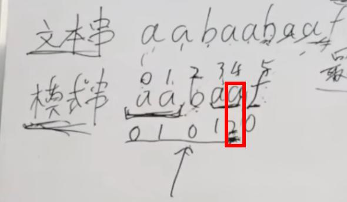

> [链接](https://mp.weixin.qq.com/s/MoRBHbS4hQXn7LcPdmHmIg)

## ①  理论篇

### KMP算法与解决的问题

> 解决字符串匹配问题！！

例如：
给定文本串，`aabaabaaf` ，和模式串 `aabaaf` ，请问，该文本串中，是否出现过模式串？


### 暴力方法与KMP

暴力方法：
两层for循环，第一层遍历文本串，第二层遍历模式串，逐个匹配模式串中的字符，当匹配不到时，文本串后移一位再继续匹配模式串的第一个字符.....
时间复杂度：`O(m * n)`  n是文本串的长度，m是模式串的长度；

KMP算法：
当遇到不匹配时，即`b <-> f` ,由于f之前的字符都匹配上了，那么，文本串不会从第二个a开始，而是可以从这个当前的b开始，且模式串也不需要从第一个a开始，而是从模式串的b开始来对应文本串的这个b，因为文本串的前面一定是aa。

### 前缀表的由来

重点是找到，不匹配之前的子串的最长相等前后缀！这里的最长相等前后缀是`aa`，长度是2，所以会跳转到下标为2的位置，即`b`的位置；

前缀：模式串中，包含首字母，不包含尾字母的所有子串，都称为前缀；
后缀：。。。。

### 最长相等前后缀

比如一个字符串`a`，它没有前后缀，所以最长相等前后缀是0，`aa`，前缀是a，后缀也是，所以是1；`aab`，是0；`aaba`是1；`aabaa`是2；`aabaaf`是0；这个010120即是前缀表

这里有个点，就是前缀必须包含首字符，后缀必须包含尾字符！

### 使用前缀表匹配的过程



>在f不匹配的时候，找到前面的子串的前缀表对应的最长相等前后缀，是2，所以能证明文本串的b前面必然有两个字符和模式串的b后面的两个字符相同，所以直接跳到索引2的位置，找到模式串的b开始。。。


## ② KMP算法（代码篇）


### next数组的不同实现方法

- 直接前缀表
- 前缀表右移一位，首位为-1；
- 前缀表整体减一；

### 具体代码

- 前缀表统一减一的Cpp代码实现：

```cpp
class Solution {  
public:  
    void getNext(int* next, const string& s) {  
        int j = -1;  
        next[0] = j;  
        for(int i = 1; i < s.size(); i++) { // 注意i从1开始  
            while (j >= 0 && s[i] != s[j + 1]) { // 前后缀不相同了  
                j = next[j]; // 向前回退  
            }  
            if (s[i] == s[j + 1]) { // 找到相同的前后缀  
                j++;  
            }  
            next[i] = j; // 将j（前缀的长度）赋给next[i]  
        }  
    }  
    int strStr(string haystack, string needle) {  
        if (needle.size() == 0) {  
            return 0;  
        }  
        int next[needle.size()];  
        getNext(next, needle);  
        int j = -1; // // 因为next数组里记录的起始位置为-1  
        for (int i = 0; i < haystack.size(); i++) { // 注意i就从0开始  
            while(j >= 0 && haystack[i] != needle[j + 1]) { // 不匹配  
                j = next[j]; // j 寻找之前匹配的位置  
            }  
            if (haystack[i] == needle[j + 1]) { // 匹配，j和i同时向后移动  
                j++; // i的增加在for循环里  
            }  
            if (j == (needle.size() - 1) ) { // 文本串s里出现了模式串t  
                return (i - needle.size() + 1);  
            }  
        }  
        return -1;  
    }  
};
```

- 前缀表不减一的Cpp代码实现：>
```cpp
class Solution {  
public:  
    void getNext(int* next, const string& s) {  
        int j = 0;  
        next[0] = 0;  
        for(int i = 1; i < s.size(); i++) {  
            while (j > 0 && s[i] != s[j]) {  
                j = next[j - 1];  
            }  
            if (s[i] == s[j]) {  
                j++;  
            }  
            next[i] = j;  
        }  
    }  
    int strStr(string haystack, string needle) {  
        if (needle.size() == 0) {  
            return 0;  
        }  
        int next[needle.size()];  
        getNext(next, needle);  
        int j = 0;  
        for (int i = 0; i < haystack.size(); i++) {  
            while(j > 0 && haystack[i] != needle[j]) {  
                j = next[j - 1];  
            }  
            if (haystack[i] == needle[j]) {  
                j++;  
            }  
            if (j == needle.size() ) {  
                return (i - needle.size() + 1);  
            }  
        }  
        return -1;  
    }  
};
```

几个步骤：
1. 初始化
	1. i：指向后缀末尾位置
	2. j：指向前缀末尾位置
2. 处理前后缀不同的情况
3. 处理前后缀相同的情况
4. 更新next数组的值；


[[2023-01-03_星期二]]
