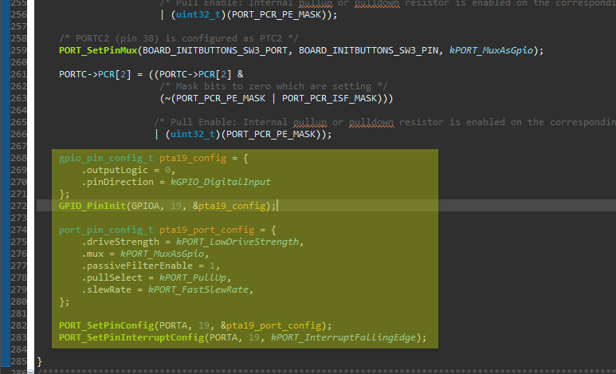

> Asking support to intercept interrupt on PTA19 starting from the example project frdmkw38_lp_bm
> [链接](https://nxp.lightning.force.com/lightning/r/Case/5002p00002nl2LvAAI/view)

[nxp.lightning.force.com](https://nxp.lightning.force.com/lightning/r/Case/5002p00002nl2LvAAI/view)


## 第一步： Why and How ？

Dear Andreoli Daniele,
**It is expected that when the device enters low-power mode you can no longer be able to intercept an interrupt with the debugger**. 

1. Also, you can set this specific pin to <u>*work as a wake-up interrupt source*</u> and then check if the source of the wakeup was this specific pin and then doing.
2. You can also **disable low-power to test that the interrupt is working as expected**.

Could you please help us ***<u>change the following line in "board.h" to enable this pin as a wake-up source</u>***. 

It is a bitmap, so you can set multiple wake-up pins.

-

Please don’t forget to **configure the GPIO**, with Config Tool or with a code-first approach.



You can find more information about low-power modes in the following documents:-
 • Chapter 10 of "Bluetooth® Low Energy Application Developer’s Guide"
 • Chapter 3.15 of "Connectivity Framework Reference Manual"


## 第二步： 效果

Dear Alan,

many thanks for your support, it works in this way!

I've also tried to add the following define in the `Board.h` file to be able to manage the wake up from both the switch and the PTA19, and it works:

```c
#define BOARD_WAKEUP_PIN_KEYBOARD_BITMAP BOARD_WkupPin_PTC2_c_FallingDetect
#define BOARD_WAKEUP_PIN_SERIAL_BITMAP BOARD_WkupPin_PTC6_c_BothDetect
#define BOARD_WAKEUP_PIN_ACCELEROMETER BOARD_WkupPin_PTA19_c_FallingDetect
```

now the device wakes up in the same way from the PTA19 and the sitch SW3.

just a last question, how can I distinguish between the 2 wake up?

Daniele


### 回答

Dear Daniele,

Sorry for the late response.

There's **no direct way to know which GPIO pin awakens the device, only if the wakeup source was from a GPIO**, so I suggest reading the GPIO value when the device exits low-power mode, so Could you please try it and see if it solves your problem?

Best regards,

Alan


## 第三步：跟踪

Dear Alan,

I added the following code in the `void BleApp_Init(void)` funcion on `lowpower.c` file:

```c
gpioInputPinConfig_t PTA19_input = {
	.gpioPort = gpioPort_A_c,
	.gpioPin = 19
};

gpioInputPinConfig_t SW3_input = {
	.gpioPort = gpioPort_C_c,
	.gpioPin = 2
};

if (GpioReadPinInput(&PTA19_input) == 0)
{
	BLEAPP_WRITE("Switch on from PTA19\r\n");
}

if (GpioReadPinInput(&SW3_input) == 0)
{
	BLEAPP_WRITE("Switch on from SW3\r\n");
}
```


it work **but is sensitive to the bounce of the external switching in this way**.

If you don't have other suggestion I will **add external hardware filtering**.

many thanks!


[[2022-11-28_星期一]]
