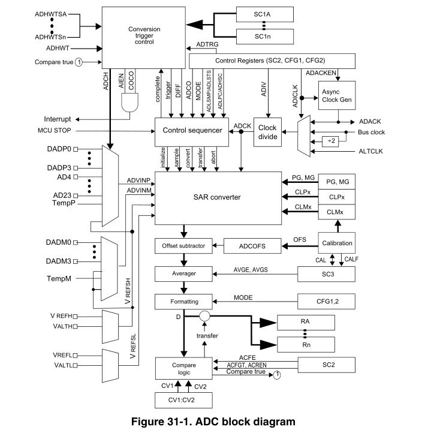
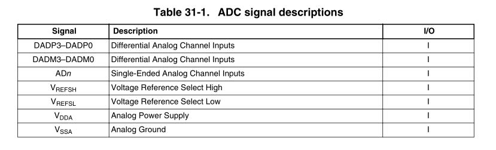
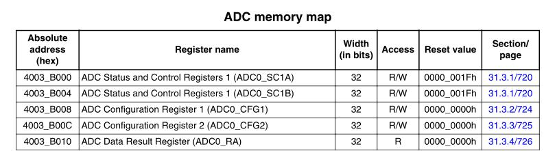
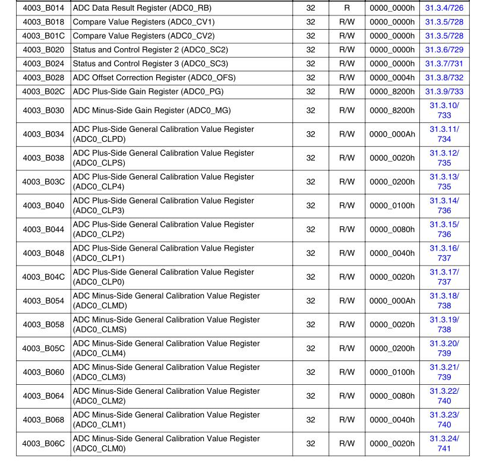

> 这个16-bit ADC是 线性逐次逼近型，为MCU的SOC而设计；

理解 ADC 的类型： [ADI 理解逐次逼近寄存器型ADC：与其它类型ADC的架构对比](https://www.maximintegrated.com/cn/design/technical-documents/tutorials/1/1080.html)

[ADC基本类型的工作原理与性能特点](https://ee.ofweek.com/2020-11/ART-11000-2800-30471924.html)

[常见类型ADC原理探秘，选型必知](https://www.cnblogs.com/embInn/p/14038141.html)

## 0 前置知识

逐次逼近寄存器(Successive Approximation Register):
- 逐次逼近ADC使用比较器逐次缩小包含输入电压的范围。
- 在每个连续的步骤中，转换器**将输入电压与内部数字与模拟转换器的输出进行比较**，后者可能表示所选电压范围的中点。
- 在这个过程的每一步，近似都被存储在一个逐次逼近寄存器(SAR)中。
- 例如，假设输入电压为 6.3 V，初始范围为0到16v。对于第一步，输入6.3 V与8v (0-16V范围的中点)进行比较。比较器报告输入电压小于8v，因此SAR被更新为将范围缩小到0 - 8v。第二步，将输入电压与4v (0 - 8v的中点)进行比较，比较器报告输入电压高于4v，因此更新SAR以反映输入电压在4 - 8v范围内。第三步，输入电压与6v比较(4v与8v的一半);比较器报告输入电压大于6伏，搜索范围变为6 - 8伏。继续这些步骤，直到达到预期的解决方案为止。

其拓扑结构如下，

## 1. 介绍

> For the chip specific modes of operation, see the power management information of the device.

### 1.1 Features

> 1. 16-bit 线性SAR-ADC；
> 2. 4对差分和24个单端外部模拟输入；
> 3. 输出模式：
>    1. 差分 16-bit、13-bit、11-bit、9-bit；
>    2. 单端 16-bit、12-bit、10-bit、8-bit；
> 4. 差分模式输出格式是16位扩展2的补码；
> 5. 单端输出是右对齐无符号格式；
> 6. 单次或连续转换，即单次转换后自动返回idle；
> 7. 可配置的采样时间和转换速度/功率
> 8. 转换完成/硬件平均完成**标志和中断**
> 9. 可选择多达四个源的**输入时钟**
> 10. 在低功耗模式下运行用于低噪声
> 11. <u>异步时钟源用于低噪声操作，可选择输出时钟</u>
> 12. 可选择的硬件转换触发与硬件通道选择
> 13. <u>自动与中断比较小于、大于或等于、在范围内或超出超出范围，值可编程</u>
> 14. 温度传感器 
> 15. 硬件平均功能
> 16. **可选参考电压：外部或备用**
> 17. 自校准模式

### 1.2 Block diagram

## 2. ADC信号说明

> ADC 模块支持最多 4 对差分输入和最多 24 个单端输入。
>
> 每个差分对需要两个输入，**`DADPx` 和 `DADMx`**。 ADC 还需要四个 电源/参考/接地 连接。

### 2.1 模拟电源 VDDA

ADC 模拟部分使用  `VDDA`  作为其电源连接。**<u>在某些封装中，VDDA 在内部连接到 VDD</u>**。如果外部可用，则将 VDDA 引脚连接到与 VDD 相同的电压电位。可能需要外部过滤以确保干净的 VDDA 以获得良好的结果。

### 2.2 模拟地VSSA

ADC 模拟部分使用  `VSSA`  作为其接地连接。**<u>在某些封装中，VSSA 在内部连接到 VSS</u>**。如果外部可用，则将 VSSA 引脚连接到与 VSS 相同的电压电位。

### 2.3 参考电压选择

**<u>`VREFSH`  和  `VREFSL`  是 ADC 模块的高参考电压和低参考电压。</u>**

ADC 可以配置为选择两对之一的 VREFSH 和 VREFSL 对。**<u>每对包含一个必须介于最小 Ref  Voltage High 和 VDDA 之间的正参考，以及一个必须与 VSSA 处于相同电位的接地参考</u>**。这两对是：

- 外部的（VREFH 和 VREFL）
- 候选的（VALTH 和 VALTL）。

**<u>使用 `SC2[REFSEL]`  决定选择哪一对作为参考电压。</u>**

VALTH 和 VALTL参考电压对可以根据 MCU 配置，选择额外的外部引脚或内部源。请参阅有关此 MCU 特定电压参考的芯片配置信息。

**<u>在某些封装中，VREFH 在封装中连接到 VDDA，VREFL 连接到 VSSA</u>**。如果外部可用，则正参考可以连接到与 VDDA 相同的电位，或者可以由外部源驱动到最小参考电压高和 VDDA 电位之间的电平。 **<u>VREFH 绝不能超过 VDDA</u>**。将接地参考连接到与 VSSA 相同的电压电位。

### 2.4 模拟通道输入 ADx

**ADC 模块支持多达 24 个单端模拟输入。当 SC1n[DIFF] 为低电平时，通过 SC1[ADCH] 通道选择位选择单端输入进行转换。**

### 2.5 差分模拟通道输入 DADx

ADC 模块最多支持**<u>四个差分模拟通道输入</u>**。每个差分模拟输入都是一对外部引脚 `DADPx` 和 `DADMx`，*它们相互参考以提供最准确的模拟到数字读数*。

**<u>当 `SC1n[DIFF]` 为高电平时，选择差分输入通过 `SC1[ADCH]` 进行转换。如果 `SC1n[DIFF]` 为低电平，则所有 `DADPx` 输入均可用作单端输入。</u>**

在某些 MCU 配置中，如果 SC1n[DIFF] 为低电平，一些 `DADMx` 输入也可以用作单端输入。对于特定于此设备的 ADC 连接，请参阅芯片特定的 ADC 信息。

## 3. 内存映射和寄存器定义

> 本节介绍 ADC 寄存器。

### 3.1 ADC 状态和控制寄存器 1  (ADCx_SC1n)

`SC1A`  用于软件和硬件触发模式。

为了允许内部外设触发 ADC 的顺序转换，ADC 可以有多个状态和控制寄存器：每个转换一个。 SC1B–SC1n 寄存器指示潜在的多个 SC1 寄存器，仅用于硬件触发模式。有关此设备特定的 SC1n 寄存器数量的信息，请参见芯片配置信息。 SC1n 寄存器具有相同的字段，并以“乒乓”方式用于控制 ADC 操作。

在任何一个时间点，只有一个 SC1n 寄存器在主动控制 ADC 转换。允许在 SC1n 主动控制转换时更新 SC1A，对于特定于该 MCU 的任何 SC1n 寄存器，反之亦然。

在 SC1A 主动控制转换时写入 SC1A 会中止当前转换。在软件触发模式下，当 SC2[ADTRG]=0 时，写入 SC1A 随后启动新的转换，如果 SC1[ADCH] 包含一个非全 1 的值（模块禁用）。

在特定 SC1n 寄存器主动控制转换时写入任何 SC1n 寄存器会中止当前转换。 SC1B-SC1n 寄存器均未用于软件触发操作，因此写入 SC1B-SC1n 寄存器不会启动新的转换。

