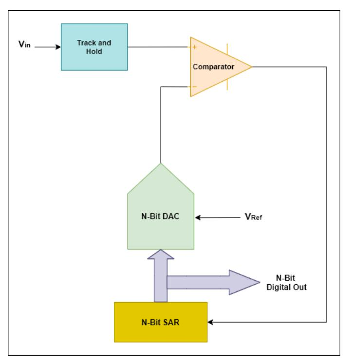
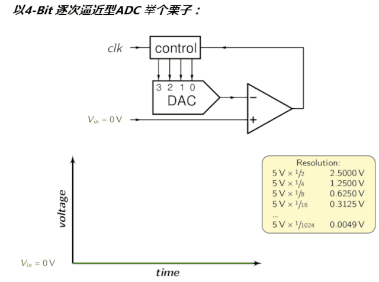

> 这个16-bit ADC是 线性逐次逼近型，为MCU的SOC而设计；

理解 ADC 的类型： [ADI 理解逐次逼近寄存器型ADC：与其它类型ADC的架构对比](https://www.maximintegrated.com/cn/design/technical-documents/tutorials/1/1080.html)

[ADC基本类型的工作原理与性能特点](https://ee.ofweek.com/2020-11/ART-11000-2800-30471924.html)

[常见类型ADC原理探秘，选型必知](https://www.cnblogs.com/embInn/p/14038141.html)

## 0 前置知识

逐次逼近寄存器(Successive Approximation Register):
- 逐次逼近ADC使用比较器逐次缩小包含输入电压的范围。
- 在每个连续的步骤中，转换器**将输入电压与内部数字与模拟转换器的输出进行比较**，后者可能表示所选电压范围的中点。
- 在这个过程的每一步，近似都被存储在一个逐次逼近寄存器(SAR)中。
- 例如，假设输入电压为 6.3 V，初始范围为0到16v。对于第一步，输入6.3 V与8v (0-16V范围的中点)进行比较。比较器报告输入电压小于8v，因此SAR被更新为将范围缩小到0 - 8v。第二步，将输入电压与4v (0 - 8v的中点)进行比较，比较器报告输入电压高于4v，因此更新SAR以反映输入电压在4 - 8v范围内。第三步，输入电压与6v比较(4v与8v的一半);比较器报告输入电压大于6伏，搜索范围变为6 - 8伏。继续这些步骤，直到达到预期的解决方案为止。

其拓扑结构如下，

 为了直观，看看前文的动图：

