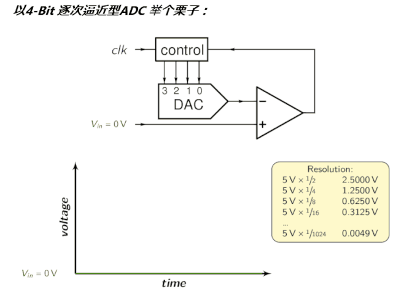

> [链接](https://mp.weixin.qq.com/s/3HrXGXdw6Ds_qBuaOQKGxA)

一个产品要与外界物理环境打交道，一个至关重要的触角就是**采样真实模拟世界的信号，翻译成芯片可理解的数字信号**，进而实现很多为人服务的应用产品。那么提到采样，ADC技术你绕不开，今天总结分享一下ADC的点点滴滴。

## 什么是ADC？

在现代电子工业技术中，模数转换器(ADC, A/D，或A-to-D)是一种**将模拟信号转换成数字信号的系统**。ADC还可以提供各类的测量，例如将输入模拟电压或电流转换为表示电压或电流大小的数字的电子设备。通常情况下，数字输出是一个与输入成比例的二进制补码，但也有其他的可能性。举些栗子：

-   KTV中麦克风将你唱歌的声音转成数字音频信号，经由信号处理，功放再播放出来
-   数码相机将物体表面反射的光线转换为数字信号，从而成像
-   疫情期间必用物资额温枪，将人体红外辐射经由光电转换成电压，最终转换为数字信号进行温度显示
-   .......举不胜举。

> ADC将**<u>连续时间和连续幅度的模拟信号转换为离散时间和离散幅度的数字信号</u>**。转换涉及输入的量化，因此<u>必然会引入少量的误差或噪声</u>。此外，<u>ADC不会连续执行转换，而是定期进行转换，对输入进行采样，从而限制了输入信号的允许带宽</u>。

ADC的性能主要由其带宽和**信噪比（SNR）**来表征。

-   **ADC带宽** (Band width)：<u>ADC的带宽主要由其采样率来表征</u>。
-   **ADC的SNR**：SNR(signal noise ratio)是指信噪比，受许多因素影响，包括分辨率，线性度和准确性（量化级别与真实模拟信号的匹配程度），混叠和抖动。ADC的SNR通常以其有效位数（ effective number of bits：ENOB），它返回的每个度量的位数平均来表示，而不是噪声。<u>理想的ADC的ENOB等于其分辨率</u>。

> 故，选择ADC以匹配待数字化信号的带宽和所需的SNR。**如果ADC的采样率大于信号带宽的两倍，那么根据Nyquist–Shannon采样定理，就可以实现完美的重构。**量化误差的存在甚至限制了理想ADC的SNR。但是，如果ADC的SNR超过输入信号的SNR，则其影响可能会被忽略，从而导致模拟输入信号的本质上是完美的数字表示。

整这么多文字还是不直观易懂，到底啥是ADC，来个会动的图吧：

## 需要理解的指标：

### 1. 分辨率

ADC看成一个黑匣子，基本的<u>有一个模拟输入及其等效数字输出</u>。下图所示示例为一个N位ADC。N通常是6到24之间的任何值，常见的是8、10、12或16位。<u>**参考电压可能为单端电压，也可能为一个 `-Vref ~ +Vref` ,是一个正负电压参考源**</u>。

***输入是一个模拟电压，范围从0到参考电压***，<u>参考电压取决于实际ADC及外围电路</u>。 假设使用N位，则可能有 `2^N` 个可能的数字输出值，**则1位表示的值为 `Vbit = Vref / 2^N`** 。在很多书上也称这个指标为***LSB（Least Significant Bit）***。

> 这便是分辨率的概念。模数转换器的<u>*分辨率表示在模拟值范围内它可以产生的离散值的数量*</u>。该分辨率决定了量化误差的大小，因此决定了不使用过采样的理想ADC的最大平均信噪比。

举个栗子，如果给定ADC的最大输入值为5.0V，而ADC为10位类型，则每一位表示 `Vbit = 5 / 2^10 = 4.89mV` 。这个ADC的分辨率，或者说量化步长，是4.89 mV。这是它的绝对理论分辨率。

在这种特殊情况下，信号的分辨率不能高于 `±(4.89 / 2) mV` 。这个极限称为**量化误差，所有的ADC，即使是完美的ADC，都有一定程度的量化误差，具体取决于ADC的分辨率**。分辨率的数学定义为：

**`Q = (Vref＋ - Vref－) / 2^M`**

其中，`Vref＋` 和 `Vref－` 是ADC的参考电压，M是ADC的量化位数，M越大，Q越小，分辨率越高；

> 这个公式简单解读：就是将参考电压按照进行 `2^M` 等分，比如10位ADC，就是将参考电压等分成1024份，输入电压与参考电压之比乘以1024，即为ADC的值。故:
>
> 

### 2. 量化误差

量化误差是由理想ADC中的量化过程产生的。由于ADC的模拟输入电压与输出数字化值之间的存在舍入误差。 **在理想的ADC中，量化误差均匀地分布在`- LSB/2` 和 `+ LSB/2` 之间**，并且信号具有覆盖所有量化水平的均匀分布，因此**信号量化噪声比SQNR（Signal-to-quantization-noise ratio）定义为：**

> 

其中,M为ADC的位数，M位数越大或越高，SQNR也越大。

### 3. 精度

量化误差和非线性是ADC所固有的误差指标。用最低有效位（LSB）的单位进行度量。比如一个10位ADC，LSB为 `1 / 2^10 = 0.0977%` 。

### 4. 非线性度

实际使用的ADC除了上面说的量化误差外，**<u>还具有更多的误差源</u>**：

- **差分非线性误差DNL(Differential Non-Linearity)**: 当ADC输出在应该改变的时候没有改变，就会出现DNL误差。
  - 例如，假设给定输入的当前输出代码是01101100，并且输入值增加了半步量化。代码应该是01101100 + 1位，或者01101101。当输入电压低于当前输入电压时，也会发生相反的情况。此时由于种种原因，这种情况可能不会发生。在本例中，ADC的误差为±1位DNL。
- **积分非线性误差INL(Integral Non-Linearity)**：<u>如果量化水平在整个输入范围内分布不均匀，就会出现INL误差</u>。
  - 例如，某ADC具有12位(4096个计数)分辨率和4.096V的参考电压。每个比特数正好表示输入电压变化的1.000mV，因此，输入电压为4096 mV，输出电压为1111 1111 1111，即0xFFF。对于某些adc，输入4095mV，甚至4094mV，仍然会得到0xFFF的数字输出。实际情况是，在整个输入范围内，1位的值发生了非常微小的变化，比如1.001mV或0.999mV。<u>积累的误差会导致一个或两个比特精度的全量程误差。</u>

在为特定应用指定ADC时必须考虑这些因素。

所有ADC都存在由其物理缺陷引起的非线性误差，导致其输出偏离其输入的线性函数(或其他函数，在故意使用非线性ADC的情况下)。这些误差有时可以通过校准来减轻，或通过测试来避免。<u>所谓校准，比如可以通过量点线性校准，假定y为ADC数值，x为输入模拟电压</u> :

> 

### 5. 采样率

模拟信号在时间上是连续的，因此<u>有必要将其转换为数字序列，这是数字信号处理的基础</u>。因此，需要定义从模拟信号中采样数字序列的速率。<u>该速率称为转换器的采样率或采样频率</u>。可以采样连续变化的带限信号，<u>然后可以通过重构滤波器从离散时间值中再现原始信号</u>。

奈奎斯特-香农采样定理表明，**只有当采样率高于信号最高频率的两倍时，才可以忠实再现原始信号。个人在使用时，一般会选4倍以上。**

<u>由于实际的ADC不能进行瞬时转换，因此在转换器执行转换期间(称为转换时间)输入值必须保持恒定。一个被称为**采样保持电路**</u>——在大多数情况下，它***使用一个电容来存储输入端的模拟电压，并使用一个电子开关或栅极来断开电容与输入端的连接***。许多ADC集成电路包括内部的采样保持电路模块。

### 6. 混叠

ADC通过在不连续时间间隔（离散的含义）内对输入值进行采样来工作。假设以高于奈奎斯特速率的频率对输入进行采样（定义为有用信号频率的两倍），则可以重构信号中的所有频率。

如果对高于奈奎斯特速率一半的频率进行采样，则会将它们错误地检测为较低频率，这一过程称为混叠。<u>***之所以会出现混淆，是因为每个周期对函数进行两次或两次以下的瞬时采样会导致丢失周期，从而出现频率错误地降低的情况***</u>。例如，以1.5 kHz采样的2 kHz正弦波将重构为500 Hz正弦波。

<mark>为了避免混叠，ADC的输入必须经过硬件低通滤波，最简单的实现形式为一阶无源RC滤波网络，以去除采样率一半以上的频率。这种滤波器被称为抗混叠滤波器，它对于实际的ADC系统至关重要，该系统适用于具有更高频率内容的模拟信号。在需要防止混叠的应用程序中，可以使用过采样来大大减少甚至消除混叠。</mark>

例如：六种不同采样速率采集的数字序列重建的4种波形。其中两种波形在采样率足够情况下未出现混叠。另外两个说明了在较低速率下会失真（混叠增加）

### 7. 过采样

<u>为了经济起见，通常以所需的最小速率对信号进行采样，结果是引入的量化误差是**白噪声**在转换器整个通带上的扩散。如果以远高于奈奎斯特速率的速率采样信号，然后进行数字滤波以将其限制为信号带宽，则会产生以下优点：</u>

- **过采样可以更轻松地实现模拟抗混叠滤波器**
- 降低的噪声，尤其是在过采样之外还采用噪声整形处理后。

过采样通常用于音频ADC中，与典型晶体管电路的时钟速度（> 1 MHz）相比，所需的采样率（通常为44.1或48 kHz）非常低。在这种情况下，可以以很少的成本或不增加成本就可以大大提高ADC的性能。此外，由于任何混叠信号通常也都在频带外，因此使用非常低成本的滤波器通常可以完全消除混叠。下图比较直观，可以看出提高采样频率，可以更为真实的重建原始信号，而采样频率低些，对于信号的细部则无法准确重建。

## 总结

在单片机、DSP信号处理系统中，我们免不了要对物理信号进行采样，需要运用到模数转换器件，模数转换器万万千，那么要用好ADC器件，或者使用单片机、DSP内置ADC，了解这些技术指标以及其描述的真实含义，是非常必要的。