# K60之ADC详解

> 昨天尝试使用不检波的电磁传感器利用10us甚至更快的中断直接通过AD采样获取磁场信号时，发现中断响应时间与配置不符。
>
> 实验过程如下：（芯片型号MK60DN512VLL10，使用16M有源晶振，4分频后25倍频即100M系统时钟）。
>
> - 使用1ms周期的中断，每一次中断进行5次12位精度ADC，进行100000次中断用时为100s无误。
> - 缩短中断周期为0.1ms，保持中断回调函数不变，同样进行100000次中断，总计用时却需要近47s！！！
> - 进一步缩短周期为0.05ms，发现总用时仍然为47s。
>
> 即我们可以推算出AD采样转换时屏蔽了中断请求，并计算出来每一次的ADC时间约为47s/100000/5=0.09ms。不禁有所困惑，对于100M的系统时钟，ADC采样速率怎么会这么慢呢？

- 分享一个ADC转换时间计算软件，链接：https://pan.baidu.com/s/12NLeTzlPOvrBi_D8AgNMjw 密码：5iis

- 于是着手研究芯片寄存器数据手册和超核库函数以及芯片头文件的寄存器定义。

- 芯片寄存器头文件 `MK60D10.h` 链接：https://pan.baidu.com/s/12NLeTzlPOvrBi_D8AgNMjw 密码：5iis

- 寄存器数据手册[K60P100M100SF2V2RM](https://jiangxh.files.wordpress.com/2018/03/k60p100m100sf2v2rm.pdf "K60P100M100SF2V2RM") 链接：https://pan.baidu.com/s/15BM2c5LI3WH64Ul3hnv0-A 密码：9u21

这些均可以在NXP官网下搜索K60系列芯片资料下载到。

从官网下载的数据手册和寄存器头文件均为最新版本，如果使用第三方库文件，内部的定义大部分均是基于之前的版本。

如对于`MK60DN512ZVLL10`系列带Z的上一版本芯片，使用的数据手册应为`K60P144M100SF2RM.pdf`

同时相对应的寄存器头文件版本应在v1.3之前的版本。

打开寄存器数据手册直奔ADC章节。

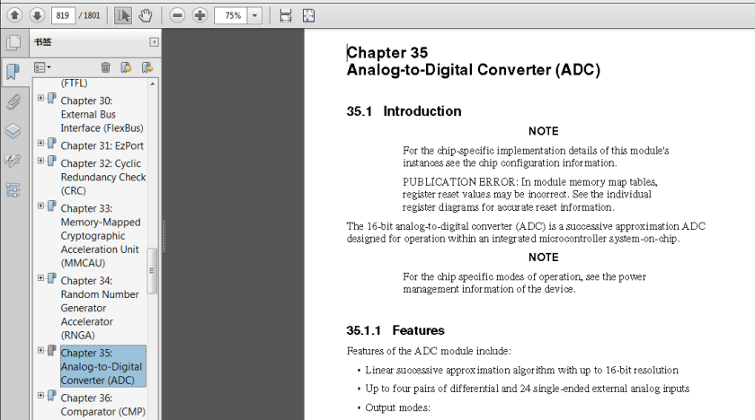

结合已有的K60中文手册，简单的进行一些翻译并附上个人理解，如有错误请帮忙指出谢谢！

# 第35章模数转换器（ADC）

## 35.1引言

> 注意：对于特定芯片型号的ADC模块实例实现细节请查看芯片配置信息。（划重点说明芯片配置信息很重要）

> 发布错误：在模块内存映射表中，寄存器重置值可能是不正确的。（说明库函数的寄存器头文件也可能有误，以数据手册为准。不然也不会有多个版本的寄存器头文件MK60D10.h了）

请参阅各个芯片独立的寄存器图表以获得准确的复位信息。（由于`MK60D10.h`的适配芯片型号较多，而一个寄存器数据手册的适配芯片型号有限，可能部分寄存器地址存在不匹配问题。以P144和P100为例，P100的寄存器数量远远少于P144的芯片，使用时应注意回避这些寄存器）

> 16位模数转换器(ADC)是一种**逐次逼近型ADC**，用于集成在一块芯片上的微控制器系统内的操作（单片机的定义）。（<u>逐次逼近型ADC的转换速率应该是恒定的，不会因为输入信号变化而变，如果不知道什么是逐次逼近ADC的请回去重修数电或者自行百度！</u>）

注意：对于芯片的具体操作方式，请参阅设备的电源管理信息。（*ADC的配置会设置电源的配置，例如配置低功耗ADC、ADC参考电平选择等等*）

### 35.1.1 特征

ADC模块的特点包括：

- 最高16位分辨率的线性逐次逼近算法。
- 多达4对差分和24个单端外部模拟输入口。
- 输出模式有：
  - 16位、13位、11位、9位差分模式
  - 16位、12位、10位、8位单端模式

- 差分模式以2进制补码的扩展格式输出。

- 单端模式以右对齐的无符号格式输出。

- 支持单次或连续转换两种转换模式，也即是说单次转换之后自动转换成空闲模式。

- 可配置的采样时间和转换速率/电压。

- 存在标志位或触发中断表示转换完成/硬件计算采样平均值完成。

- 可选择高达4种的输入时钟。

- 可配置低功耗模式来降低噪声。

- 低噪声操作模式下可使用异步时钟源作为输出时钟。

-  选择硬件转换来触发硬件通道选择。

- 自动比较中断可以大于、等于、小于、超过可编程值、或者在可编程值区间之内。

- 带有温度传感器。

- 硬件平均性能检测功能。

- 可选择的基准电压：外部或备用。

- 自校准模式。

- 高达<u>64倍增益</u>的可编程增益放大器（**PGA**——Programmable Gain Amplifier）。

### 35.1.2 框图

自行查看数据手册，框图较为复杂可以先跳过不看。

## 35.2 ADC信号描述（对于绘制K60核心板非常重要！！！）

**每个差分对需要两个输入源，DADPx和DADMx**。如下图所示：

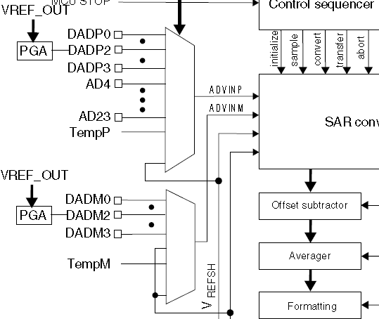

- ADC还需要4个供电/参考电平/地平面连接。

注意：请参阅芯片配置章节中的ADC配置章节，以获得该设备上支持的通道数。（不同型号K60的ADC通道数可能不同）

| 信号        | 描述                 | I/O  |
| ----------- | -------------------- | ---- |
| DADP3-DADP0 | 差分模拟通道**输入** | 输入 |
| DADM3-DADM0 | 差分模拟通道输入     | 输入 |
| AD23-AD4    | 单端模拟通道输入     | 输入 |
| VREFSH      | 最高基准电压         | 输入 |
| VREFSL      | 最低基准电压         | 输入 |
| VDDA        | 模拟电压源           | 输入 |
| VSSA        | 模拟地电源           | 输入 |

### 35.2.1 模拟供电电源（VDDA）

***<u>ADC模拟部分使用VDDA作为供电连接。在部分封装里，VDDA内部连接到了VDD。如果外部连接可以的话，将VDDA引脚连接到与VDD同样的电源电压。可能需要外部的滤波来保证干净的VDDA确保ADC转换结果准确有效</u>***

### 35.2.2 模拟地（VSSA）

ADC模拟部分使用VSSA作为接地连接。与VDDA相同，在部分封装里，VSSA内部连接到了VSS。如果外部连接可以的话，将VSSA引脚连接到与VSS同样的电压。

### 35.2.3 基准电压选择

**<u>*VREFSH和VREFSL是参考高电压和参考低电压。ADC能够配置可接收两对电压VREFSH 和VREFSL中的一对。每对都包含一个有效的参考并且该参考电压一定在最小的参考高电压和VDDA 之间。*</u>**

一个参考地一定和VSSA电压大小相同。两对电压分别是外部的VREFH 和VREFL和可选择的VALTH 和VALTL。通过设置寄存器SC2 中的 `REFSEL` 位可以对参考电压进行选择。根据MCU 配置，可选参考电压（VALTH 和VALTL）对可以选择额外的外部引脚或内部电源，请查阅这款MCU 的参考电压的芯片配置信息。

在一些封装中，VREFH 是内部连接到VDDA 上，VREFL 是内部连接到VSSA 上的。如果外部电压有效，则有效参考电压就可以连接到与VDDA 相同的电压上，**或者在最小参考高电压和VDDA 之间的一个电平之间（VREFH 不要高于VDDA**）。将参考地连接到与VSSA 相同的电压上。

### 35.2.4 模拟通道输入（ADx）

当寄存器 `SC1n` 中的 `DIFF` 位为低时，通过**<u>改变SC1寄存器的ADCH位的状态可以选择单端输入</u>**。

### 35.2.5 差分模拟通道输入（DADx）

每个差分模拟输入都是一对外部引脚（DADPx和DADMx）相互参照以提供最精确的模拟到数字的读取。**当SC1n寄存器的\[DIFF\]位为高时，通过SC1的\[ADCH\]选择差分输入。如果SC1n\[DIFF\]低，那么所有DADPx输入都可以作为单端输入。**

## 35.3 寄存器定义

ADC存储器映像

表格不再复制，介绍一下每一列的说明

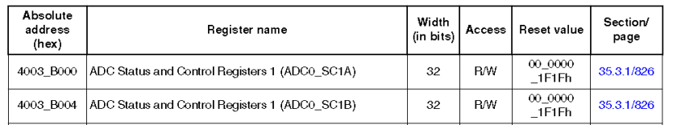

- 第一列为16进制的寄存器绝对地址

- 第二列为寄存器名，后面会对每一个寄存器名进行翻译说明

- 第三列为寄存器长度位数

- 第四列为读写属性（R/W为可读写，R为只读，W为只写）

- 第五列为复位值，即初始化后的默认值。

- *第六列为该寄存器在文档中的位置（包括章节号和页数*）

 

| 绝对地址  | 寄存器名                 | 寄存器标识    |
| --------- | ------------------------ | ------------- |
| 4003_B000 | ADC 状态控制寄存器1      | （ADC0_SC1A） |
| 4003_B004 | ADC 状态控制寄存器1      | （ADC0_SC1B） |
| 4003_B008 | ADC 配置寄存器1          | （ADC0_CFG1） |
| 4003_B00C | ADC 配置寄存器2          | （ADC0_CFG1） |
| 4003_B010 | ADC 数据结果寄存器       | （ADC0_RA）   |
| 4003_B014 | ADC 数据结果寄存器       | （ADC0_RB）   |
| 4003_B018 | ADC比较值寄存器          | （ADC0_CV1）  |
| 4003_B01C | ADC比较值寄存器          | （ADC0_CV2）  |
| 4003_B020 | ADC状态控制寄存器2       | （ADC0_SC2）  |
| 4003_B024 | ADC状态控制寄存器3       | （ADC0_SC3）  |
| 4003_B028 | ADC 片选连接寄存器       | （ADC0_OFS）  |
| 4003_B02C | ADC 正向增加寄存器       | （ADC0_PG）   |
| 4003_B030 | ADC 负向增加寄存器       | （ADC0_MG）   |
| 4003_B034 | ADC 正向整体校正值寄存器 | （ADC0_CLPD） |
| 4003_B038 | ADC 正向整体校正值寄存器 | （ADC0_CLPS） |
| 4003_B03C | ADC 正向整体校正值寄存器 | （ADC0_CLP4） |
| 4003_B040 | ADC 正向整体校正值寄存器 | （ADC0_CLP3） |
| 4003_B044 | ADC 正向整体校正值寄存器 | （ADC0_CLP2） |
| 4003_B048 | ADC 正向整体校正值寄存器 | （ADC0_CLP1） |
| 4003_B04C | ADC 正向整体校正值寄存器 | （ADC0_CLP0） |
| 4003_B050 | ADC PGA 寄存器           | （ADC0_PGA）  |
| 4003_B054 | ADC 负向整体校正值寄存器 | （ADC0_CLMD） |
| 4003_B058 | ADC 负向整体校正值寄存器 | （ADC0_CLMS） |
| 4003_B05C | ADC 负向整体校正值寄存器 | （ADC0_CLM4） |
| 4003_B060 | ADC 负向整体校正值寄存器 | （ADC0_CLM3） |
| 4003_B064 | ADC 负向整体校正值寄存器 | （ADC0_CLM2） |
| 4003_B068 | ADC负向整体校正值寄存器  | （ADC0_CLM1） |
| 4003_B06C | ADC 负向整体校正值寄存器 | （ADC0_CLM0） |
| 400B_B000 | ADC 状态控制寄存器1      | （ADC1_SC1A） |
| 400B_B004 | ADC 状态控制寄存器1      | （ADC1_SC1B） |
| 400B_B008 | ADC 配置寄存器1          | （ADC1_CFG1） |
| 400B_B00C | ADC 配置寄存器2          | （ADC1_CFG2） |
| 400B_B010 | ADC 数据结果寄存器       | （ADC1_RA）   |
| 400B_B014 | ADC 数据结果寄存器       | （ADC1_RB）   |
| 400B_B018 | ADC 比较值寄存器         | （ADC1_CV1）  |
| 400B_B01C | ADC比较值寄存器          | （ADC1_CV2）  |
| 400B_B020 | ADC状态控制寄存器2       | （ADC1_SC2）  |
| 400B_B024 | ADC状态控制寄存器3       | （ADC1_SC3）  |
| 400B_B028 | ADC 片选连接寄存器       | （ADC1_OFS）  |
| 400B_B02C | ADC 正向增加寄存器       | （ADC1_PG）   |
| 400B_B030 | ADC 负向增加寄存器       | （ADC1_MG）   |
| 400B_B034 | ADC 正向整体校正值寄存器 | （ADC1_CLPD） |
| 400B_B038 | ADC 正向整体校正值寄存器 | （ADC1_CLPS） |
| 400B_B03C | ADC 正向整体校正值寄存器 | （ADC1_CLP4） |
| 400B_B040 | ADC 正向整体校正值寄存器 | （ADC1_CLP3） |
| 400B_B044 | ADC 正向整体校正值寄存器 | （ADC1_CLP2） |
| 400B_B048 | ADC 正向整体校正值寄存器 | （ADC1_CLP1） |
| 400B_B04C | ADC 正向整体校正值寄存器 | （ADC1_CLP0） |
| 400B_B050 | ADC PGA 寄存器           | （ADC1_PGA）  |
| 400B_B054 | ADC 负向整体校正值寄存器 | （ADC1_CLMD） |
| 400B_B058 | ADC 负向整体校正值寄存器 | （ADC1_CLMS） |
| 400B_B05C | ADC 负向整体校正值寄存器 | （ADC1_CLM4） |
| 400B_B060 | ADC 负向整体校正值寄存器 | （ADC1_CLM3） |
| 400B_B064 | ADC 负向整体校正值寄存器 | （ADC1_CLM2） |
| 400B_B068 | ADC 负向整体校正值寄存器 | （ADC1_CLM1） |
| 400B_B06C | ADC 负向整体校正值寄存器 | （ADC0_CLM0） |

下面介绍的是各个寄存器的详细说明，也是库函数的操作指南

### 35.3.1 ADC状态控制寄存器1

SC1A 寄存器有软件和硬件触发两种操作模式。为了使由外设激发的ADC 转换有序进行，ADC 包含了不止一个的状态和控制寄存器，每一个转换只能使用其中一个。SC1B-SC1n 寄存器显示了只有在硬件触发操作模式下才使用多个SC1 寄存器。查阅芯片配置信息查看各个具体芯片型号的SC1 寄存器数量。SC1n 寄存器有相同的位，用”ping-pong”法控制ADC 操作。（关于ping-pong法可参看博客 http://blog.csdn.net/sun19910114/article/details/52983553 ）

任一时刻，只有一个SC1n 寄存器是处于有效控制ADC 转换的状态。当SC1n 有效控制ADC 转换时，可以更新SC1A（反过来，对于芯片的任何SC1n 寄存器也同样可以这样）。

当SC1A 正在控制一个转换的同时对SC1A进行写操作会打断当前转换。在软件触发模式下，当SC2的[ADTRG]位为低、且SC1[ADCH]包含一个值而不是所有都是1时，对寄存器SC1A 进行写操作后会初始化开始一个新的转换。

同时，当SC1n 寄存器 正在控制一个转换的同时对SC1n进行写操作会打断当前转换。在软件触发操作模式下不会用到SC1B-SC1n 寄存器，因此对SC1B-SC1n 进行写操作不会引起一个新的转换。

地址计算：ADC0_SC1A-4003_B000h 基址+0h 偏移量=4003_B000h

ADC0_SC1B-4003_B000h 基址+4h 偏移量=4003_B004h

ADC1_SC1A-400B_B000h 基址+0h 偏移量=400B_B000h

ADCx_SC1n每一位的描述：

| 位            | 描述                                                         |
| ------------- | ------------------------------------------------------------ |
| 31-8 Reserved | 这些位为只读保留位，各位值始终为0.                           |
| 7 COCO        | 转化完成标志：COCO 标志位是只读的，当比较功能关闭（SC2[ACFE]=0），硬件均值功能也取消（SC3[AVGE]=0）时，每当转换完成之后就会置位该位。当打开了比较功能（SC2[ACFE]=1）时，只有当比较结果是True的时候，转换完成时才会置位COCO 标记位。当硬件均值打开时（SC3[AVGE]=1）， 只有当所选数量的转换(由AVGS决定)完成时才会置位COCO 标记位。当校准次序完成的时候，也会置位寄存器SC1A 中的标记位COCO。当对寄存器SC1A 进行写操作或者对寄存器Rn 进行读操作时，都会清除标记位COCO。  注：  0 转换没有完成。  1 转换完成。 |
| 6 AIEN        | 中断使能：使能转换完成中断。当AIEN 位为1 时，转换完成时COCO置位的同时就会引发一个中断。注：0 转换完成中断禁止。 1 转换完成时中断使能。 |
| 5 DIFF        | 差分模式使能：DIFF配置ADC工作在差分模式下。当使能时，该模式会自动选择差分通道，改变转换算法和周期数来完成转换。注：0 选择单端转换和输入通道。1 选择差分转换和输入通道。 |
| 4-0 ADCH      | 输入通道选择：用于选择一个输入通道。输入通道解码依赖于DIFF位的值。DAD0-DAD3 与输入差分引脚对DADPx和DADMx有关。（注：在位字段设置描述中的部分输入通道选项可能对部分型号无法使用。实际的ADC通道分配请查看芯片配置详细信息。）当通道选择位全部设置为1111 时逐次逼近转换器子系统会关闭。该特征允许明确地禁用ADC，同时可以将输入通道与所有其他的资源隔离开来。通过这种方式终止连续转换可以防止进行新的单个转换。在没有启用连续转换的情况下，没有必要将通道选择位ADCH全部设置为1来将ADC 置于低功耗状态，因为转换完成之后模块会自动进入低功耗状态。  00000 当DIFF=0，DADP0 选择为输入；当DIFF=1，DAD0 选择为输入。  00001 当DIFF=0，DADP1 选择为输入；当DIFF=1，DAD1 选择为输入。  00010 当DIFF=0，DADP2 选择为输入；当DIFF=1，DAD2 选择为输入。  00011 当DIFF=0，DADP3 选择为输入；当DIFF=1，DAD3 选择为输入。  00100 当DIFF=0，AD4 选择为输入；当DIFF=1，该位保留。  00101 当DIFF=0，AD5 选择为输入；当DIFF=1，该为保留。  00110 当DIFF=0，AD6 选择为输入；当DIFF=1，该为保留。  00111 当DIFF=0，AD7 选择为输入；当DIFF=1，该为保留。  01000 当DIFF=0，AD8 选择为输入；当DIFF=1，该位保留。  01001 当DIFF=0，AD9 选择为输入；当DIFF=1，该位保留。  01010 当DIFF=0，AD10 选择为输入；当DIFF=1，该位保留。  01011 当DIFF=0，AD11 选择为输入；当DIFF=1，该位保留。  01100 当DIFF=0，AD12 选择为输入；当DIFF=1，该位保留。  01101 当DIFF=0，AD13 选择为输入；当DIFF=1，该位保留。  01110 当DIFF=0，AD14 选择为输入；当DIFF=1，该位保留。  01111 当DIFF=0，AD15 选择为输入；当DIFF=1，该位保留。  10000 当DIFF=0，AD16 选择为输入；当DIFF=1，该位保留。  10001 当DIFF=0，AD17 选择为输入；当DIFF=1，该位保留。  10010 当DIFF=0，AD18 选择为输入；当DIFF=1，该位保留。  10011 当DIFF=0，AD19 选择为输入；当DIFF=1，该位保留。  10100 当DIFF=0，AD20 选择为输入；当DIFF=1，该位保留。  10101 当DIFF=0，AD21 选择为输入；当DIFF=1，该位保留。  10110 当DIFF=0，AD22 选择为输入；当DIFF=1，该位保留。  10111 当DIFF=0，AD23 选择为输入；当DIFF=1，该位保留。  11000 保留。  11001 保留。  11010 当DIFF=0，温度传感器（单端）选择为输入；当DIFF=1，温度传感器（差分）选择为输入。  11011 当DIFF=0，Bandgap（单端）为输入；当DIFF=1，Bandgap（差分）为输入。  11100 保留。  11101 当DIFF=0，VREFSH 选择为输入；当DIFF=1，– VREFSH （差分）选择为输入。参考电压选择由SC2 寄存器中REFSL 位决定。  11110 当DIFF=0，VREFSL 选择作为输入；当DIFF =1,该位保留。参考电压选择由寄存器SC2中REFSEL 决定。 11111 模块停止工作。 |

### 35.3.2 ADC配置寄存器1（ADCx\_CFG1）

CFG1 寄存器可以选择操作模式，包括设置时钟源、时钟分频、低功耗配置以及长时间采样的配置。

- 地址：ADC0\_CFG1—4003\_B000h     基址+8h     偏移量=4003\_B008h

- ADC1\_CFG1—400B \_B000h               基址+8h     偏移量=400B\_B008h

位描述：

| 位            | 描述                                                         |
| ------------- | ------------------------------------------------------------ |
| 31-8 Reserved | 这些位为只读保留位，各位值始终保持为0.                       |
| 7 ADLPC       | 低功耗配置：ADLPC 控制逐次逼近转换器的电源配置。当不要求高采样速率的时候可以优化功耗。 注：0 正常供电配置。1 低功耗配置。以最大时钟速率的代价降低功耗。 |
| 6-5 ADIV      | 时钟分频选择：ADIV 选择ADC 使用的分频系数产生内部时钟ADCK。 00 分频系数为1，时钟频率为输入时钟。 01 分频系数为2，时钟频率为输入时钟/2. 10 分频系数为4，时钟频率为输入时钟/4. 11 分频系数为8，时钟频率为输入时钟/8. |
| 4 ADLSMP      | 采样时间配置： ADLSMP 会根据选择的转换模式选择不同的采样时间。该位能够调整采样周期，以允许更高的输入阻抗能够被精确的采样或最大化转换速度以降低输入阻抗。如果启动了连续转换，也不要求高转换速率，则可以使用长时间采样以降低功耗。当ADLSMP=1，长时间采样选择位ADLSTS[1:0]可以选择长时间采样时间范围。 注：0 短时间采样。1 长时间采样。 |
| 3-2 MODE      | 转换模式选择：MODE 用作选择ADC的工作模式。 00 当DIFF=0：为单端8位转换；当DIFF=1，为2进制补码输出的9位差分转换。 01 当DIFF=0：为单端12位转换；当DIFF=1，为2进制补码输出的13位差分转换。 10 当DIFF=0：为单端10位转换；当DIFF=1，为2进制补码输出的11位差分转换。 11 当DIFF=0：为单端16位转换；当DIFF=1，为2进制补码输出的16位差分转换。 |
| 1-0 ADICLK    | 输入时钟选择： ADICLK 位选择输入时钟源来产生ADC内部时钟（ADCK）。注意，当选择ADACK为时钟源时，不需要在转换开始前激活。当选择该位同时不在转换开始前活跃，(CFG2[ADACKEN]=0)时，异步时钟在转换开始时被激活，在转换结束时关闭。在这种情况下，每次时钟源被重新激活时，都有一个相关的时钟启动延时。 00 总线时钟。 01 总线时钟**/2 **10 交替时钟（ALTCLK） 11 异步时钟（ADACK） |

### 35.3.3 ADC配置寄存器2（ADCx\_CFG2）

CFG2 寄存器为超高速转换选择特定的高速配置，并在长采样模式下选择长采样持续时间。

- 地址：ADC0_CFG2—4003_B000h 基址+Ch 偏移量=4003_B00Ch

- ​            ADC1_CFG2—400B_B000h 基址+Ch 偏移量=400B_B00Ch

位描述：

| 位         | 描述                                                         |
| ---------- | ------------------------------------------------------------ |
| 31-5 保留  | 这些位为只读保留位，各位保持值为0。                          |
| 4 MUXSEL   | ADC 复用选择：ADC 复用选择位用于改变ADC复用设置在可选的ADC 通道设置之间进行选择。 0 选择ADxxa 通道。 1 选择ADxxb 通道。 |
| 3 ADACKEN  | 异步时钟输出使能： ADACKEN 可以使能异步时钟源，时钟源输出与ADC 转换和CFG1[ADICLK]输入时钟选择的状 态无关。根据MCU 的配置，其他模块可以使用异步时钟。即使当ADC 处于空闲或者来自不同时钟源的操作正在执行，都可设置该位允许使用这个时钟。同样，由于ADACK时钟已经运行，选择带有异步时钟的单次转换或者第一个连续转换操作的延时就会减少。 0 异步时钟输出禁用；只有ADICLK 被选择且转换被使能时异步时钟才能使能。 1 不管ADC 的状态是什么，异步时钟和时钟输出都使能。 |
| 2 ADHSC    | 高速配置：ADHSC 配置ADC 高速操作。通过改变转换时序来允许更高速率的转换时钟（高速转换时两个ADCK 被加进转换时间）。 0 选择正常转换时序。 1 选择高速转换时序。 |
| 1-0 ADLSTS | 长采样时间选择： 当选择了长采样时间（CFG1[ADLSMP]=1）时，ADLSTS 选择扩展采样时间中的一个。该特点允许高阻抗输入，可以达到精确采样；或在低阻抗输入时，可以将转换速度最大化。如果不要求高转换率，当持续转换使能时，更长的采样时间可以降低功耗。 00 默认最长采样时间。（额外附加20 个ADCK 周期，总共24 个ADCK 周期） 01 额外附加12 个ADCK 周期；总共有16 个ADCK 周期的采样时间。 10 额外附加6 个ADCK 周期；总共有10 个ADCK 周期的采样时间。 11 额外附加2 个ADCK 周期；总共有6 个ADCK 周期的采样时间。 |

  

### 35.3.4 ADC数据结果寄存器（ADCx\_Rn）

数据结果寄存器（Rn）包含一次ADC 转换结果，这个结果是通过相应的状态和通道

控制寄存器（SC1A:SC1n）选择的通道产生的。对于每个状态和通道控制寄存器，都有一个相应的数据结果寄存器。

在无符号右对齐模式下寄存器Rn 中没有使用的位会被清除，在有符号的扩展二进制补码模式下会携带符号位（MSB）。例如，当配置成10 位的单端模式时，D[15:10]会被清除。当配置成11 位的差分模式时，D[15:10]会携带符号位，即位10扩展到位15。

下表描述了数据结果寄存器在不同的模式下的行为。

表参见数据手册，表中S表示符号位或符号位扩展。D表示数据位， 2进制补码形式特别标出。

| 16位差分模式 | D15为符号位，D14-D0为数据位，有符号2进制补码的格式       |
| ------------ | -------------------------------------------------------- |
| 16位单端模式 | D15-D0均为数据位，无符号右对齐格式                       |
| 13位差分模式 | D15-D12为符号位，D11-D0为数据位，带符号扩展2进制补码格式 |
| 12位单端     | D15-D12为0，D11-D0为数据位，无符号右对齐格式             |
| 11位差分     | D15-D10为符号位，D9-D0为数据位，带符号扩展2进制补码格式  |
| 10位单端     | D15-D10为0，D9-D0为数据位，无符号右对齐格式              |
| 9位差分      | D15-D8为符号位，D8-D0为数据位，带符号扩展2进制补码格式   |
| 8位单端      | D15-D8为0，D7-D0为数据位，无符号右对齐格式               |

- 地址：ADC0\_RA—4003\_B000h 基址+10h 偏移量=4003\_B010h

- ADC0\_RA—4003\_B000h 基址+14h 偏移量=4003\_B014h

- ADC1\_RA—400B\_B000h 基址+10h 偏移量=400B\_B010h

- ADC1\_RA—400B\_B000h 基址+14h 偏移量=400B\_B014h

位描述：

| 位             | 描述                        |
| -------------- | --------------------------- |
| 31-16 Reserved | 保留位，只读保留位，始终为0 |
| 15-0 D         | 数据结果（具体格式见上表）  |

### 35.3.5 比较值寄存器（ADCx-CVn）

比较值寄存器（CV1 和CV2）包含一个比较值，当比较功能使能时（SC2[ACFE]=1），可以与转换结果的值做比较。在不同的操作模式下，该寄存器与数据结果寄存器Rn一样的位的位置定义和值的格式组成（无符号或者有符号扩展二进制补码）。

因此比较功能只用ADC 操作模式相关的比较值寄存器CVn位。比较值2 寄存器（CV2）只有当比较区域功能使能时才用，即SC2[ACREN]=1。

- 地址： ADC0_CV1—4003_B000h 基址+18h 偏移量=4003_B018h

- ADC0_CV2—4003_B000h 基址+1Ch 偏移量=4003_B01Ch

- ADC1_CV1—4003_B000h 基址+18h 偏移量=400B_B018h

- ADC1_CV2—4003_B000h 基址+1Ch 偏移量=400B_B01C

位描述：

| 位             | 描述                        |
| -------------- | --------------------------- |
| 31-16 Reserved | 保留位，只读保留位，始终为0 |
| 15-0 CV        | 比较值                      |

### 35.3.6 状态控制寄存器2（ADCx\_SC2）

SC2 寄存器有转换执行，硬件/软件触发选择，比较功能和ADC 模块的参考电压选择功能。

- 地址：ADC0\_SC2—4003\_B000h 基址+20h 偏移量=4003\_B020h

- ADC1\_SC2—400B\_B000h 基址+20h 偏移量=400B\_B020h

介绍一下图的含义：

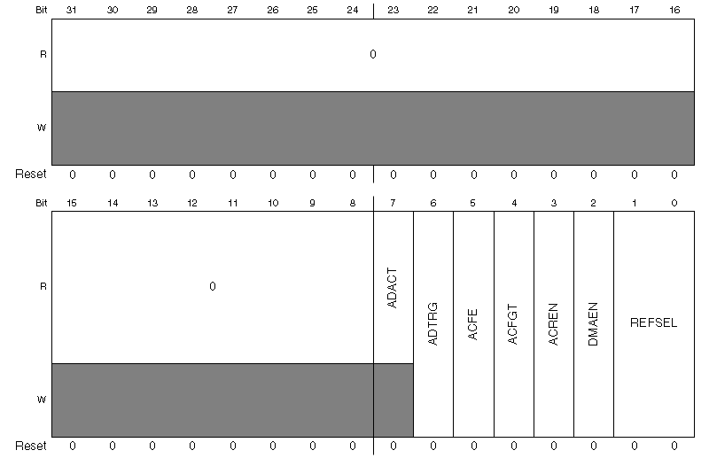

图的最上侧一行表示数据位，可以看到总共32位。每一位都对应一列。第二行表示寄存器可读属性，第三行为可写属性，如果寄存器只读，则可读R一行为白色，可写W一行为灰色，如数据位31-7；如果寄存器可读可写，则两行合并在一起，如数据位6-0。最下面一行为寄存器复位值。

位描述：

| 位            | 描述                                                         |
| ------------- | ------------------------------------------------------------ |
| 31-8 Reserved | 这些位为只读保留位，各位值始终保持为0.                       |
| 7 ADACT       | 转换执行：ADACT 提示一个转换或者硬件均值计算命令是否正在执行。当转换开始时ADACT 被置为1，当转换完成或者中断时，ADACT 就会被置0。 0 转换没有在执行。 1 转换正在执行。 |
| 6 ADTRG       | 转换触发选择：ADTRG 选择触发类型用于开始一个转换操作。两个触发类型都是可选择的：软件触发和硬件触发。当选择软件触发时，转换就会随着SC1A的写操作后开始执行。当选择硬件触发时，在ADHWTSn 输入脉冲之后，根据ADHWT输入的assertion，转换就会开始执行。 0 选择软件触发。 1 选择硬件触发。 |
| 5 ACFE        | 比较功能使能：ACFE 使能比较功能。 0 比较功能禁止。 1 比较功能使能。 |
| 4 ACFGT       | 比较功能比使能功能更多： 基于ACREN 的值，ACFGT 配置比较功能来检查转换的结果与比较值寄存器CV1和CV2之间的关系。为了使ACFGT有效，ACFE 位必须置位。 0 配置检测到小于阈值，在范围之外不包含边界，在范围之内不包含边界，具体功能需根据CV1 和CV2 寄存器中的值。 1 配置检测到大于等于阈值，在范围之外包含边界，在范围之内包含边界，具体功能根据CV1 和CV2 寄存器中的值。 |
| 3 ACREN       | 比较功能区域使能：ACREN 配置比较功能用于检查被监控的输入的转换结果是否介于CV1和CV2由ACFGT的值所决定的范围之间。ACFE 位必须置位以保证ACFGT 有效。 0 区域功能禁止。只有比较值1 寄存器CV1做比较。 1 区域功能使能。比较值寄存器CV1 与CV2 都做比较。 |
| 2 DNAEN       | DMA 使能： 0 DMA 禁止。 1 DMA 使能，同时在ADC 转换完成期间会维持ADC的DMA（直接存储器读取）请求（当任何一个SC1n[COCO]标志被断言（asserted））。 |
| 1-0 REFSEL    | 参考电压选择：REFSEL 位选择用于转换的参考电压源。 00 默认的电压引脚对（外部引脚VREFH 和VREFL）。 01 可选的参考电压对（VALTH和VALTL）。这对电压对可能是附加的外部引脚或者是基于MCU 配置的内部电压源。 10 保留。 11 保留。 |

### 35.3.7 状态控制寄存器3（ADCx\_SC3）

SC3 寄存器控制ADC 模块的校对、持续转换、硬件计算均值功能。

- 地址：ADC0_SC3—4003_B000h 基址+24h 偏移量=4003_B024h

- ADC1_SC3—400B_B000h 基址+24h 偏移量=400B_B024h

位描述：

| 位            | 描述                                                         |
| ------------- | ------------------------------------------------------------ |
| 31-8 Reserved | 这些位为只读保留位，各位值始终保持为0.                       |
| 7 CAL         | 校对：置位后CAL 就开始校对过程。校对在进行的时候该位保持为1，当校对过程完成之后该位清零。必须检查CALF 位来确定校对过程的结果是否正确。一旦开始，校对的操作不能被寄存器写操作中断否则结果失效并且CALF位置位。设置CAL位可以取消当前的任何转换。 |
| 6 CALF        | 校对失败标记： CALF 会显示校对过程的结果。如果SC2[ADTRG]=1 时，或者任何ADC寄存器在进行写操作，或者是在校对过程完成之前有停止模式进入时，校对过程会失败。对该位写1，可以清除该位。 0 校对正常完成。 1 校对失败。即ADC的转换准确度无法保证。 |
| 5-4 保留      | 为只读保留位，各位保持值为0                                  |
| 3 ADCO        | 持续转换使能：ADCO 使能持续转换。 0 如果硬件计算均值使能（AVGE=1），在开始转换之后将进行一个转换或者一组转换。 1 如果硬件计算均值使能（AVGE=1），在开始一个转换之后则有持续的转换和多组转换。 |
| 2 AVGE        | 硬件计算均值使能：AVGE 使能ADC 的硬件计算均值功能。 0 硬件计算均值功能禁止。 1 硬件计算均值功能使能。 |
| 1-0 AVGS      | 硬件计算均值选择：AVGS 决定多少ADC 转换的值求平均得到ADC 的均值。 00 4 个采样均值。 01 8 个采样均值。 10 16 个采样均值。 11 32 个采样均值。 |

### 35.3.8 ADC偏移量修正寄存器（ADCx\_OFS）

ADC偏移校正寄存器(OFS)包含用户选择或校准生成的偏移误差修正值。该寄存器是一个二进制补码、左对齐、16 位的值。从转换中减去OFS中的值，结果被转移到结果寄存器Rn。如果结果大于最大值或小于最小值，就会被强制转换成适合当前操作模式的值。

- 地址：ADC0\_OFS—4003\_B000h 基址+28h 偏移量=4003\_B028h

- ADC1\_OFS—400B\_B000h 基址+28h 偏移量=400B\_B028h

| 位         | 描述                       |
| ---------- | -------------------------- |
| 31-16 保留 | 保留为只读位，保持各位为0. |
| 15-0 OFS   | 偏移量误差修正值           |

### 35.3.9 ADC正向增益寄存器（ADCx\_PG）

正向增益寄存器带有累加误差修正机制，不论是差分模式的正向输入或单端模式

的全体转换。PG 是以16 位实数二进制形式出现，它是一个增益调整因子，在

ADPG15 与ADPG14 之间带有小数点。用户必须根据校对过程中描述的值对寄存器进行写操作，否则累加误差准确度达不到要求。

- 地址：ADC0\_PG—4003\_B000h 基址+2Ch 偏移量=4003\_B02Ch

- ADC1\_PG—400B\_B000h 基址+2Ch 偏移量=400B\_B02Ch

| 位         | 描述                       |
| ---------- | -------------------------- |
| 31-16 保留 | 保留为只读位，保持各位为0. |
| 15-0 PG    | 正向增益                   |

### 35.3.10 ADC负向增益寄存器（ADCx\_MG）

对于差分模式下的负向输入，负向增益寄存器（MG）带有累加误差修正机制。在单端模式下该寄存器无效。MG 是一个以二进制形式存在的16 位实数，它是一个增益调整因子，在ADMG15 和ADMG14 之间有小数点。用户必须根据校对过程中描述的值对寄存器进行写操作，否则累加误差精确度达不到要求。

- 地址：ADC0\_MG—4003\_B000h 基址+30h 偏移量=4003\_B030h

- ADC1\_MG—4003\_B000h 基址+30h 偏移量=400B\_B030h

  

位

描述

31-16 保留

保留为只读位，保持各位为0.

15-0 MG

负向增益

### 35.3.11 ADC正向增益通用校验值寄存器（ADCx\_CLPD）

正向增益通用校验值寄存器中有校验信息，这些信息是由校验功能产生的。这些寄存器带有七个不同宽度的校验值：CLP0\[5:0\]，CLP1\[6:0\]，CLP2\[7:0\]，CLP3\[8:0\]，CLP4\[9:0\]，CLPS\[5:0\]，CLPD\[5:0\]。一旦自校验次序确定（即CAL 被清零），CLPx 会自动置位。校验之后用户对这些寄存器进行写操作可能会导致线性度误差规范可能无法满足。

地址：ADC0\_CLPD —4003\_B000h 基址+34h 偏移量=4003\_B034h

ADC1\_CLPD —400B\_B000h 基址+34h 偏移量=400B\_B034h

  

位

描述

31-6 保留

保留为只读位，保持各位为0.

5-0 CLPD

校验值

35.3.12 ADC正向增益通用校验值寄存器（ADCx\_CLPS）

更多的信息可以查阅CLPD 寄存器描述。

地址：ADC0\_CLPS—4003\_B000h 基址+38h 偏移量=4003\_B038h

ADC0\_CLPS—4003\_B000h 基址+38h 偏移量=4003\_B038h

  

位

描述

31-6 保留

保留为只读位，保持各位为0.

5-0 CLPS

校验值

35.3.13 ADC正向增益通用校验值寄存器（ADCx\_CLP4）

同CLPD描述，寄存器说明同上，10位校验值

地址：ADC0\_CLP4—4003\_B000h 基址+3Ch 偏移量=4003\_B03h

ADC1\_CLP4—400B\_B000h 基址+3Ch 偏移量=400B\_B03h

35.3.14 （ADCx\_CLP3）——9位校验值，其余同上

地址：ADC0\_CLP3—4003\_B000h 基址+40h 偏移量=4003\_B040h

ADC1\_CLP3—400B\_B000h 基址+40h 偏移量=400B\_B040h

35.3.15 （ADCx\_CLP2）——8位校验值

地址：ADC0\_CLP2—4003\_B000h 基址+44h 偏移量=4003\_B044h

ADC1\_CLP3—400B\_B000h 基址+44h 偏移量=400B\_B040h

35.3.16 （ADCx\_CLP1）——7位

地址：ADC0\_CLP1—4003\_B000h 基址+48h 偏移量=4003\_B048h

ADC1\_CLP3—400B\_B000h 基址+48h 偏移量=400B\_B040h

35.3.17 （ADCx\_CLP0）——6位

地址：ADC0\_CLP0—4003\_B000h 基址+4Ch 偏移量=4003\_B04Ch

ADC1\_CLP0—400B\_B000h 基址+40h 偏移量=400B\_B040h

35.3.18 ADC PGA寄存器（ADCx\_PGA）

地址：ADC0\_PAG—4003\_B000h 基址+50h 偏移量=4003\_B050h

ADC1\_PAG—400B\_B000h 基址+50h 偏移量=400B\_B050h

ADCx\_PGA 各位功能描述

  

位

描述

31-24 保留

这些位为只读保留位，保持各位值为0

23 PGAEN

PGA 使能：-
0 PGA 禁用。-

1 PGA 使能。

22 保留

该位为只读保留位，保持值为0

21 保留

只写保留位，不可读

20 PGALPb

PGA 低功耗控制-
0 PGA 在低功耗下运行-

1 PGA 在正常模式下运行

19-16 PGAG

PGA 增益设置：-
PGA 增益\=2^(PGAG)-

0000 1-

0001 2-

0010 4-

0011 8-

0100 16-

0101 32-

0110 64-

0111 Reserved-

1000 Reserved-

1001 Reserved-

1010 Reserved-

1011 Reserved-

1100 Reserved-

1101 Reserved-

1110 Reserved-

1111 Reserved

15 -0 保留

这些位为只读保留位，保持值为0

35.3.19 ADC负向增益通用校验值寄存器（ADCx\_CLMD）

CLMx 存有校验功能产生的校验信息。他们带有七个不同宽度的校验值：CLM0\[5:0\]，CLM1\[6:0\]，CLM2\[7:0\]，CLM3\[8:0\]，CLM4\[9:0\]，CLMS\[5:0\]，CLMD\[5:0\]。一旦自动校验过程完成（CAL 被清除），CLMx 就会自动置位。校验之后用户对这些寄存器进行写操作可能会导致线性度误差规范可能无法满足。

地址：ADC0\_CLMD—4003\_B000h 基址+54h 偏移量=4003\_B054h

ADC1\_CLMD—400B\_B000h 基址+54h 偏移量=400B\_B054h

  

位

描述

31-6 保留

保留为只读位，保持各位为0.

5-0 CLMD

校验值

35.3.20 （ADCx\_CLMS）——同上，注意偏移地址

35.3.21（ADCx\_CLM4）——同上

35.3.22 （ADCx\_CLM3）——同上

35.3.23 （ADCx\_CLM2）——同上

35.3.24 （ADCx\_CLM1）——同上

35.3.25 （ADCx\_CLM0）——同上

## 35.4 功能性描述（功能的概括和总结！）

在复位、低功耗停止模式或者是当SC1n 中的ADCH 各位都为高时，ADC模块是禁止的，详细信息可查看电源管理信息。在一个转换完成之后另一个转换还没有初始化之前ADC 模块是空闲的。当ADC 空闲时，异步时钟输出使能禁止或CFG2\[ADACKEN\]=0。此时模块处于最低功耗状态。一旦软件选定通道，ADC 能够执行模拟到数字的转换操作，所有的模式根据线性逐次逼近算法执行转换操作。

为了符合精确定位的要求，ADC 模块必须通过芯片校对功能进行校对。更多详细信息查看校对功能。

当转换完成之后，结果保存在数据寄存器Rn中。如果中断已经使能（或SC1n\[AIEN\]=1），当各自转换完成，他们各自的转换完成位SC1n\[COCO\]置位，中断产生。

ADC 模块会自动将转换的结果与比较值寄存器CV1和CV2中的值做比较。通过设置SC2\[ACFE\] 位再进行任何带有转换模式和执行配置的操作，可以使能比较功能。

ADC 模块有自动将多次转换的结果求均值的功能。通过设置AVGE 位再进行任何转换模式和执行配置操作可以使能硬件计算均值功能。

注意：对于利用芯片具体操作模式，涉及到MCU 的电压管理信息。

### 35.4.1 PGA功能描述

在低频信号到达16 位的逐次逼近（SAR） ADC 之前，可编程的增益放大器（PGA）是通过对其进行放大来放大动态范围。放大器的增益区间在1 到64 范围之间（取值为1,2,4,8,16,32,64）。该模块可用于处理电压值为0—1.2V±10mV差分输入和输出。PGA 输出的一般模式是由逐次逼近（Successive Approximation Register） ADC 的要求决定。

PGA 只有一个参考电压对。正电压参考是各个芯片特有的，要根据选择的芯片和MCU 的配置来定。参考地为PGA 的模拟地，参看芯片配置章节查看PGA电压参考的具体信息。PGA 寄存器允许控制PGA 增益和操作模式。

### 35.4.2 时钟选择和分配控制

四个时钟源的一个都可以作为ADC 模块的时钟源。选择时钟源之后根据配置值分频产生转换器的输入时钟（ADCK）。通过CFG1\[ADICLK\] 位可以选择以下时钟源：

 ·总线时钟。这是默认选择。

 ·总线时钟二分频。为了得到更高的总线时钟频率，通过设置CFG1\[ADVI\] 位，最大可以使总线时钟16 分频。

 ·ALTCLK，是根据MCU 定义的。涉及到芯片配置信息。

 ·异步时钟（ADACK）。该时钟是产生于ADC 模块中的一个时钟源。当选择异步时钟源时，不要求时钟先于转换开始使能。当上述情况发生时（CFG2\[ADACKEN\]=0），异步时钟在转换开始时使能，转换结束时关闭。在这种情况下，每次时钟源的重新激活都有一个相关的时钟启动延迟。为了防止因ADACK 时钟启动延迟而出现的转换时间的差异性，可以设置CFG2\[ADACKEN\]=1，在使用ADACK 时钟源初始化任何转换之前，最坏情况等待5us 启动时间。当MCU 在正常停止模式下，ADACK 作为输入时钟源时，转换也是可能的。具体可以参看Power Control查看更多细节。

不管选择哪种时钟，时钟的频率必须为下降到ADCK 要求的频率区域内。如果有效时钟太慢，ADC 可能不按照规定的条件运行。如果有效时钟太快，时钟必须分频到合适的频率。分频是由CFG1\[ADIV\] 各位确定的，如1 分频，2 分频，4分频或8 分频。

### 35.4.3 参考电压选择（前面都已经介绍过，这里又进行了一次总结）

ADC 可以被配置为接受两个参考电压对中的一对作为参考电压（VREFSH和VREFSL）进行转换操作。每对都带有一个positive参考电压，它的值必须在最小高电压参考与VDDA 之间。同时参考地必须与VSSA 相同电压大小。这两对参考电压分别为外部参考电压（VREFH和VREFL）和可选参考电压（VALTH 和VALTL）。这些参考电压是通过寄存器SC2中的REFSL 位来选择的。可选参考电压对（VALTH 和VALTL）可能选择额外的外部引脚或内部资源，这个要根据MCU 的配置来定。参看MCU 关于参考电压芯片配置的信息。

### 35.4.4 硬件触发和软件触发选择

ADC 模块有一个可选择的异步硬件转换触发器ADHWT，当SC2\[ADTRG\] 置位以及硬件触发器选择的事件ADHWTSn发生后，它就会被使能。该功能并不是在所有的MCU 中都有效。关于ADHW 的信息以及对MCU ADHWTSn 配置细节可以查阅芯片配置章节。

当一个ADHWT 源有效且硬件触发器使能（SC2\[ADTRG\]=1）时，当硬件触发器选择事件ADHWTSn发生后，在ADHWT 的上升沿转换就会开始一次转换。当一个转换操作正在执行时，在上升沿有一个触发操作时，该上升沿被视为无效。在持续转换配置中，只有初始的上升沿持续转换操作才会被追踪。在初始化该转换的同一个ADC

状态控制寄存器SCn下，ADC 会持续执行转换操作，直到转换终止。硬件触发功能操作与任何转换模式和配置信息都是息息相关的。

硬件触发选择事件（ADHWTSn）必须在接收到ADHWT 信号之前设置。如果不能达到该要求，转换器可能会忽视触发器或使用错误的配置信息。如果在转换操作执行时硬件触发选择的事件生效（is asserted），它必须等待当前转换完成，直到接收到ADHWT 信号开始一个新的转换操作都保持着置位状态。转换的通道和状态位的选择要根据有效的触发选择信号（ADHWTSA 有效（active）时选择 SC1A;ADHWTSn有效时选择 SC1n）。

注意：在同一时间生效多个硬件触发选择信号(ADHWTSn)会导致未知结果。为了避免这种情况的发生，在下一个预期转换之前只选择一个硬件触发信号(ADHWTSn)。

当转换完成之后，结果保存在数据寄存器Rn中，它与ADHWSn 接受位相关，比如ADHWTSA有效时选择RA寄存器，ADHWTSn有效时选择Rn寄存器。

与ADHWTSn相关联的转换完成标志（SC1n\[COCO\]）置位，如果启用了相应的转换完成中断（SC1\[AIEN\]=1）时，就会产生一个中断。

## 35.4.5 转换控制

可以按照CFG1\[MODE\]描述的CFG1\[MODE\]位和SC1n\[DIFF\]位来执行转换操作。转换可以由软件或者硬件触发方式发起（initiate）。除此之外，ADC 模块可以配置成低功耗工作模式，长时间采样，持续转换，硬件均值和自动转换值比较（将转换结果的自动比较结果与软件的比较值进行比较）的模式。

### 35.4.5.1 启动转换

在以下情况下转换可以启动：

 如果选择了软件触发操作(SC2\[ADTRG\]=0)，此时对SC1A 寄存器进行写操作(同时SC1n\[ADCH\] 各位不全为1)。

 选择了硬件触发操作（SC2\[ADTRG\]=1）以及硬件触发事件ADHWTSn已经发生之后，有一个硬件触发或ADHWT事件可以启动转换。通道和状态位的选择依赖于选择有效触发信号（ADHWTSA有效选择SC1A，ADHWTSn有效选择SC1n，如果两个都无效，则选择了关闭的情况）。

注意：在同一时间选择多个硬件触发选择信号(ADHWTSn)会导致未知结果。为了避免这种情况的发生，一次转换完成前只选择一个硬件触发信号(ADHWTSn)。

在启用连续转换时（即ADCO=1），将结果转移到数据寄存器。

如果持续转换使能，当前的转换完成之后，一个新的转换会自动执行。在软件触发操作模式下（ADTRG=0），当对SC1 寄存器写操作完成之后，持续转换就会开始执行直到打断终止。在硬件触发模式下（ADTRG=1 同时有一个ADHWTSn 事件发生），硬件触发事件之后，持续转换就会开始执行并一直持续直到它终止。

当硬件计算均值功能使能时，当前转换完成之后就会自动开始一个新的转换直到正确数量的转换完成。在软件触发模式下，当对寄存器SC1A 写操作完成之后转换就会开始。在硬件触发模式下，当一个硬件触发之后，转换就会开始。如果还启用了持续转换，当一组中的最后一个转换完成之后就会对开始一组新的转换并求均值。

### 35.4.5.2 完成转换

当转换结果送到数据结果寄存器Rn中转换就完成了。如果比较功能禁止，可以通过SC1n 寄存器中的COCO 位来查看转换是否完成。如果硬件均值使能，只有当最后一个转换完成之后SC1n\[COCO\] 才会置位。当比较功能使能时，只有当比较条件是真的时候，SC1n\[COCO\] 位才会置位，同时转换结果会被传输。如果硬件计算均值和比较功能都使能，只有当最后一个转换完成同时比较条件是真时，SC1n\[COCO\] 位才会置位。当各自的SC1n\[COCO\] 位置位的同时SC1n\[AIEN\] 位为高时，就会产生一个中断。

### 35.4.5.3 取消转换

以下情况都会取消转换操作：

· 当SC1A 正在控制一个转换时，对它进行写操作，会取消当前转换。在软件触发模式下（SC2\[ADTRG\]=0），对SC1A 寄存器进行写操作会启动一个新的转换（如果在SC1A 中的ADCH 位是等于一个不全为1 的值）。

·当SC1B—SC1n寄存器正在控制转换时，对相应的SC1B—SC1n寄存器进行写操作就会取消当前转换操作。SC1(B-n)寄存器不能用在软件触发操作模式下，因此对其进行写操作不会引发一个新的转换操作。

·对包括了SC1A—SC1n 之内的所有的ADC 寄存器进行写操作会终止转换。这说明操作模式已经发生了改变，因此当前转换就被视为无效了。

· MCU 复位或者进入了低功耗停止模式会中断转换。

· MCU 进入了正常停止模式且ADACK 没有使能会中断转换。

当一个转换被取消时，数据寄存器Rn中的内容不会改变。当最后一个转换操作成功完成之后，数据寄存器才会继续结果值的传输。如果转换被复位或者低功耗停止模式取消，RA 和Rn 就会回到他们复位时的状态。

### 35.4.5.4 电源控制

ADC 模块会一直保持空闲状态直到转换操作开始。如果选择了ADACK 作为转换时钟源，但异步时钟输出禁止（CFG2\[ADACKEN\]=0），ADACK 时钟发生器也会保持空闲状态（关闭状态）直到有新的转换启动。如果异步时钟输出有效（ADACKEN=1），不管ADC 是处于什么状态或MCU 处于什么功耗模式它都有效。当ADC 在有效时，可以设置CFG1\[ADLPC\] 来减少电源的消耗。这样会产生一个更低的fADCK最大值。

### 35.4.5.5 采样时间和总的转换时间

对于一个短采样（CFG1\[ADLSMP\]=0），会在第一次转换采样的4 个ADCK 周期的基础之上再加上2 个额外的采样周期。对于高速转换（CFG2\[ADHSC\]=1），任何转换都会额外增加2 个采样周期。下表总结了ADC 配置可能的采样时间。

表略。具体参看数据手册-

  

ADC配置

采样周期（ADCK周期）

CFG1\[ADLSM\]

CFG2\[ADLSTS\]

CFG2\[ADHSC\]

第一次或单次采样

随后的

0

X

0

6

4

转换的总时间依赖于：采样时间（由CFG1\[ADLSMP\]位和CFG2\[ADLSTS\] 位决定）；MCU总线频率；转换模式（由CFG1\[MODE\] 和SC1n\[DIFF\] 位决定）;高速配置（CFG2\[ADHSC\] 位）;转换时钟频率（fADCK）。

CFG2\[ADHSC\] 位用于配置一个更高的时钟输入频率，它可以加快转换的速率。为了达到内部ADC操作时间的需要，ADHSC增加了额外的ADCK周期。当ADHSC=1，转换要多花费2 个ADCK 的周期。ADHSC=0，当ADCLK 速率超过了最小时间时，就要用到ADHSC。

当模块使能时，采样输入就会开始。1.ADLSMP 和ADLSTS 会根据所选的转换模式来选择采样的次数。2.当采样完成之后，转换器就会与输入通道分离开来，同时线性逐次逼近算法开始执行，它可以决定模拟信号的数值。3.当转换算法完成之后，转换结果会传输到寄存器Rn 中。

如果总线频率比fADCK 小，当短采样使能（ADLSMP=0）时，不能保证持续转换操作的精确采样时间。

最大的转换时间是与所选的时钟源和所选分频有关。通过ADICLK 位可以对时钟源进行选择，分频是由ADIV 位确定的。

下面的方程给出了适合所有配置的最大转换时间。从下面的一系列表中可以得到方程中不同的变量参考值。

ConversionTime = SFCAdder + AverageNum \*（BCT + LSTAdder + HSCAdder）

表35-107为单次转换或持续转换中的第一次转换的时间（SFCAdder）

  

CFG1

\[ADLSMP\]

CFG2

\[ADACKEN\]

CFG1

\[ADICLK\]

单次转换或持续转换中的第一次转换的时间（SFCAdder）

1

x

0x，10

3个ADCK周期+5个总线时钟周期

1

1

11

3个ADCK周期+5个总线时钟周期

1

0

11

5μs+3个ADCK周期+5个总线时钟周期

0

x

0x，10

5个ADCK周期+5个总线时钟周期

0

1

11

5个ADCK周期+5个总线时钟周期

0

0

11

5μs+5个ADCK周期+5个总线时钟周期

表中标红部分的时间前提需要保证CFG2\[ADACKEN\]必须在转换启动前至少5us已经置1。

表35-108为均值因子（AverageNum）

表浅显易懂，请参看数据手册对应之处。

表35-109 为基本转换时间（BCT）

略

表35-110 长采样额外时间（LSTAdder）

略

表35-111 高速转换额外时间（HSCAdder）

略

注：ADCK 频率必须在fADCK 的最小和最大之间以满足ADC 的精度要求。

### 35.4.5.6 转换时间实例（帮助理解上面的转换时间公式）

#### 35.4.5.6.1 典型转换时间配置

一个典型的ADC转换配置是：10位精度，输入时钟源选择为总线时钟；输入时钟不分频；总线时钟为8MHz；关闭长采样时间；高速转换关闭；

下表计算了单次采样时间

  

变量

时间

SFCAdder

5个ADCK周期+5个总线时钟周期

AverageNum

1

BCT

20个ADCK周期

LSTAdder

0

HSCAdder

0

变量参数具体对照请参看上面的一系列表格。可以得出，对于总线时钟和ADCK频率都是8MHz的ADC来说，转换时间需要3.75μs。

#### 35.4.6.2 长转换时间配置

一个长转换ADC配置是：16位差分模式，输入时钟选择为总线时钟；输入时钟8分频；总线时钟为8MHz；长采样时间使能；配置为最长额外采样时间；高速转换禁止；32次均值转换使能；

表略。

计算出一次转换时间是57.625μs，共采样32次，因此总转换时间为1.844ms。

#### 35.4.6.3 短转换时间配置

配置略，表略

计算出转换时间为1.45μs。

#### 35.4.5.7 硬件均值功能

硬件计算均值功能使能时（SC3\[ACGE\]=1），可以利用它来求多次转换的均值。转换数量是由AVGS\[1:0\]位决定的，可以选择4，8，16，32 个转换数来求均值。当硬件计算均值正在处理时，SC2\[ADACT\] 位置位。

当选择的输入值进行采样和转换完成之后，会对放置在累加器中的结果进行求均值操作。当选择了硬件计算均值时，单次转换完成之后不会置位SC1n\[COCO\] 位。

如果比较功能禁止、或者比较结果是True的话，当选择数量的转换完成之后，平均转换结果会存到数据结果寄存器Rn 中，且SC1n\[COCO\] 位置位。当ADC 模块中断使能时（SC1n\[AIEN\]=1），当COCO 位置位之后，就会产生一个ADC 的中断。

注意：当MCU 处于等待或者正常停止模式时，硬件计算均值功能能够在通道中执

行转换操作。如果SC1n\[AIEN\]位已经置位，当硬件计算均值操作完成之后，ADC

中断就会唤醒MCU。

## 35.4.6 自动比较功能

比较功能可以检查转换的结果与一个比较值相比是小于、大于还是等于或者看结果在两个比较值区间之内还是之外。比较模式是由SC2\[ACFGT\]，SC2\[ACREN\]，比较值寄存器CV1和CV2中的值共同决定的。当输入值经过采样转换之后获得的值，CV1和CV2比较值的作用在下表中描述了。在下表中给出了6 种比较模式。

  

ACFGT

ACREN

ADCCV1与ADCCV2的关系

功能

比较功能的描述

0

0

比阈值小

如果结果比CV1寄存器中的值小，比较结果为真

1

0

大于或等于阈值

如果结果大于或等于CV1中的值则比较结果为真

0

1

小于或等于

超出区域范围，不包括边界

如果结果比CV1小或比CV2大则为真

0

1

大于

在区域内，不包括边界

如果结果比CV1小且比CV2大则为真

1

1

小于或等于

在区域内，包括边界

如果结果大于等于CV1且小于等于CV2则为真

1

1

大于

在区域外，包括边界

如果结果大于等于CV1的值或者小于等于CV2的值则为真

当SC2\[ADCREN\]=1时，如果CV1 中的值小于或等于CV2 中的值，置位SC2\[ACFGT\] 位，会选择触发包含端点的内部区域比较功能。清除ACFGT会选择触发外部比较区域功能，但是不包含端点；如果CV1 中的值比CV2 中的值大，置位ACFGT 位选择触发外部比较区域，且包含端点值功能。清除ACFGT 位会选择内部比较区域，不包含端点功能。

如果选择的情况计算值为真，SC1n\[COCO\] 置位。

当转换完成并且比较功能使能，如果比较条件为假，COCO 不会置位，转换结果的值不会传输到结果寄存器Rn中。如果硬件均值功能使能，比较功能模块会将均值与比较值做比较。同样的比较功能定义也适用。如果ADC 中断使能且当COCO 置位之后会产生一个ADC 中断。

注意：当MCU 处于等待或正常停止模式，比较功能可以检测通道中的电压。当比较条件为真时，ADC 中断会唤醒MCU。-

## 35.4.7 校准功能

ADC提供了一种自校准功能来确保转换精度。在任何复位后且在转换启动前，校准必须运行，或有效的校准值写入。校对功能设置了偏移校对值，负向校对值和正向校对值。偏移校对值会自动存放在ADC 偏移纠正寄存器（OFS）中，正向和负向校对值会自动存放到ADC正向和负向校对寄存器（CLPx 和CLMx）中。在校对之前用户必须正确配置ADC 模块，在校对功能完成之后必须产生正向和负向增益校准值并存到ADC正向增益寄存器（PG）中。

在校对之前，用户必须根据时钟源的需求，配置ADC 时钟源和频率，低功耗配置，参考电压选择，采样时间和高速配置。如果应用程序要使用很多种配置的ADC，必须选择高精确度的配置，或者根据不同的配置条件选择不同的校对方式。如果想要最好的校对结果，推荐设置硬件计算均值选择位取最大值（即SC3\[AVGE\]=1,SC3\[AVGS\]=11，取均值32），ADC 时钟频率fADCK 小于或等于4MHz，VREFH=VDDA，在正常的电压和温度下校对。

在校对期间，输入通道、持续转换功能、比较功能、分辨率模式、单端/差分模式全部都是无效的。

如果SC3\[ADTRG\]=0，当用户设置SC3\[CAL\]位，校对工作就会自动启动。如果SC3\[ADTRG\]=1，SC3\[CAL\] 位不会置位，而SC3\[CALF\]会置位。当校对有效时，ADC 寄存器不能进行写操作且不能进入停止模式，否则校对的路径就会出错导致SC3\[CAL\] 位清除同时SC3\[CALF\] 位置位。校对序列结束时，SC1n中的COCO 位置位。校对过程结束时，SC1n\[AIEN\] 位可以引发中断的发生。如果校对结束时CALF 位没有置位，就说明自动校对成功完成。

为了完成校对，用户通过以下步骤来生成增益的校对值：

1\. 在RAM 中初始化一个16 位变量。

2\. 将正向增益校对的结果CLP0，CLP1，CLP2，CLP3，CLP4，和CLPS存到该变量所在区域。

3\. 将该区域分成两部分。

4\. 设置变量的MSB。

5\. 开始的两个步骤可以通过设置移位来完成，高字节的位循环向右移，低字节位也重复这个步骤。

6\. 将值存到正向增益寄存器（PG）中。

7\. 对于负向增益的值处理步骤也是一样的。

当上述步骤完成之后，用户就可以按照ADC 的需求重新配置。如果需要，通过清除和再次设置SC3\[CAL\] 位可以执行第二次校验。

校验的所有步骤可能要花费14K 个ADCK 周期和100 个总线周期，这个要看结果和时钟源的选择。对于一个8MHz 的时钟源，大概要1.7ms。为了减少校对花费的时间，校对值（偏置值、正向增益、负向增益、正向校对值、负向校对值）可以在启动校对之后和恢复到第一次转换之前存进Flash 中。这样使得校验等待时间减少，使得20 个寄存器就可以存储所有在低功耗，复位或者低功耗停止模式恢复时的操作。

## 35.4.8 用户定义偏移功能

ADC 偏移纠正寄存器OFS含有用户选择或校对生成纠正偏移错误后的值。该寄存器以二进制补码、左对齐格式存储。在偏移纠正寄存器中的值是由转换值相减得到的，结果的值会传输到结果寄存器Rn中。如果得到的结果比最大值要大或者比最小值还小，就会强制根据当前的操作模式调整到适当的限制。

ADC 偏移纠正寄存器的组成与数据结果寄存器是不同的，这是为了在忽视所选的转换模式条件下对校验值的更新进行保护。在低功耗更新模式下，低位会被忽视。例如，在8 位单端模式下，OFS\[14:7\]与D\[7:0\]相减。OFS\[15\]位显示符号位，OFS\[6:0\]被忽视。同样的位也用在9 位的差分模式下，OFS\[15\]显示符号位，映射到D\[8\]位。对于16 位的差分模式，所有的OFS\[15:0\]位直接与转换结果数据D\[15:0\]中相减。在16 位的单端模式下，在偏移纠正寄存器OFS中没有一位是与信号结果最不重要的结果D\[0\]相对应的，因此奇数值（-1 或者1 等等）是不能从结果中扣除的。

一旦自校验过程完成之后（SC3\[CAL\] 清除），OFS 会根据校验要求自动置位。如果用户需要，可以对OFS 进行写操作，将之前的校验结果覆盖掉。如果用户将一个不是校验值的数据写到偏移量纠正寄存器中，ADC 误差定位可能不能达到之前的要求。推荐将校验产生的值在用户写之前存到存储器中。

注意：用户可以通过设置，有效地限制偏移量的值。如果偏移量过大，转换结果会超出极限值。

偏移校对功能在用户移除偏移量或者DC 偏移值的时候使用。偏移纠正寄存器，OFS 可以在二进制补码形式下写一个数，偏移量可以直接从结果或硬件均值结果中扣除。为了增加偏移，在二进制补码形式下存储负偏移量就可以增加偏移。导致超出范围的偏移纠正将会被强制在最大和最小值之间（单端转换最小值为0x0000;差分转换是0x8000）。

为了保证精确度，存储在OFS 寄存器中的校对偏移值必须增加到用户定义的偏移中。在操作期间也许会不断改变偏移，所以建议把原始的偏移校对值放在flash 中，以至于它可以被恢复并且增加到存储在OFS 寄存器中的任何用户偏移调整值和总数当中。

## 35.4.9 温度传感器

ADC 模块包含一个温度传感器，它的输出信号接在一个ADC 模拟量输入通道上。温度计算公式见数据手册。

其中：Vtemp 是测量的外界温度的电压值，Vtemp25 是25 度时对应的电压值，m 为电压相对温度的比值(V/°C)。

在进行温度计算时可以利用Vtemp25 与m 的对应表。

用户读取温度传感器通道，计算VTEMP,比较VTEMP25。如果VTEMP 大于VTEMP25，冷斜率值被运用到之前的方程中。如果VTEMP 小于VTEMP25，热斜率值被运用到之前的方程中。

如果想要知道详细的使用方式，可以看名为Temperature Sensor for the HCS08 Microcontroller Family（document AN3031）。

## 35.4.10 MCU等待模式

等待模式使MCU 处于更低功耗的待机模式，待机模式的恢复非常快，因为时钟源保持使能状态。如果正在进行转换时MCU 进入等待模式，那么转换会继续直到完成。在MCU 处于等待模式时，通过硬件触发或使能连续转换，可以初始化转换。

处于等待模式时，总线时钟、总线时钟的2 分频和ADACK 都可以作为转换时钟源。在等待模式时，ALTCLK 作为转换时钟源是由该MCU 的ALTCLK 的定义决定的。参考该MCU 中模块说明中关于ALTCLK 说明的信息。

如果比较和硬件计算均值功能禁止且ADC 中断使能（AIEN=1），转换完成事件就会置COCO 位（如果可能，产生一个中断），生成ADC 中断，把MCU从等待模式中唤醒。如果硬件均值使能，当选择的数量的转换完成时，会置COCO位（如果中断使能，还会产生一个中断）。如果比较使能，只有当比较条件满足时，会置COCO 位（如果中断使能，还会产生一个中断）。如果选择了单次转换，比较触发器没有满足，ADC 将回到空闲状态，不能把MCU 从等待模式中唤醒，除非一个新的转换通过硬件触发被开始。

## 35.4.11 MCU正常停止模式

停止模式时MCU 处于低功耗待命状态，此时绝大多数时钟源都被禁止。

### 35.4.11.1 MCU正常停止模式（ADCLK禁用）

如果异步时钟源（ADACK）没有被选为转换时钟，则会执行一个停止指令，停止当前的转换，使得ADC 模块处于空闲状态。ADC 寄存器的内容，包括Rn 不受正常停止模式的影响。当退出正常停止模式时，软件或硬件触发使ADC 恢复转换。

### 35.4.11.2 MCU正常停止模式（ADCLK使能）

如果ADACK 被选为转换时钟，则在正常停止模式时，ADC 模块会继续工作。参考”芯片配置”的一章。

如果在进入正常停止模式时，转换正在进行中，则会继续直到转换完成。当MCU 通过硬件方式触发进入正常停止模式或者使能连续转换时，转换可以被启动。

如果比较功能和硬件计算均值功能禁止，那么此时如果ADC 中断使能的话，转换完成将会置COCO，而且会产生一个中断从正常停止模式中唤醒MCU。结果寄存器将会保存转换结果。如果硬件计算均值功能使能，那么当被选择的转换完成时，COCO 会被置位(如果中断使能，会产生一个中断)。如果比较功能使能，仅当比较条件都满足时COCO 才会被置位（如果中断使能，会产生一个中断）。如果选择了单次转换而且没有使能比较功能，那么ADC 将返回空闲状态，此时将不能从正常停止模式中唤醒MCU，除非有其他的硬件触发一个新的转换。

### 35.4.12 MCU低功耗模式

当MCU 进入低功耗模式时，ADC 模块会自动禁止。所有模块带着各自的复位值都会从低功耗模式退出。因此，这些模块必须从低功耗模式中退出后，重新使能和配置。

注意：对于芯片的特定模式，请参考设备的电源管理信息。

## 35.5 初始化信息

本节给出了初始化和配置ADC 模块的样例。ADC 模块可以配置为16 位、12位、10 位、8 位的单通道转换模式，也可以配置为16 位、13 位、11 位、9 位的差分、单端、连续转换模式。请参考后表。

注：十六进制值由前面的0x指定，由前一个%指定的二进制值，而十进制值没有前面的字符。

### 35.5.1 ADC模块初始化样例

#### 35.5.1.1 初始化顺序

在ADC模块可以用来完成转换之前，必须执行一个初始化过程。一个典型的顺序是:

1.  按照校准功能中的指令校准ADC模块
2.  更新配置寄存器CFG以选择输入时钟源和用于生成ADCK的分频比。该寄存器也用于选择样本时间和低功率配置。
3.  更新状态和控制寄存器2（SC2），选择转换触发模式，硬件或软件触发，以及是否使能比较功能
4.  更新状态和控制寄存器3（SC3），选择持续转换或单次转换模式（ADCO）或硬件均值功能。
5.  更新状态和控制寄存器SC1：SC1n选择转换为单端或差分，并选择是否使能转换完成中断。同时选择需要转换的输入通道。
6.  更新PGA寄存器来选择是否使能PGA，并配置合适的增益。这个寄存器也用来选择电源工作模式，并检查该模块是否是斩波稳定的。

#### 35.5.1.2 伪代码示例

这个示例中，ADC 模块被配置成中断使能，单端10 位转换的低功耗模式，采样时间为长采样时间，通道1 输入，内部时钟源ADCK 为总线时钟的1分频。

CFG1 = 0x98 (%10011000)

Bit 7 ADLPC 1 ，低功耗模式，降低了最快的时钟频率。

Bit 6:5 ADIV 00 ，分频因子1。

Bit 4 ADLSMP 1 ，长采样时间。

Bit 3:2 MODE 10，选择单值10 位转换模式，差分11 位转换模式

Bit 1:0 ADICLK 00 ，选择总线时钟。

SC2 = 0x00 (%00000000)

Bit 7 ADACT 0 ，转换过程中有标志指示。

Bit 6 ADTRG 0 ，软件触发。

Bit 5 ACFE 0，禁止比较功能。

Bit 4 ACFGT 0，此示例中无用。

Bit 3 ACREN 0，比较范围无效。

Bit 2 DMAEN 0，DMA 请求无效。

Bit 1:0 REFSEL 00，选择默认参考引脚对（外部引脚VREFL 和VREFL）。

SC1A = 0x41 (%01000001)

Bit 7 COCO 0 ，转换完成后，表示只读。

Bit 6 AIEN 1 ，转换完成中断使能。

Bit 5 DIFF 0 ，单值转换模式。

Bit 4:0 ADCH 00001 ，输入通道1 作为ADC 输入通道。

RA = 0xxx

保存转换结果。

CV = 0xxx

当比较功能使能时，保存比较结果。

初始化过程框图略

## 35.6 应用信息

本节包括ADC 模块的应用方面的方法，ADC 模块已经集成到那些需要ADC 的嵌入式应用微控制器中。

### 35.6.1 外部引脚

#### 35.6.1.1 模拟供电引脚

ADC 模块拥有不同引脚来引入电源和地（VDDA 和VSSA）。

在部分设备中，当使用独立的引脚时，VDDA 和VSSA 必须连接到同样的电压上作为MCU的数字电源（VDD 和VSS），而且走线时必须保证最大的噪声抵抗力，旁路电容尽量靠近引脚。

在一些设备中VSSA 与数字引脚VSS 共享相同的引脚。

在另一些设备中，VSSA 和VDDA 共享MCU 的数字输入引脚，需要将模拟电源的单独焊盘连接到相应的数字电源，以保持供电之间的隔离性。

如果模拟和数字电源采用不同的电压，则VSSA 引脚之间必须用地连接起来。这一定是唯一地连接地平面，尽可能使VSSA是单点接地。

#### 35.6.1.2 模拟电压参考引脚

除了模拟电源，ADC 模块转换时还需要两个参考电压，VREFSH 和VREFSL。VREFSH是转换的参考高电压，VREFSL 是参考低电压。

ADC 可以为VREFSH 和VREFSL 配置成两对参考电压之一。每对包括一个参考正极和一个参考地。所说的两对参考为外部参考电压（VREFH 和VREFL）和可选参考电压（VALTH 和VALTL）。这些参考电压通过SC2 寄存器中的REFSEL 位来配置。可选参考电压（VALTH 和VALTL）根据MCU 配置要选择额外的外部引脚和内部资源。参考MCU 参考电压的芯片配置信息。

在一些封装中，外部参考电压和可选参考电压分别连接到VDDA 和VSSA。其中一个正参考会与VDDA 共用引脚，而参考地会与VSSA 共用引脚。

如果外部有效，则有效参考电压就可以连接到外部电压上用作VDDA，或者被外部电压驱动在最小参考高电压和有效VDDA 之间的一个电平（VREFH 永远不要超过VDDA）。将参考地连接到同一有效电压上作为VSSA。参考电压对走线时必须保证最大的噪声抵抗力，旁路电容尽量靠近引脚。

通过VREFH和VREFL环路，在每个逐次逼近转换步骤中，电流以电流峰值的形式向电容器阵列提供电荷。满足当前需求的最好的外部元件是一个具有良好高频特性的0.1 μF电容器。该电容器连接在VREFH和VREFL之间，并且必须尽可能靠近包引脚。由于电流引起的电压下降可能导致转换错误，所以不建议在路径上放置电阻。在这条路上的电感必须是最小的，也就是寄生的。

#### 35.6.1.3 模拟输入引脚

外部模拟输入引脚与数字I/O 引脚复用。经验表明，电容在提高模拟信号输入的抗噪声上很有用，0.01uf 的电容在抑制高频噪声上很重要。但是这些电容并不是在所有情况下都需要，但是一旦需要，必须将它靠近芯片引脚。

对合适的转换，输入电压必须在VREFH 和VREFL 之间。如果输入电压等于或超过VREDH，转换电路将转换成0xFFF（12 位）、0x3FF（10 位）、0xFF（8 位）。如果输-

入电压低于或等于VREDL，则转换结果均为0x000。输入电压在VREFH 和VREFL 之

间，转换结果呈线性变化。当采样电容充电时，有一个与VREFL有关的简单电流。

为了使电流注入所造成的精度损失最小，与模拟输入引脚相邻的引脚不能在转换过程中发生变化。

### 35.6.2 错误源

#### 35.6.2.1 采样误差

为了转换正确，采样时间必须足够长，这样才能保证结果的正确。

采样公式见数据手册

其中：

RAS=外部模拟信号源电阻。

SC=采样窗口的ADCK 周期个数。

CADIN=内部ADC 输入电容值。

NUMTAU=-ln(LSBERR/2N)。

LSBERR=LSB 方式的采样误差可接受值。

N=8（8 位模式），10（10 位模式），12（12 位模式）和16（16 位模式）。

通过设置ADLSMP 和改变ADLSTS 位，或者降低ADCK 的频率来增加采样时间，可以提高采样精度。

#### 35.6.2.2 引脚泄露误差

如果外部模拟信号源阻值RAS 很高，那么I/O 引脚泄露会导致转换错误。如果这种误差无法被容忍，则确保RAS 低于VREFH/(4\*ILEAK\*2N),从而少于1/4 LSB 泄露错误（N=8（8 位模式），10（10 位模式），12（12 位模式）和16（16 位模式）。

#### 35.6.2.3 噪声引起的误差

采样过程中产生的噪声会影响到转换的精度。当满足下面的条件时，ADC 的精确度才会得到保证：

在绘制核心板时可以参考以下标准-

1．VREFH 和VREFL 之间有一个0.1uF low-ESR（高频）的电容。-

2．VDDA 和VSSA 之间有一个0.1uF low-ESR（高频）的电容。-

3．如果感应隔离来源于初级电源，那么需要额外在VDDA 和VSSA 之间再增加一个1uF 的电容。-

4．VSSA和VREFL 在铺地层要与VSS 单点连接。-

5．在启动（硬件触发转换）ADC 转换之前或者在启动（硬件或软件触发转换）结束之后立即使MCU 进入等待或者正常停止模式。

6．对于软件触发转换，立即写等待或停止命令到SC1 寄存器当中。

7．对于正常停止模式，选择ADACK 作为时钟源。正常停止操作可以减少VDD的噪声，但是会增加转换时间。

8．转换时，MCU 没有I/O 变化，输入，输出。

当系统外部的某些活动导致辐射或者过大的电源噪声进入ADC 模块时，在这种情况下，使MCU 不能进入等待或者正常停止状态， I/O 的活动不能被停止。下面的方法可能会减少这些噪声的干扰：

（1） 在选中的AD 输入引脚与VREFL 或VSSA 之间加上一个0.01uF 的电容（这样可以提高抗噪能力，但是会影响采样速率）。

（2） 通过多次采样均值滤波。四次采样可以消除1LSB 错误的影响。

（3） 通过关闭异步时钟（ADACK）可以减少同步噪声，但是与ADCK同步的噪声不能完全排除。

#### 35.6.2.4 编码宽度和量化误差

ADC 可以量化成理想的线性变换，可以量化成65535 个值（16 位模式下）。每个值都具有同样的高度和宽度，宽度被定义成转换点和下一个之间的差，理想的N位转换编码宽度（N 为16,12,10,8），定义为1LSB：

1LSB = （VREFH）/2N-

由于结果的数字化，所以必然存在一种内在的量化误差。对于8 位，10 位，12 位转换，当电压值处于线性函数相对转换点之间的中心时，转换最为准确。因此，在8,10,12 位模式时，量化误差为±1/2LSB。结果，第一个（0x000）转换的编码宽度只有1/2LSB，而最后一个（0xFF 或0x3FF）是1.5LSB。对于16位转换，只有当整个编码宽度出现时，才会进行编码转换，所以量化误差为-1LSB到0LSB，每个编码宽度为1LSB。

#### 35.6.2.5 线性误差

ADC 模块同样也存在几种非线性误差。尽管采取了一些减少误差的措施，但是系统设计者还是应该注意这些误差，因为它们会影响整个系统的准确性。这些误差包括：

1\. 零刻度误差（EZS 有时叫做偏移量）：这种误差是第一次转换的实际编码宽度与理想编码宽度之差（8，10,12 位中为1/2LSB，16 位中为1LSB）。若第一次转换是0x001，那么实际的0x001 的编码宽度和理想的宽度之间的误差（1LSB）即为零刻度误差。

2\. 全刻度误差（EFS）：这种误差是最后一次转换的实际编码宽度与理想编码宽度之间的误差（8,10,12 位中为1.5LSB，16 位中为1LSB）。若最后一次转换是0x3FF，那么实际的0x3FF 的编码宽度和理想的宽度之间的误差（1LSB）即为全刻度误差。

3\. 微分非线性误差（DNL）：这种误差是对于所有转换的理想理码宽和实际码宽之间的最坏情况下的误差。

4\. 整体非线性误差（INL）：这种误差是DNL 总和的最高值。更简单的说，对于所有的编码，这种误差是实际转换电压与理想转换电压之间的最大差值。

5\. 总体非调整误差（TUE）：这种误差是实际转换函数与理想线性转换函数之间的所有的误差。

#### 35.6.2.6 编码抖动，非单调性，失码

AD 转换对于这三种形式的误差最为敏感：编码抖动，非单调性，失码。

编码抖动：在某个转换点，反复进行采样，但是一个电压值转换成了2 个数字量。当输入电压远远小于转换电压时，转换出的值为低编码。然而，当输入电压在转换电压附近时，即使很小的系统噪声也会导致转换的不确定性。这种误差可以通过多次采样滤波来减少。

非单调性：除了编码抖动之外，高电压转换出低编码。失码：不进行任何转换的那些输入值。

对于8,10 位AD 采集，主要警惕单调性和失码。

以上就是全部的ADC数据手册内容

下面我们先从超核库的ADC库进行研究。

首先打开根据芯片手册编写的芯片寄存器映像文件MK60D10.h，该文件通用于所有库，只不过不同库使用的该文件版本可能不尽相同。

我们以最后一次的版本v1.9为例（超核库中使用的是MK60Z系列最后一个版本——v1.3版本）

下面是ADC模块的结构体定义，该部分可以由前面的寄存器向量表取ADC0或ADC1通道根据顺序编写得到。

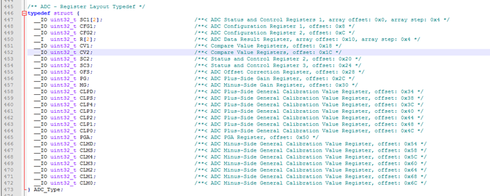

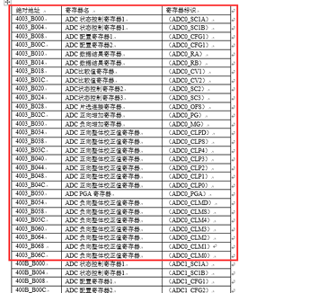

首先typedef是类型定义，可以这么理解：typedef struct 是为了使用这个结构体方便。和单纯使用Struct定义类型的具体区别在于:若struct adc\_type {}这样来定义结构体的话。在申请adc\_type 的变量时，需要这样写，struct adc\_type n;若用typedef，可以这样写，typedef struct adc\_type{} ADC\_Type; 。在申请变量时就可以这样写，ADC\_Type n;区别就在于使用时，是否可以省去struct这个关键字。更进一步，我们可以发现当我们使用了typedef后，连原先的结构体名adc\_type也可以省略，即变成了typedef struct {} ADC\_Type，只需要定义替代原先struct adc\_type的一个名字ADC\_Type就可以了。（adc\_type是结构体名，ADC\_Type是替代struct类型中adc\_type名的结构体的名称）

\_IO、\_I、\_O为Cortex-M4系列的标准定义，表示寄存器的可读写属性

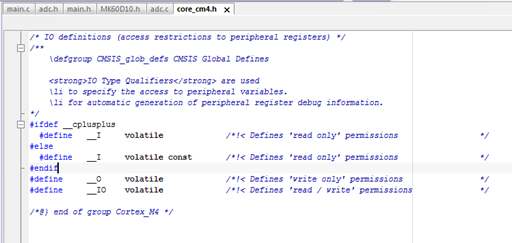

每一个寄存器都是32位长度，因此均定义为uint32\_t类型

于是每一个寄存器的定义即为：（可读写类型 + 数据类型 + 寄存器名）

定义完成这个结构体后，我们会发现，数据手册中明明定义的寄存器向量表不止这些，通过数据手册的说明可以知道其实只是ADC0和ADC1两个通道的ADC模块而已，他们的寄存器结构体完全相同，因此我们只需要定义一次结构体，而在后面定义两个通道的绝对地址作为结构体基址即可。

在MK60D10.h的ADC部分寄存器定义的最后给出了寄存器绝对地址和指针的定义，以及ADC中断向量表的定义。（v1.3版本之前无中断向量定义）

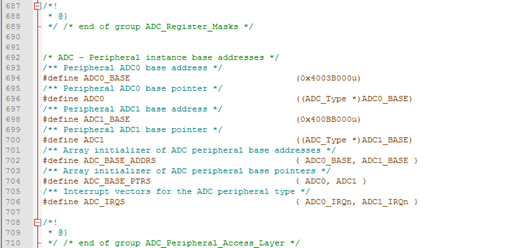

而结构体定义和地址定义中间，则是各个寄存器的每一位的定义

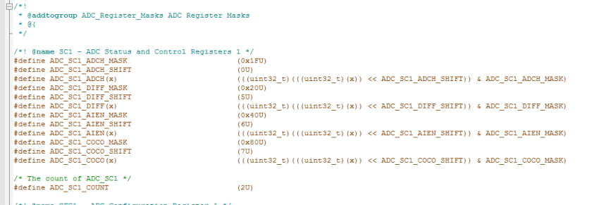

赋值的后缀U表示16进制数。

xxxx\_MASK为寄存器各功能复位值，复位值可以在数据手册的寄存器向量表中查到。

xxxx\_SHIFT为寄存器功能模块最低位号

最后解释一下一长条的赋值，以机器操作顺序来看，首先是((uint32\_t)(x))表示将x扩充到32位，其中x是一个位域变量，具有固定长度，但不超过8位。

在扩充x变量长度后，将该32位变量第一位左移到该寄存器功能的最低位，即((uint32\_t)(x)) << ADC\_SC1\_DIFF\_SHIFT)：左移5位，于是原本的32位数据被左移扩充至37位了，因此还需要一次强制转换(uint32\_t)将这个37位数据缩短至32位（将高5位丢弃），即((uint32\_t)(((uint32\_t)(x)) << ADC\_SC1\_ADCH\_SHIFT))。最后将寄存器的复位值与这个变量做”与”操作，相当于将除了该寄存器功能部分以外的所有值清空。只保留这个寄存器模块的几位数据。

以及部分寄存器还有xxxx\_COUNT的定义，表示该寄存器有ADC0和ADC1两种不同的配置。

这些就是寄存器映像头文件中关于ADC模块的定义了。

进而我们转到超核库中的ADC.c和ADC.h中

ADC.h的最开头为常见的预防重复定义的方式

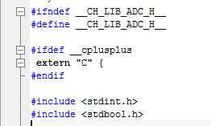

然后定义ADC模块，对于普通芯片来说，只有ADC0和ADC1两个模块，但部分芯片可能存在ADC2模块，故多定义了一个ADC2作为保留模块。

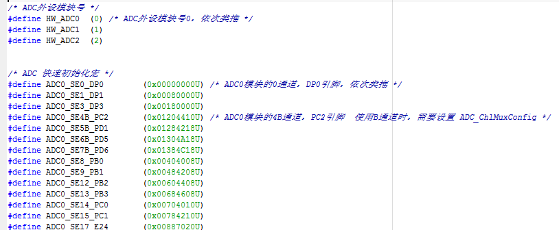

然后就是各个ADC可复用引脚的定义，这里将他们定义成16进制数，看似毫无规则，个人估计是为了库的所有权而专门设计的，防止被他人抄袭。但仔细观察还是有所特点的：首先将这些16进制数都 转化成2进制，ADC0的引脚最低位均为0，ADC1的引脚最低位均为1。B通道的高八位为00000001，A通道为00000000。具体定义我们在后文有说明。

而排列顺序我们可以从数据手册的引脚配置pin config中得到

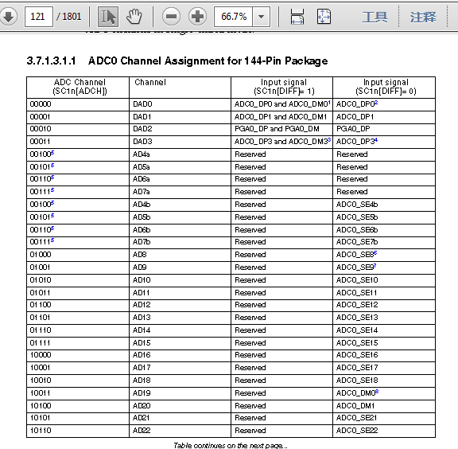

后面则是定义ADC初始化配置的各个结构体，各个配置的具体位和寄存器在数据手册中都已经写清楚了。

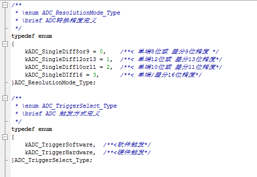

并定义触发通道，kADC\_Mux为触发器的通道选择，注明了MuxB只能硬件触发。而kADC\_ChlMux则是硬件触发模式下的通道选择。这两者需要加以区分。

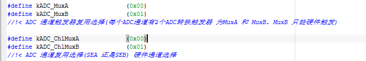

定义ADC转换完成后的回调函数。

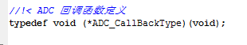

最后综合整个配置过程所需，定义结构体囊括所有初始化中需要配置的属性

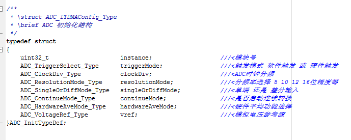

下面看ADC.c文件

首先确保ADC基址已经定义

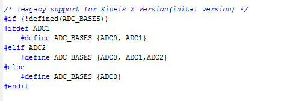

定义结构体，并将ADC基址赋值给这个结构体的起始地址。

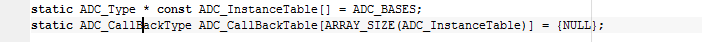

定义时钟配置，（暂时不管）

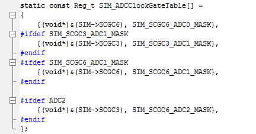

中断结构体

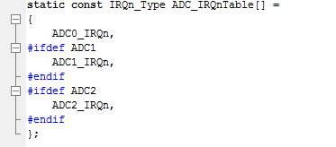

后面就是具体的ADC配置和转换函数了，我们找到入口函数：ADC\_QuickInit

从示例来看，两个参数分别为ADC的引脚选择，ADC转化精度

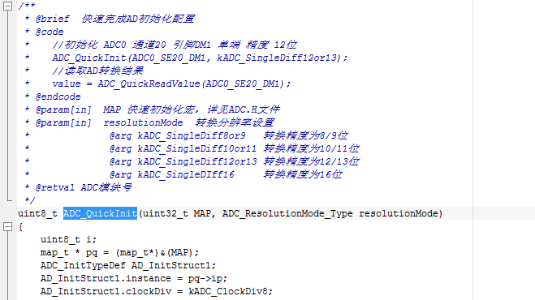

首先定义了一个结构体pq，结构体定义在common.h中。

结构体类型为不同长度的位域，具体可百度其冒号的用法”:”，冒号后的数字为位数，从上往下为从低位到高位共32位，与前面复用引脚定义相对应。

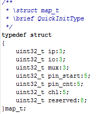

ADC0的低三位ip均为0，ADC1的低三位ip为001，作为初始化中instance的赋值。

默认配置总线时钟8分频

接着往下是引脚复用，暂时不做考虑

然后将已经赋值的初始化结构体作为参数用ADC\_Init进一步完成初始化配置。

以及进行通道选择（包括ADC0和ADC1以及AB通道的选择）

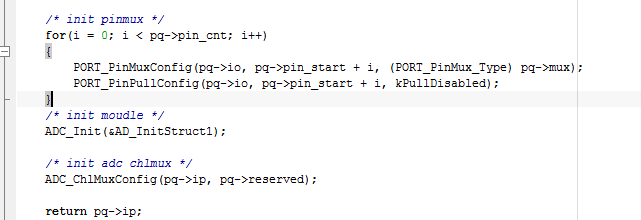

ADC\_Init函数中首先进行的时钟配置，接着进行一系列寄存器赋值

如时钟源配置：/\* set clock configuration \*/

ADC\_InstanceTable\[ADC\_InitStruct->instance\]->CFG1 &= ~ADC\_CFG1\_ADIV\_MASK;

ADC\_InstanceTable\[ADC\_InitStruct->instance\]->CFG1 |= ADC\_CFG1\_ADIV(ADC\_InitStruct->clockDiv);

首先通过和复位值的反码进行与”&”操作清空原有配置，再将配置属性ADC\_CFG1\_ADIV(x)中的x赋值为ADC\_InitStruct->clockDiv，最后通过位或”|”操作将这个寄存器的指定位赋值为配置值。

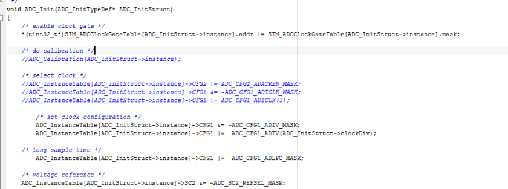

配置完成后进行ADC校准

剩余的配置也是类似，基本操作相同。

不同的库函数对寄存器的操作方式不同，可以说各有各的优点，但最后操作完后的寄存器结果都是相同的，并且基本的理论顺序不变，可以举一反三，甚至自己写一套更高效的库函数来代替。

