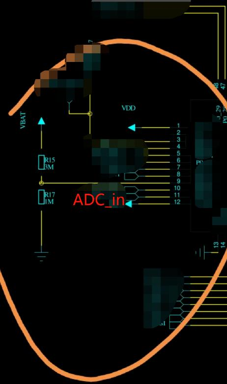

> 本文来解析一个使用STM32采集电池电压踩过的坑。以STM32F4 的ADC属于逐次逼近SAR 型ADC为例进行分析，参考STM32F405xx  Datasheet，对于如何编写ADC程序就不做描述了

## What?

> 采集电池电压，利用<u>两个电阻将电池电压分压</u>，然后送入单片机，当电阻如上分别取4M欧/1M欧时，ADC采集到的ADC值与万用表测得的ADC输入端相差很大，取30K欧以及10k欧时，则相差变小。
>
> - 当电阻是4M和1M 时候， ADC采集不准确；
> - 当电阻变小到30K和10K，ADC计算值和万用表测量值就相差不大了；
> - 当电阻是3M和1M，ADC计算值和万用表测量值就相差很多？
> - 但是，3M/1M 和 30K/10K 两种情况，万用表测量值是一样的！也就是3M/1M时，ADC有问题？？

## STM32 ADC

> STM32 12位ADC是**逐次逼近型的模数转换器**。它有多达<u>19个多路复用通道</u>，允许它测量来自16个外部源、2个内部源和VBAT通道的信号。通道的A/D转换可以**<u>在单次、连续、扫描或间断模式下进行</u>**。
>
> ADC的结果存储在左对齐或右对齐的16位数据寄存器中。模拟看门狗功能允许应用程序检测输入电压是否超过用户定义的、更高或更低的阈值。

主要功能，具体操作，怎么编程这些细节，有大量的资料就不罗嗦了，主要来看看电气特性。

### 1. 电气特性

1. ADC 可支持采样频率 `fADC` 受供电电压影响，供电电压高，可支持采样频率范围更高；
2. 可支持输入电压 `vAIN` 范围须在参考电压范围内；
3. 外部输入阻阻抗 `RAIN` 最大为 `50K`；
4. 开关切换阻抗 `RADC` 最大为 `6K` ；
5. 内部采样保持电容 `CADC` 为 `4pF` ；

上面的公式用于确定误差小于1/4 LSB时允许的最大外阻抗。N = 12(12位分辨率)，k是在 `ADC_SMPR1` 寄存器中定义的采样周期数。

> ADC精度vs.负注入电流 : 应该避免在任何模拟输入引脚上注入负电流，因为这会显著降低在另一个模拟输入上执行转换的精度。<u>建议在模拟引脚上增加一个肖特基二极管(引脚接地)，这可能会注入负电流。</u>

> Page 136 图例（上图中标识解释）：
>
> 1. 见表68
> 2. 实际转移曲线的示例。
> 3. 理想转移曲线
> 4. 终点相关线
> 5. ET =未调整总误差：实际和理想传递曲线之间的最大偏差。
> 6. EO =偏移误差：第一个实际过渡与第一个理想过渡之间的偏差。
> 7. EG =增益误差：最后一个理想过渡与最后一个实际过渡之间的偏差。
> 8. ED =微分线性误差：实际步长与理想步长之间的最大偏差。
> 9. EL =积分线性误差：任何实际过渡和终点相关线之间的最大偏差。

寄生电容表示PCB的电容（取决于焊接和PCB布局质量）加上焊盘电容（大约5 pF）。<u>**寄生电容值高会降低转换精度。为了解决这个问题，应该减少fADC**</u>。

## ComeBack

电路等效绘制一下，忽略ADC采样通道内部ESD保护二极管，以及等效电流源，如下图：

好了，这图一画出来，问题的原因就显而易见了，**SAR ADC是将采样电容上的电压通过逐次逼近原理转换为数字量的，按上述图，由于R2为兆级电阻，那么等效加载在采样电容上的电压就不能简单的看成是R1/R2的分压了，此时ADC的输入阻抗在百50K欧级别，简化定性看一下，忽略分布电容影响，计算方便将输入阻抗看成50K直流电阻（实际深入动态分析的话则不可忽略,假定电池电压为5V），具体计算就不做了。**

**为什么电阻选这么大呢？我想估计是为了将电池电压监控取样回路的电流降低，以节省电量。**

## How?

我觉得这样应该可以：

找一个低功耗的运放做一个阻抗变换就可以兼顾两者需求，当然如果更完善一点，还可以考虑串入一个RC低通滤波环节，可以有效降低噪声。

## Conclusion

对于单片机ADC的使用，总结了这几点：

- 将输入短路，可测量热噪声。实际应用时，将输入端短路，采集一定数量的样本，由于热噪声符合高斯分布，可计算出其期望、方差，接入真实信号可以利用统计规律进行相应的噪声滤波处理。
- 量化噪声，可以通过输入一定幅度及频率的正弦波，进行度量系统的量化噪声。
- 设计ADC采样电路时，需要注意阅读芯片手册的电气特性参数，这个对于设计一个稳定的模数采集系统至关重要。

