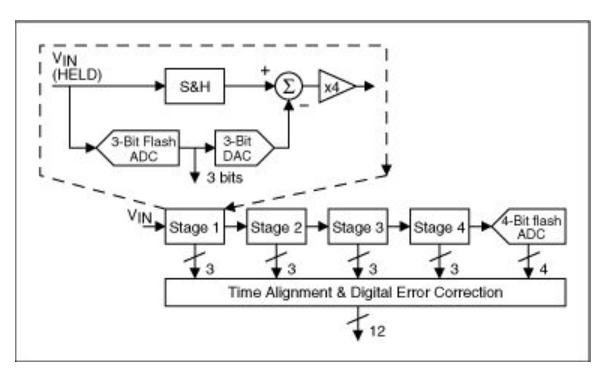

> 在了解了主要常见的重要ADC的技术指标，本文来梳理两个方面的内容，**常见的ADC类型及原理**，以及可能容易掉进去的坑。
>
> 工程师往往关注点更多在于功能，而忽略了性能。为什么会忽略性能呢？因为可能缺少对于原理的深入探究，那么使用时可能失之毫厘，谬以千里。性能往往不好，稳定性也可能不佳。

## ADC类型

### 1. 积分型ADC

**优点**：

- 积分型ADC**分辨率高**，位数可做到12位甚至更高

- **线性度非常好**。本质上，输入端与一个集成的参考电压相比较来决定输出端，<u>所以线性度将取决于比较器的精度</u>。

- 电路实现拓扑简单，用于实现这些设备的元件相对较少，因此**电路相对简单**且生产成本较低。

**缺点：**

- 主要缺点是**转换速度慢**。N位ADC，输出可能需要长达2个N的时钟周期来转换单个采样点

- 转换<u>*原理都是基于对电压积分并将积分后电压与另一电压比较以控制计数，计数输出即为ADC输出。积分对象要么是基于参考电压，要么是基于参考电压和输入电压*</u>。
- 主要用于传感器应用和诸如电压表和电流表等设备，在这些设备中，精度比速度更重要。换句话说<u>*积分型ADC采样速度比较低，但精度非常高*</u>
- 积分型ADC有不同的种类，<u>*常见的有**单、双斜率积分**等。增加一个“斜率”，以牺牲转换时间为代价而增加精度*</u>。

#### 1.1 单斜率积分ADC

> 比较器将输入电压 `Vin` 与参考电压 `Vref` 的值进行比较（请注意，由于 `Vref` 已连接至运算放大器的反相输入，因此我们将  `Vref` 设为负）。同时计算时钟周期数。当积分器输出等于 `Vin` 时，比较器输出逻辑“ 0”，触发计数器和积分器复位，锁存器保持数字输出。
>
> 这就是转换时间，知道为啥说这种积分型ADC慢了吧。来看下最差的情况吧，假设输入电压 `Vin = Vref`  , 假定 `Tclk = 1us` ,假定是20位ADC，那么 `tc = 2^20 us`  

#### 1.2 双斜率积分ADC

> 双斜率ADC与单斜率ADC的不同之处在于，现在把 `Vc` 与地进行比较，并集成了两个电压 `Vref` 和 `Vin`。
>
> 刚开始时，负输入连接到积分器，使 `Vc` 斜升直到计数器溢出。由于在反相输入会切换到一个负值进行积分，因此积分器输出将始终为正且大于零，因此计数器将继续运行直到溢出为止，这需要2N个时钟周期（= T1）。
>
> 
>
> `Vc` 在T2时刻，将等于 `Vc1` 与 `Vc2` 之和，且为0，也即：
>
> 
>
> 所以：
>
> 
>
> 因此，`T2 / T1` 即为ADC转换的原理，双斜率比单斜率ADC更慢，<u>由于执行了两次积分， 与积分器斜率相关的误差将被抵消，从而从原理上提高了精度</u>。

### 2.  Sigma-Delta Σ-∆ ADC

从输入端开始，差动放大器产生的输出为 `Vin` 与1位DAC输出之间的差。

1位DAC的输出可以是以下两个值之一： `-Vref` 或  `+Vref`

在此拓扑结构中，<u>可将积分器视为取前一个值和当前输入值的移动平均值</u>。

因此，假设刚开始时比较器正向段固定在高于0V的很小一值，比较器反转。其值将为高或1。然后，DAC输出将为 `+Vref`。在下迭代中，将从 `Vin` 的当前值中减去该值。由于先前的值为0V，因此积分器输出现在将为 `-Vref`。此时，比较器输出将为0，而DAC输出将为 `-Vref`。

在下一个采样中，由于前一个值为 `-Vref`，积分器输出将为0，并且差动放大器实际上将减去 `-Vref`，从而将 `+Vref` 加到 `Vin`。比较器输出将为1。

此过程继续迭代进行，因此，对于0V输入，比较器输出将为 `101010…` 的稳定流。记住逻辑1表示 `+Vref` ，逻辑0表示 `-Vref` ，那么如对N个样本进行采样并取平均值，则很容易看出平均值为0V。比较器之后的处理块将简单地将其输出为单个值 `0000…` ，假设参考值为 `(-Vref ~ +Vref)`。

现在，假设 `Vin` 为1V，这是一个5V ADC。`±Vref` 为±2.5V。按照与之前相同的步骤进行迭代操作，输出将为：`1011101…` 输出为1.07V。

**概括起来**：

> Σ-∆ ADC 对所处理信号进行过采样（这个概念见模数采样知多少），并对待处理信号进行低通滤波。通常，在过滤器之后使用Flash  ADC转换的比特数小于所需的比特数。所产生的信号连同由FLASH离散电平产生的误差，被反馈回并从输入中做差然后输入到滤波器。这个负反馈的可对噪声形成抑制作用，使它不出现在期望的信号频率。ADC之后的数字滤波器（利用抽取滤波器）可降低采样率，滤除不想要的噪声信号并提高输出分辨率（故称为sigma-delta调制，也称为delta-sigma调制）。

### 3. Flash ADC（直接比较型）

FLASH ADC的原理可能是最容易理解的。下图是一个两位ADC的示意图，由许多比较器组成，每个比较器都被提供了比上一个基准值高一个位值的基准电压。因此，对于一个8位ADC，需要256个这样的比较器。对于10位，则需要1024。

FLASH ADC（直接比较型）速度很快。它直接转换输入，而不需要任何采样或繁重的后期处理。问题是，它需要很多比较器，而且很多比较器占用了芯片上的大量硅空间。因此，只有在需要其他ADC实现方法无法达到的极高速度时才使用Fash ADC。

### 4. 半Flash型（二分法应用）

实际应用中，还有一个变种比较常用，半 FLASH ADC。它使用两步的过程来减少实际转换链中所需的转换器数量：

- 首先，将输入信号与恰好位于半 `Vref`的电平进行比较。如果它更低，那么最高有效的位MSB，被设置为0，输入被馈送到一个比较器链与参考电压设置为 `(Vref / 2)` ，以转换得到其余的位。

- 如果输入信号高于 `(Vref / 2)` ，则将MSB设置为1，从输入信号中减去 `(Vref / 2)` 。比较器链再次用于获取剩余的位。

**<u>所以，本质上，半步FLASH ADC，以牺牲一个额外的比较，来节省一半比较器。这种思路还可以继续推演扩展，比如4分 FLASH ADC等等。</u>**

#### 4.1 逐次逼近寄存器SAR型ADC

**逐次逼近寄存器(Successive Approximation  Register)** : 逐次逼近ADC使用比较器逐次缩小包含输入电压的范围。在每个连续的步骤中，转换器将输入电压与内部数字与模拟转换器的输出进行比较，后者可能表示所选电压范围的中点。在这个过程的每一步，近似都被存储在一个逐次逼近寄存器(SAR)中。

例如，假设输入电压为6.3 V，初始范围为0到16v。对于第一步，输入6.3 V与8v  (0-16V范围的中点)进行比较。比较器报告输入电压小于8v，因此SAR被更新为将范围缩小到0 - 8v。第二步，将输入电压与4v (0 -  8v的中点)进行比较，比较器报告输入电压高于4v，因此更新SAR以反映输入电压在4 -  8v范围内。第三步，输入电压与6v比较(4v与8v的一半);比较器报告输入电压大于6伏，搜索范围变为6 -  8伏。继续这些步骤，直到达到预期的解决方案为止。

其拓扑结构如下：

#### 4.2 Pipelined ADC

**流水线ADC(也称为子例程量化器)**使用两个或多个流水线。

- 首先，进行粗略的转换。
- 第二步，用数模转换器(DAC)确定输入信号的差异。然后将这个差异转换为更细的值，并在最后一步中合并结果。这可以被认为是后续逼近ADC的一种改进，其中反馈参考信号由整个范围的比特(例如，4比特)的中间转换组成，而不仅仅是下一个最重要的比特。

结合逐次逼近法和flash adc的优点，该类型具<u>***有速度快、分辨率高、模具尺寸小等优点***</u>。

在这个原理图中，模拟输入 `Vin` 首先被采样并由**采样保持器**(S&H)保持稳定，而第一阶段的flash  ADC将其量化为三位。然后将3位输出馈给3位DAC(精确到12位)，然后从输入中减去模拟输出。这个“剩余量”扩大4倍并被送入下一阶段(第二阶段)。这个增加的剩余量继续通过下级流水线，每一阶段提供3位，直到它到达4位flash  ADC，将解析最后的4LSB位。

因为每个阶段的位是在不同的时间点确定的，所以相同样本对应的所有位在被馈送到数字错误校正逻辑之前都与移位寄存器进行了时间对齐。请注意，当一个流水完成对输入样本的处理，确定本流水采集位并将残差传递到下一个流水时，它便可以开始处理从每个流水中嵌入的采样保持器接收到的下一个样本。这种流水线操作是高吞吐量的原因，这也是流水的概念。

## 总结一下

熟悉各类ADC的意义，因为如前文所说，嵌入式设备免不了需要采集物理世界的模拟信号。信号各具特点，有的频率高，有的噪声多，有的需要精度高但速度可能不要很快等等。这里整理几种常见ADC（*当然还有其他种类比如电荷平衡原理ADC、分时ADC、FM ADC、时间拉伸ADC、增量编码ADC、Wilkinson ADC等等*）的原理及特点，了解各类ADC的基本特点，有助于进行器件选型、系统设计。

