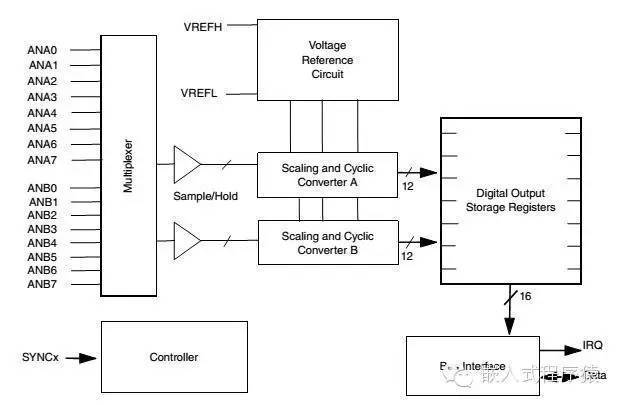
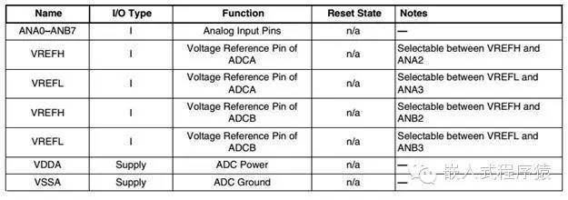

# 闲聊飞思卡尔ADC模块

>  [腾讯云链接](https://cloud.tencent.com/developer/article/1090072)

因为ADC模块是各种控制比较重要的功能模块，基本的保护算法都要靠ADC的采样数据来执行，所以ADC模块还是要熟练掌握,今天我们就来学习下飞思卡尔的ADC模块，如果有猿友使用过microchip的MCU就会发现这两种MCU的ADC模块还是有很大的不同的。

## 目录

[TOC]

## 1. ADC模块简介

KV4x系列MCU 的ADC模块有16个通道，是***双端12位的ADC***，有独立的参考电压源和控制块，*<u>分为ADCA和ADCB，各有8个通道</u>*，ADCA和ADCB***可以并行采样也可以串行采样，有各自的采样保持电路***，特性主要有：

- 12位的分辨率
- 最大时钟频率为25M，周期为40ns.
- 采样速率可以达到8.83百万次每秒
- 可以去其他外设同步，像常用的PWM外设
- 可以连续扫描存储16次的测量值
- <u>输入信号的增益可以配置为x1,x2,x4,</u>这个功能还是很有用的.
- 中断功能
- 可选的DMA功能
- 可选的采样修正功能
- 单端或者差分输入

## 2. ADC模块框图

从下图可以清楚的看出ADC模块的构成，**<u>主要有通道多路开关，采样保持，参考电压，数字输出存储寄存器，中断以及数据传输等功能块</u>**。

## 3. ADC模块外部信号

主要的外部信号可以通过下表详细的看出

**外部输入信号主要有：**

- 模拟输入引脚：ADC外设有16路模拟输入引脚，被分为 `ANA[0;7]` 和 `ANB[0:7]` ,ADCA和ADCB都有自己的采样保持电路和转换器。

- 参考电压引脚：
  - VREFH和VREFL的电压是不一样的，VREFH一般为VDDA，VREFL一般为0V.

- 电源引脚VDDA和VSSA为ADC模块提供电源.

- ADC寄存器

与ADC相关的寄存器也比较多，具体的内容可以参考飞思卡尔官方的数据参考手册，这里主要介绍**几个主要的寄存器**。

- ADC\_CTRL1，控制寄存器一，主要用来**配置ADC扫描模式以及中断源使能**。位0到位2总共3位用来配置扫描模式，主要有六种模式：<u>*单次顺序扫描，单次并行扫描，循环顺序扫描，循环并行扫描，顺序触发扫描和并行触发扫描*</u>。

- ADC\_CLISTx，主要用来配置单端或者差分输入的通道

- ADC\_STAT，状态寄存器主要用来指示一些ADC模块的状态，主要包括转换状态，转换完成中断，过零中断，高低门限中断。

- ADC\_RSLTn ，结果寄存器用来存储转换完成的结果。

## 4. 驱动程序概述

ADC的驱动程序有两种方案，一种为自己开发，按照数据手册的指引开发简单的ADC驱动，另一种是使用飞思卡尔SDK提供的ADC模块驱动程序，SDK包含功能比较全的ADC驱动，自己开发我们不用的功能可以不包含，使代码简单易用。这里主要简单介绍下自己开发驱动，

**主要包含几个功能：**

**初始化函数**：按照数据手册配置寄存器，实在不会可以参考例程学习配置，因为ADC模块是各种控制比较重要的功能模块，基本的保护算法都要考ADC的采样数据来执行。

初始化主要包括***配置时钟*，*配置通道*，*转换模式*，*使能中断***等

**中断函数**：<u>当然你也可以选择使用查询来得到转换结果，但建议大家在正式的项目中尽量使用中断</u>。

中断函数中主要包括*<u>清中断标志</u>*，*将结果寄存器中的值读取到数组中或者变量中*，需要注意的一点是如果是<u>使用并行采样模式和使用顺序扫描模式的中断函数是不一样的</u>，采用并行的话需要分别写ADCA和ADCB的中断，如果是使用顺序扫描只要完成ADCA的中断就可以。

**数据传输函数**：主要完成数据的搬运和传输给其他模块使用，这个根据架构来决定。

实际应用中**<u>需要注意低功耗模式下和正常模式下的区别</u>**，另外虽然数据手册说最大可以配置为25M的频率，但建议大家不要配置到最大频率使用，确保转换稳定精确，有兴趣的猿友可以配置为不同的模式，对比下不同。

