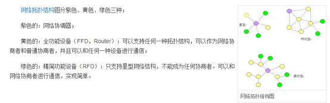
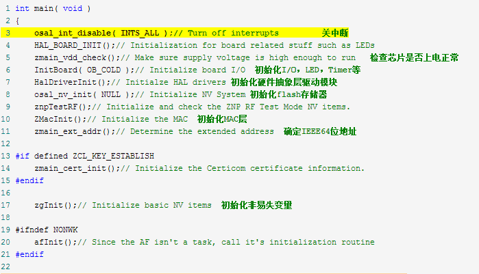
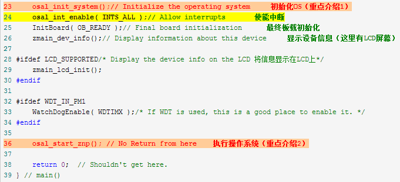
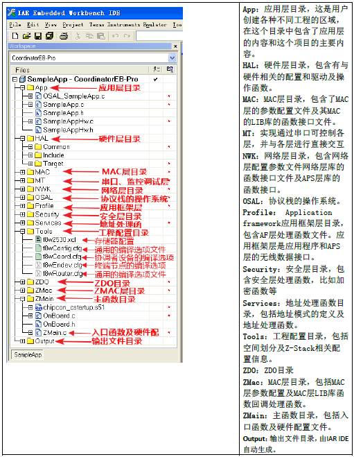

# ZigBee 协议栈知识详细总结

## 目录

[TOC]

## 1.1 Zigbee 网络结构

### Zigbee 协议架构

SAP：服务接入点，<u>*Service Access Point*</u>

具体的分层架构：

> 1.  PHY：物理层
> 2.  MAC：媒体访问控制层
> 3.  NWK：网络层
> 4.  API：应用层，有三个组成：
>     - APS：应用支持子层, **Application Support Sub Layer**
>     - ZDO：设备对象, **Zigbee Device Object**
>     - AF：应用程序框架，**Application Framework**

## 1.2 IEEE 802.15.4 通信层

### 1.2.1 物理层服务

标准规定的物理层包括一个管理实体，即**物理层管理实体**（**Physical Layer Management Entity**, PLME），分别提供以下两个服务：

*   PD-SAP：数据服务接入点，**Physical Data SAP**
*   PLME-SAP：管理服务接入点，**Physical Layer Management Entity SAP**

在 **PLME-SAP** 中，包含PHY-PIB（**物理层个域网信息数据库**），整个物理层也有一个RF-SAP（**无线发送接收访问接口**）的称呼。

物理层数据桢结构中，包含SFD（**帧界定符**， **Start of Frame Delimiter**），用来<u>表示前导码域的结束以及分组数据域的开始。这是一个一字节的固定数据</u>。
此外，数据桢结构中的**物理数据单元**（或称**物理层负载**, **PHY Service Data Unit**, PSDU）。

### 1.2.**2** MAC 层服务

MAC 层和物理层一样，也包含一个管理实体，称为MLME（**MAC Layer Management Entity**）。负责维护和 MAC 子层相关的管理目标数据库。也就是 MAC 子层的PAN（**Personal Area Network**）信息数据库。

这里又涉及好几个缩写，这个章节里面没有说清楚其作用：

*   MCPS：**MAC 公共部分子层**
*   MCPS-SAP：**MAC 公共部分子层服务接口**
*   MLME-SAP: MAC层管理服务接入点
*   MAC PIB：**MAC 层个域信息库**

### 1.2.**3** MAC 帧结构

MAC 帧一般由三部分组成：MAC 帧头（MHR, **MAC Header**）、MAC 静载荷和MAC 帧尾（MFR, **MAC Footer**）

### 1.2.**4** MAC 帧类型

MAC 数据桢有四种类型：

> 1.  信标帧
> 2.  数据桢
> 3.  应答帧
> 4.  命令帧

其中信标帧中，有一个可变域叫做**同步时隙分配域**（GTS）。

## **1.4** 网络层

### **1.4.1** 功能概述

ZigBee 网络层称为NWK Layer，主要功能有：

1.  网络的建立以及网络地址分配
2.  网络拓扑结构管理：**星型、树型、网状**
3.  <u>网络路由管理：ZigBee 使用AODV（**Ad hoc On-demand Distance Vector Routing**）路由算法来实现网络路由。当网络规模比较大时，ZigBee 节点需要维护一个路由表。</u>

### **1.4.2** 服务规范

ZigBee 的网络层提供两个服务实体：

1.  **数据服务实体**：（NLDE, **NWK Layer Data Entity**）
2.  **管理服务实体**：（MLME, **NWK Layer Management Entity**）

也就分别提供两个 SAP：NLDE-SAP和MLME-SAP。

**NLDE** 提供的服务有：

1.  生成网络数据单元：<u>也就是对上层的数据进行分段、封装</u>
2.  指定路由拓扑
3.  安全支持

**MLME** 提供的服务有：

1.  配置新设备：_配置一台设备，从而可以加入一个新网络_
2.  **建立新网络：_配置协调器，从而可以组建一个新网络_**
3.  **允许设备加入或离开网络：_协调器功能_**
4.  邻居寻址
5.  路由发现：发现并记录网络传输的路径功能，保证信息可以有效传送

## **1.5** 应用层

如前文所述，应用层包含三个部分：**应用支持子层**、**应用程序框架**、**ZDO**。

### **1.5.1** 应用支持子层

英文名：**Application Support Sub Layer**，简称APS。

提供以下两个服务实体：

1.  **应用支持子层数据实体**：APSDE，**Application Support Sub Layer Data Entity**
2.  **应用支持子层管理实体**：APSME, **Application Support Sub Layer Management Entity**

相应的，也就有APSDE-SAP和APSME-SAP。

### **1.5.2** 应用程序框架

在应用程序框架（AF, **Application Framework**）内部，ZigBee 设备对象通过APSDE-SAP来收发数据。总共定义了**240**个不同的应用对象（Application Object），通过**端点**来描述，端点接口索引号为1~240。此外还有两个特殊端点：

*   端点0：只为**ZDO**的数据接口服务
*   端点255：供应用对象的广播数据接口功能

**1\. 应用 profiles**
<u>**Application profiles** 是端点的另一种表现形式。比如一个功能分别分为控制器和执行器两个设备节点，那么这两个节点就形成了一组**profiles**</u>

**2\. Clusters 簇**
**Clusters** 是 profiles 的一个子集。在特定的 profiles 中，clusters 的标识符是唯一的。

### **1.5.3** ZDO

<u>ZigBee 协议栈中的ZDO特指端点号为0的 ZigBee 设备对象</u>。**ZDO** 管的事情实际上纵跨几个层：

> 1.  网络角色定义：**设备是 coordinator、router 还是 end-point**
> 2.  设备发现
> 3.  服务发现
> 4.  绑定——原文：“<u>绑定在 ZigBee 中是一个应用级别的概念，它是在不同节点的独立端点或组地址中使用 Cluster 标识符建立逻辑链接。绑定是在一个已经建立好的通信连接之上执行的，绑定的具体实现通过绑定表来实现</u>”。不过在这里还没搞清楚绑定是在三种设备中的哪一种去实现……

* * *

## **2.1 基于协议栈的无线收发控制**

核心是执行初始化工作包括硬件抽象层、网络层、任务等。然后执行`osal_start_znp()` ，**进入一个死循环，不断对任务进行遍历执行。这里我们需要重点了解两个函数**：

## **2.2 zigbee处理任务的大致过程**

整个ZStack 的主要工作流程，如图所示，大致分为以下6 步：
**(1) 关闭所有中断；**
(2) 芯片外部(板载外设)初始化；
(3) 芯片内部初始化；
(4) 初始化操作系统；
**(5) 打开所有中断；**
(6) 执行操作系统。

**ZStack协议栈构架**

Zigbee协议栈就是将各个层定义的协议都集合在一起，以函数的形式实现，并给用户提供一些应用层API,供用户调用。

## **2.3 ZigBee协议栈工作流程简要分析**

**协议**是个标准，是约定；

**协议栈**是协议的实现，可以理解为代码，函数库，供上层应用调用。

<mark>**消息处理机制：**<u>一般是通过回调函数实现的</u>。例如：在按键发生时，它会调用按键的回调函数（响应函数也叫），<u>*通过回调函数生成一个任务出来，然后通过任务发送`osal_msg_send`函数，发送消息处理循环，注册事件，等待处理。最后应用层事件处理函数监测到事件之后，调用相应的处理函数*</u>。</mark>

**如果出现本次任务处理周期中的间隙时间内没有完成任务，就会等到下一个 周期继续处理。所以，协议栈调试中，单步调试是没有作用的，整个协议栈都是运用定时器控制，单步运行无法控制定时器。**个人觉得没必要去探究无线数据是如何发送的，协议栈分层比较多，底层802.15.4，深究没必要，**用户只需关注APP文件夹就行了**。协议栈如果去一句话一句话的探究，少说3个月才能搞定。费时费力。

了解协议栈的运行流畅，消息处理流程，就可以知道怎么去添加任务，也就是你需要加载进去的处理事件（传感器这些处理函数），还有怎么去初始化IO口，时钟，串口这些，这样就够了，很快就能上手项目。

**下面对ZigBee协议栈对事件的处理做一个总结：**

在ZigBee协议栈中处理事件有三种方式：**轮询、中断、任务（操作系统）。**

其中轮询与中断学过单片机的都用过。<u>唯独任务（至少我所了解的）是操作系统才有的概念</u>。使用任务处理事件就需要**在一个事件产生时添加任务，在任务处理完毕时删除任务，还需要在不同任务间进行切换。**

在ZigBee协议栈中**tasksEvents**是一个任务是否存在的标志，当需要添加任务时通过调用函数**`osal_set_event()`**在**tasksEvent**s中添加相应的掩码，当任务处理完毕时直接把相应的掩码清零即可。<u>而任务切换则必须等到前一个任务处理完毕，并且没有优先级更高的任务时才被处理</u>。而优先级是由数组**tasksArr\[\]**的成员的顺序决定的。在一些比较强大的操作系统当中这些东西都有，当然是会有所区别的，只不过要复杂得多，并且引入了一些新的概念像PCB、任务调度、进程、线程等,其中任务调度我的理解就是任务切换。

在ZigBee协议栈中任务的处理总结起来就一句话：**任何一个任务都只有调用了函数`osal_set_event()`之后才能被处理。**

当然事件与任务不是一回事，任务同中断一样只是处理事件的一种方式。*而且通常是先有事件然后注册一个与事件对应的任务*。没有事件当然也可以注册任务，不过这又有点扯远了。

## **2.4 协议栈的代码**

**（1）看看Z-Stack的结构**

**APP（Application Programming）：**<u>应用层目录，这是用户创建各种不同工程的区域，在这个目录中包含了应用层的内容和这个项目的主要内容，在协议栈里面一般是以操作系统的任务实现的。</u>
**HAL（Hardware (H/W) Abstraction Layer）：**硬件层目录，包含有与硬件相关的配置和驱动及操作函数。
**MAC：**MAC 层目录，包含了MAC 层的参数配置文件及其MAC 的LIB 库的函数接口文件。
**MT（Monitor Test）**：实现通过串口可控各层，于各层进行直接交互。
**NWK（ZigBee Network Layer）**：<u>网络层目录，含网络层配置参数文件及网络层库的函数接口文件，APS 层库的函数接口</u>
<u>**OSAL（Operating System (OS) Abstraction Layer）**：协议栈的操作系统。</u>
<u>**Profile：AF（Application Framework）** 层目录，包含AF 层处理函数文件。</u>
**Security：**安全层目录，安全层处理函数，比如加密函数等。
**Services：**地址处理函数目录，包括着地址模式的定义及地址处理函数。
**Tools：**工程配置目录，包括空间划分及ZStack 相关配置信息。
**ZDO（ZigBee Device Objects）：**ZDO 目录。
**ZMac：** MAC 层目录，包括MAC 层参数配置及MAC 层LIB 库函数回调处理函数。
**ZMain：**主函数目录，包括入口函数及硬件配置文件。
**Output：**输出文件目录，这个EW8051 IDE 自动生成的。

**（2）Zigbee协议栈简介**

<u>Zigbee协议分为两部分，**IEEE 802.15.4**定义了**PHY（物理层）和MAC（介质访问层）技术规范**；**Zigbee联盟**定义了**NWK（网络层）、APS（应用程序支持层）、APL（应用层）技术规范**。</u>Zigbee协议栈就是将各个层定义的协议都集合在一起，以函数的形式实现，并给用户提供API（应用层），用户可以直接调用。

**◇协议**是一种规定。是一系列的通信标准，通信双方按照这一标准进行数据收发。

**◇协议栈**是一系列代码，是协议的具体实现形式，通俗的理解就是用代码实现的函数库，以便开发人员调用。而z\_stack就是zigbee的协议栈，所以要用zigbee建网就要用到该协议栈，调用其中的函数。

**◇zigbee网络设备**<u>主要由协调器，路由器，终端节点组成</u>。<u>*协调器的作用就是组建网络及维护网络，它上电后可以自己寻找信道及网络地址，建网成功后和路由器功能一致。*</u>IAR为集成开发环境，当把协调器，路由器，终端节点的代码分别down在其芯片时他们便可以自动组网，无线传输数据。

**你需要关心的就是你的应用逻辑，数据从哪里到哪里，怎么存储，处理，还有系统里的设备之间的通信顺序什么的；**

> - 当你的应用需要数据通信时，调用组网函数给你组建你想要的网络；
>
> - 当你想从一个设备发数据到另一个设备时，调用无线数据发送函数；当然，接收端就调用接收函数；
>
> - 当你的设备没事干的时候，你就调用睡眠函数；要干活的时候就调用唤醒函数。
>
> 所以当做具体应用时，不需要关心协议栈是怎么写的，里面的每条代码是什么意思。除非你要做协议研究。每个厂商的协议栈有区别，也就是函数名称和参数可能有区别。

**（3）ZigBee协议栈中消息、任务、事件之间是什么关系？**

**消息**是收到的事件和数据的一个封装，比如发生了一个**事件**（收到别的节点发的消息），这时<u>就会把这个事件所对应的事件号及收到的数据封装成消息，放入消息队列中</u>。协议栈是由各个层组成的，每一层都要处理各种事件，所以就为每一层定义了一个**事件处理函数**，我们可以把这个处理函数理解为**任务**，<u>***任务从消息队列中提取消息，从消息中提取所发生的具体事件，调用相应的具体事件处理函数，比如按键处理函数等等***</u>。

进入事件就是指需要处理的事件，对于系统来说，事件都是处于等待中，等待轮训时间的到来，等时间一到，事件就被触发，就是进入事件处理了。ID指的是事件的序号。

**（4）TI 有哪些例子**

GenericApp（设备互相绑定传送信息-hellow world），

Location（定位），

SampleApp（设备发送和接收LED灯信息），

SimpleApp(温度和灯开关，和智能家居结合使用的，have Profile)，

HomeAutomation（智能家居的应用，have Profile），

SerialApp（串行传输的应用），

Transmit（发送应用），

ZLOAD（协议文件夹中只有Source）。

我们主要学习和配置的就是图中**SampleApp.c**这个文件，它主要就是应用于应用的，我们面对不同的应用，只要修改**它和底层的配置文件**就行了。它里面有6个非常重要的函数，有关于初始化用户功能的；有关于所有事件的处理的；有按键服务功能编写的；有接收数据的处理的；有数据发送函数的编写的。下面我们就对这**6 个函数**进行分析：

**`void SampleApp_Init( uint8 task_id )`**

这是一个**用户用于初始化任务**的函数，它是在系统初始化阶段被调用的，而且，在调用它的时候，它里面应该有相应任务的初始化(也就是说，用户有什么初始化，都是放在这个函数里)，比如：硬件初始化、数据表初始化、电源初始化等等。

**`uint16 SampleApp_ProcessEvent( uint8 task_id, uint16 events )`**

这是一个**事件处理函数**(所有事件都是它管理)，当有已登记的事件发生时，它就被主函数调用来对事件进行处理，这些事件包括：<u>定时器、消息、以及用户定义的事件等</u>。
这个函数的功能包括：按键处理，数据接收，数据发送。当然，用户可以自己添加其它事件，我们就在这个函数添加自己的串口事件。

**`void SampleApp_HandleKeys( uint8 shift, uint8 keys )`**

这个函数是给`SampleApp_ProcessEvent( uint8 task_id, uint16 events )`调用的：当按键按下后，就会执行`SampleApp_ProcessEvent` 函数里的`case KEY_CHANGE` ，这个case 的服务函数就是`SampleApp_HandleKeys( uint8 shift, uint8 keys )`，<u>我们可以在这个函数里添加按键判断，判断哪个按键，然后执行相关任务</u>。

**`void SampleApp_MessageMSGCB( afIncomingMSGPacket_t *pkt )`**

这个函数**管理所有接收到的数据**，至于数据来自哪个设备，它是**根据簇ID 来分辨的**。
函数里面就是一个switch 语句，关键是case 及其后面的服务函数。用户可以根据不同的功能，**定义不同的簇ID(在SampleApp.h 里进行)**，然后在这个switch 语句里添加一个以簇ID 来命名的case，并在case 里面编写自己的应用程序。

**`void SampleApp_SendPeriodicMessage( void )`**

这个函数，是一个**周期性数据发送函数**，它是设备设置为周期性广播的时候调用的，它是我们设置发送数据的地方。

**`void SampleApp_SendFlashMessage( uint16 flashTime )`**

这个函数是`void SampleApp_HandleKeys( uint8 shift, uint8 keys )`函数的一个服务函数，我们也是极少用到这个函数的，故不作详解。

上述就是常用的6个函数，对于初学者，会使用zigbee协议进行应用就够了，先对驱动进行移植，再进行硬件进行初始化，再修改这6个函数，就可以对zigbee进行简单的应用了。

## **2.5 ZigBee中的频率**

**channel:2405Mhz**

这个是ZigBee的无线发射频率，相互通信的两个设备频率必须相同！这个由ZigBee硬件决定！可以通过设置信道进行选择！

**Pan ID:0x0628**

这个是ZigBee的区域身份码，如果区域身份码不同，也不能建立ZigBee通信！这个由ZigBee协议栈确定！！

**[工作频率](https://link.zhihu.com/?target=https%3A//www.baidu.com/s%3Fwd%3D%25E5%25B7%25A5%25E4%25BD%259C%25E9%25A2%2591%25E7%258E%2587%26tn%3D44039180_cpr%26fenlei%3Dmv6quAkxTZn0IZRqIHckPjm4nH00T1Yvm1FBn1w-P1R1PHm4rHR10ZwV5Hcvrjm3rH6sPfKWUMw85HfYnjn4nH6sgvPsT6KdThsqpZwYTjCEQLGCpyw9Uz4Bmy-bIi4WUvYETgN-TLwGUv3EnWT1P1mknj0z)：2.4GHz**

这个指在世界范围，通用的ZigBee频段为2.4GHz，这个不是严格的2.400GHz，而是在2.4GHz附近的几个频带，因为ZigBee采用的是信道接入技术，包括时分复用 GTS 技术和随机接入信道技术 [CSMA/CA](https://link.zhihu.com/?target=https%3A//www.baidu.com/s%3Fwd%3DCSMA%252FCA%26tn%3D44039180_cpr%26fenlei%3Dmv6quAkxTZn0IZRqIHckPjm4nH00T1Yvm1FBn1w-P1R1PHm4rHR10ZwV5Hcvrjm3rH6sPfKWUMw85HfYnjn4nH6sgvPsT6KdThsqpZwYTjCEQLGCpyw9Uz4Bmy-bIi4WUvYETgN-TLwGUv3EnWT1P1mknj0z)，这种技术能让ZigBee在2.4~2.4835GHz区域，**分成16个信道，每个信道间隔5MHz在通信时，选中一个固定的信道进行传输！**

## **3\. ZigBee 缩略词**

    API    Application Programming Interface
    APL   Application Layer
    APS   ZigBee Application Support Sublayer
    BSP   Board Support Package
    EP      Endpoint
    HAL    Hardware (H/W) Abstraction Layer
    HA      Home Automation (A Stack Profile, Profile Id 0x0104)
    MT     Monitor Test
    NWK    ZigBee Network Layer
    OSAL   Operating System (OS) Abstraction Layer
    OTA   Over-The-Air
    PC      Personal Computer
    SAP    Service Access Point
    SPI     Serial Port Interface
    ZCL    ZigBee Cluster Library
    ZDO   ZigBee Device Objects
    AF     Application Framework
    AIB    APS Information Base
    APS    Application Support Sub-Layer
    APSDE APS Date Entity
    APSME APS Management Entity
    ASDU   APS Service Datagram Unit
    MSG    Message
    NHLE   Next Higher Layer Entity
    NWK    Network
    PAN     Personal Area Network
    STAR   A network topology consisting of one master device and multiple slave devices
    ZDO    ZigBee Device Object
    AES    Advanced Encryption Standard encryption algorithm.
    CAP    Contention Access Period
    CBC-MAC Cipher Block Chaining Message Authentication Code.
    CCM   Encryption using CTR with CBC-MAC.
    Coordinator A full function device that accepts associations and transmits beacons.
    CSMA-CA Carrier Sense Multiple Access with Collision Avoidance.
    CTR    Counter mode encryption.
    DSN    Data Sequence Number
    FFD    Full Function Device.
    LQI    Link Quality Indication.
    MAC    Medium Access Control.
    MCPS   MAC Common Part Sublayer (data interface).
    MIC    Message integrity code.
    MLME   MAC Sublayer Management Entity (management interface).
    MSDU   MAC Service Data Unit.
    PAN    Personal Area Network.
    PAN Coordinator A coordinator that is the principal coordinator of a PAN.
    PHY    Physical layer.
    PIB    PAN Information Base.
    RFD    Reduced Function Device.
    RSSI   Received Signal Strength Indicator
    SFD    Start of Frame Delimiter
    ADC    Analog to Digital Conversion
    CD     Carrier Detect
    CTS    Clear To Send
    DSR    Data Set Ready
    DTR    Data Terminal Ready
    GPIO   General Purpose Input Output
    HAL    Hardware Abstract Layer
    RI     Ring Indicator
    RTS    Ready To Send

## reference

1. [15、Zigbee协议栈应用（一）--Zigbee协议栈介绍及简单例子（长文，OSAL及Zigbee入门知识）](https://www.cnblogs.com/zjutlitao/p/5722045.html)
2. [zigbee学习之路(十二):zigbee协议原理介绍 - 非你7我 - 博客园](https://www.cnblogs.com/sjsxk/p/5363676.html)
3. [Zigbee学习第四天-2--Zigbee协议栈ZStack构架\_静玉盈\_新浪博客](https://blog.sina.com.cn/s/blog_6184e67b01018upb.html)
4. [zigbee协议栈代码主要名词解释\_百度文库](https://wenku.baidu.com/view/34258f3f69eae009581beca4.html?_wkts_=1670225463437)
5. [ZigBee源码程序及解释\_百度文库](https://wenku.baidu.com/view/51a4126f5727a5e9846a613d.html?_wkts_=1670225495201)
6. [ZigBee重要结构及表解释\_百度文库](https://wenku.baidu.com/view/0f5a5708581b6bd97f19eab7.html?re=view&_wkts_=1670225574358)
7. [AF\_DataRequest详解 - 海纳百川 - 博客频道 - CSDN.NET](https://blog.csdn.net/bailyzheng/article/details/7565453)
8. [无线龙开发系统学习心得（一）Z-Stack应用&\_天津无线龙\_新浪博客](https://blog.sina.com.cn/s/blog_8cc8e3990102ux2c.html)
9. [ZStack-CC2530-2.5.1a主要代码分析总结--明白ZStack-OSAL的原理和思想 - 奔人之旅 - 博客频道 - CSDN.NET](https://blog.csdn.net/Thanksgining/article/details/42554533)

[查看原网页: zhuanlan.zhihu.com](https://zhuanlan.zhihu.com/p/27509878)