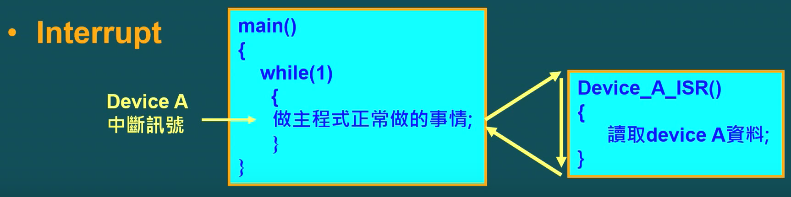

# 目录

[TOC]

#  Section1 IO与外围设备

## 1.1 前置知识

> 1. IO接口
> 2. 什么是周边设备（Peripheral device）
>    - 以CPU的角度来定义；
>    - **MCU中，除CPU以外，存储和周边元器件都叫做周边设备**；
> 3. 什么是IO设备
>    - 以CPU的运行来定义；
>    - **除了存储器之外的外围设备，都可以称为IO设备**；
> 4. CPU和外围设备沟通的方法：
>    - **总线系统**
>      - 地址总线
>      - 数据总线
>      - 控制总线
>    - CPU对外围设备存取的时候，利用地址总线产生这个外围设备的地址，然后，控制总线去告诉外围设备是读还是写，对应的数据内容就在数据总线中！

## 1.2 IO定址法

### IO mapped IO

- IO和存储器有各自独立的定址空间；
- **对IO操作和对存储器的操作的指令是不同的！**
- 利用硬件信号`Mem/IO#`来区分是要对IO操作还是存储器操作;
- MOV AX, [10]    // 对存储器的操作
- IN AX, [10]  // 对IO操作，虽然地址看起来都是10，但是是不同的位置；
- 地址总线 n bit，存储器和IO地址空间都可以用到 `2^n` ;

### Memory mapped IO

- 使用**相同指令**来对IO和存储器进行存取；
- 由CPU产生的**地址范围，决定是对IO操作还是对存储器操作**；

- MOV AX, [10]    // 对存储器的操作，因为Memory的地址空间是0~1023;
- IN AX, [1024]  // 对IO操作，因为IO的地址空间是1024~2^n-1;

## 1.3 CPU和IO的沟通

- **Polling**
  - 
- **Interrupt**
  - 

# Section2 IO资料迁移

## 2.1 前置知识

- 现有的计算机架构
  - CPU负责数据资料处理和判断
  - 所处理的资料是放在存储器中的；
- CPU处理资料前：
  - *需要将资料从存储器搬移到CPU*；
- CPU处理完资料之后：
  - 需要将资料写回存储器；
- **CPU与存储器之间的资料搬移需要总线BUS，这个过程及其耗时**；

## 2.2 嵌入式系统的Task

- 一个嵌入式系统由很多Tasks（或者叫做Processes）组成；
  - 多个Tasks互相分工合作，完成系统功能；
- 每个Task按照工作内容，分为两部分：
  - 资料处理部分（占用CPU时间） --> 这个部分不会用到BUS
  - 资料搬移部分（占用IO总线） --> 这个部分不会用到CPU
- Task按照资料处理和资料搬移的比例，分为：
  - **CPU bound**：（计算密集型）
    - 大部分时间做资料处理
    - CPU使用多，IO少，大部分时间IO处于idle
  - **IO bound**：（IO密集型）
    - 大部分时间做资料搬移
    - IO使用多

## 2.3 资料搬移方法：

- CPU-based资料搬移
  - 依赖CPU执行资料搬移指令
  - 在资料搬移期间，会占用CPU时间
- **DMA-based资料搬移**
  - **有一个额外的硬件DMAC(Direct Memory Access Controller)负责资料搬移工作；**
  - **CPU只要做DMAC相关设定，其余资料搬移工作都由DMAC来负责；**

# Section3 中断interrupt

## 3.1 CPU如何和外围设备交互

- 轮询（Polling）
  - CPU主动去问外围设备，是不是需要处理Task
- 中断（interrupt）
  - 外围设备通过中断信号，主动通知CPU
  - **CPU收到中断信号后**：
    1. CPU完成当前指令；
    2. CPU将PC push to **Stack**（Return address）；
    3. CPU将这个中断对应的中断向量（Interrupt Vector）写到**PC**（跳到**ISR**中断服务副程式执行）；

## 3.2 中断种类

1. 外部中断
   - 外部周边设备的事情event产生的中断；
2. 内部中断
   - 内部元件事件或例外情况（Exception）产生的中断；
   - 比如：执行到一个错误指令；
3. 软件中断
   - 利用软件指令产生的中断；

**有中断的程序执行的流程**：

## 3.3 中断向量表（Interrupt Vector Table）

- CPU将每个中断信号进行编号；

- 当有中断发生时：

  1. PC --> Stack （存储return address）
  2. CPU根据中断编号到中断向量表中取得中断服务副程序（ISR）地址，并给到PC（program counter）（**即跳转到ISR执行**）；

  

## 3.4 ISR程序会不会和主程序的变量修改冲突？

> 重点是ISR程序返回之前，要恢复之前的寄存器的值！

[[2022-11-25_星期五]]

