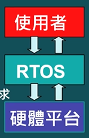
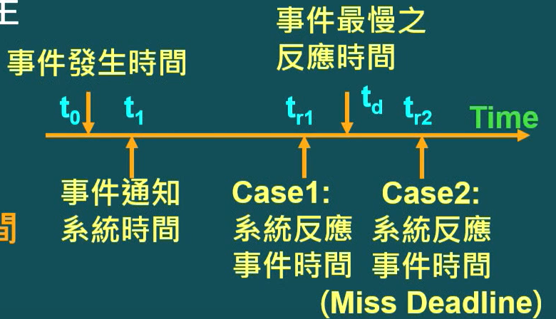

# 目录

[TOC]

# Section 1. 单元介绍

## 1.1 单元学习大纲

1. 单工程式 --- 循环执行
2. 单工程式 --- foreground/background（即 循环 + 中断）
3. 多工程式 --- nesting/non-nesting中断 （即能不能重复中断的区别）
4. 多工程式 --- 程序状态

## 1.2 RTOS的嵌入式系统架构

1. 硬件平台
   1. 比如：Cortex M3 开发板
   2. 提供计算处理、Timer、ADC等周边，通讯、I/O
2. 实时操作系统（Real-Time Operation System）
   1. 比如：uC/OS-Ⅱ RTOS
   2. 提供硬件资源管理、多工程调度、满足实时性要求
3. 使用者程序
   1. 系统需要的相关多工程式；

## 1.3 RTOS相关基本名词

+ 事件（Event）
  + 周边元件产生：比如网卡接口收到一个包；
  + 外部传感器产生：比如温度超过某个临界值的事件；
  + **CPU可由polling或中断了解事件的发生**；
+ <u>**Deadline**</u>
  + 一个事件所允许的**最慢反应时间**；
+ Miss Deadtime
  + 系统对事件的反应事件超过Deadline时间；

## 1.4 即时性系统的分类

即时性系统按照操作反应时间和Deadline关系，可以分为：

- Hard Real-time ：Miss Deadline时，会造成系统严重危害；
- Soft Real-time ： Miss Deadline时，可能性能不好，但是不会影响系统运行的正确性；

## 1.5 RTOS实时操作系统

- 大部分嵌入式系统都是real-time系统

- 大部分real-time系统**<u>同时包含hard real-time事件和soft real-time事件</u>**；

- 实时操作系统为了符合不同deadline的要求：

  - **使用多工程式架构**（Multi-task）

  - **Event driven**（事件触发）

  - **优先级调度机制**（priority-based scheduling）

    - > 高real-time要求的task设置较高的优先级！

# Section 2. 单工程式 -- 循环执行

