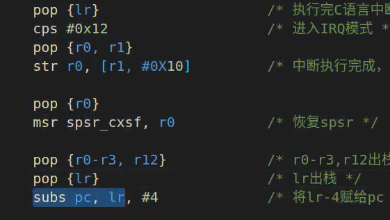

## 15.1 Cortex-A中断原理

### 一、回顾STM32的中断：

#### 1. STM32 中断向量表

ARM芯片从`0x00000000`开始运行，执行指令，在程序开始的地方有个中断向量表，**中断向量表的主要功能是描述中断对应的中断服务函数；（即哪个地址是哪个中断服务函数名的一一对应表格）**；

在文件`startup_stm32f10x_hd.s`中，查看中断向量表`_Vectors`；

对于STM32来说代码最开始的地址存放堆栈栈顶指针；

#### 2. 中断向量偏移

一般ARM从`0x00000000`开始运行，但是对于STM32，设置连接的首地址为`0x8000000`;
如果代码不从默认的首地址开始，需要设置中断向量偏移来告诉Soc内核，**设置SCB的VTOR寄存器为新的中断向量表的起始地址**；

#### 3. NVIC中断控制器

<mark>NVIC就是中断管理机构，可以使能核关闭指定的中断、设置中断优先级等。。</mark>

#### 4. 中断服务函数的编写

设置中断触发时具体要做的事情。

### 二、Cortex-A7中断系统

#### 1. Cortex-A7中断向量表

Cortex-A的中断向量表需要用户自己去定义；

#### 2. 中断向量偏移

IMX6U的裸机例程都是从`0x87800000`开始，所以需要设置中断向量偏移；

#### 3. GIC中断控制器

和NVIC一样，GIC用于管理Cortex-A的中断；
GIC提供使能关闭中断、设置中断优先级等功能；

#### 4.  IMX6U中断号

- 为了区分不同的中断源需要分配唯一的ID；
- 每个CPU支持最多1020个中断ID；
- ID0 ~ ID15 ： 16个ID分配给SGI；
- ID16 ~ ID31 ： 16个ID分配给PPI；
- ID32 ~ ID1019 ： 分配给SPI；
- IMX6ULL支持128个中断；

#### 5. 中断服务函数的编写

- **一个是IRQ中断服务函数的编写 `IRQ_Handler` 汇编代码，在`start.s`文件中；**
- 另一个是在IRQ中断服务函数里面查找并允许的具体的外设中断服务函数；

## 15.2 IMX6ULL中断向量表的编写（和复位中断服务函数）

### 一、编写按键中断例程

> KEY0 使用UART1_CTS这个IO，编写UART_CTS的中断代码；

### 二、修改 start.S

添加中断向量表，编写复位中断服务函数和IRQ中断服务函数；

编写复位中断服务函数，内容如下：
0. 关闭I-cache、D-cache和MMU；
1. 设置处理器9种工作模式下对应的SP指针；要使用中断，必须设置IRQ模式下的SP指针；
2. 清除bss段；
3. 跳转到C函数，也就是main函数；

- 清零bit位是bic，置为1就是清零这个位；

设置中断向量偏移：

设置各个模式下的SP指针：

## 15.3 IRQ中断服务函数编写

## 15.4 通用中断驱动编写

## 15.5 向GPIO驱动中添加中断处理函数

## 15.6 编写按键中断驱动

![[Pasted image 20221124112632.png]]

====================

[[2022-11-21_星期一]]

