# 目录


[TOC]

<div style="page-break-after:always"></div>

## 15.1 Cortex-A中断原理

### 一、回顾STM32的中断：

#### 1. STM32 中断向量表

ARM芯片从`0x00000000`开始运行，执行指令，在程序开始的地方有个中断向量表，**中断向量表的主要功能是描述中断对应的中断服务函数；（即哪个地址是哪个中断服务函数名的一一对应表格）**；

在文件`startup_stm32f10x_hd.s`中，查看中断向量表`_Vectors`；

对于STM32来说代码最开始的地址存放堆栈栈顶指针；

#### 2. 中断向量偏移

一般ARM从`0x00000000`开始运行，但是对于STM32，设置连接的首地址为`0x8000000`;
如果代码不从默认的首地址开始，需要设置中断向量偏移来告诉Soc内核，**设置SCB的VTOR寄存器为新的中断向量表的起始地址**；

#### 3. NVIC中断控制器

<mark>NVIC就是中断管理机构，可以使能核关闭指定的中断、设置中断优先级等。。</mark>

#### 4. 中断服务函数的编写

设置中断触发时具体要做的事情。


### 二、Cortex-A7中断系统

#### 1. Cortex-A7中断向量表

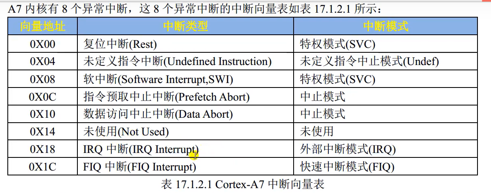

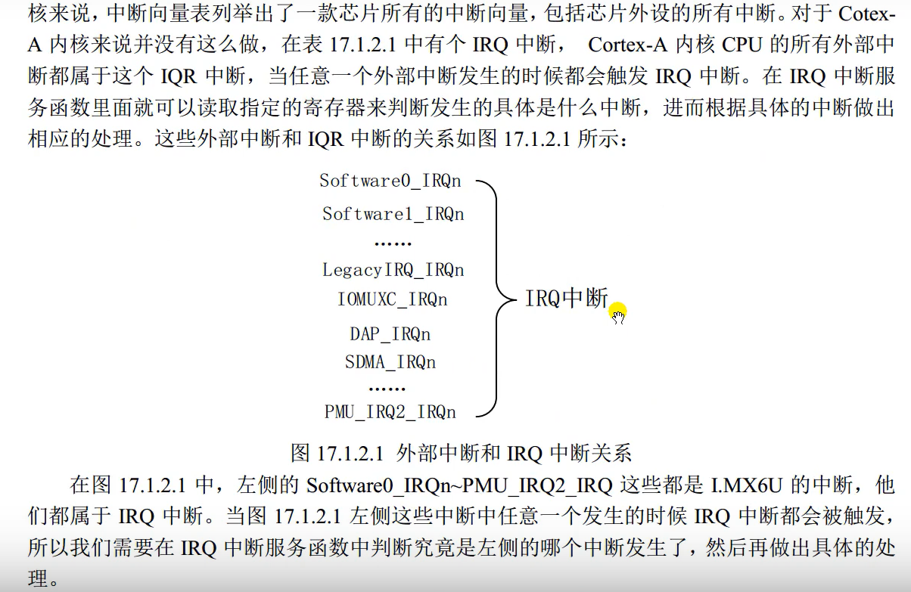

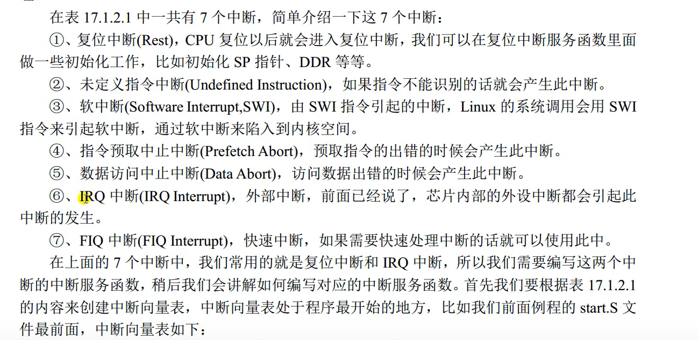


Cortex-A的中断向量表需要用户自己去定义；

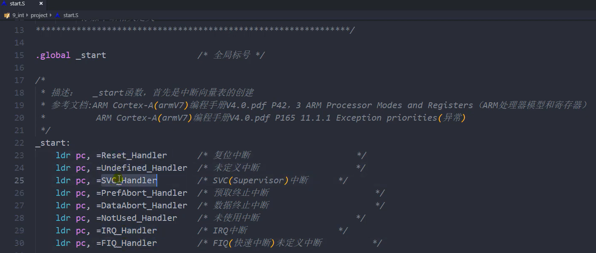
#### 2. 中断向量偏移

IMX6U的裸机例程都是从`0x87800000`开始，所以需要设置中断向量偏移；

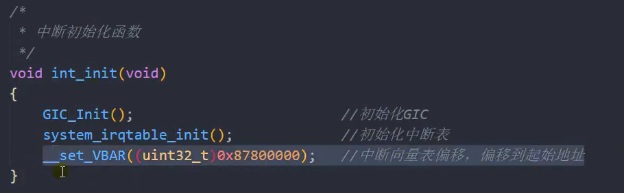

#### 3. GIC中断控制器

和NVIC一样，GIC用于管理Cortex-A的中断；
GIC提供使能关闭中断、设置中断优先级等功能；

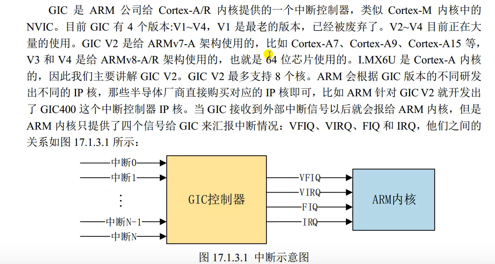


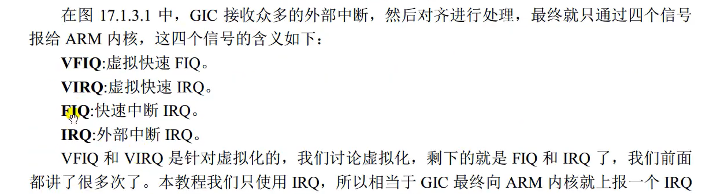

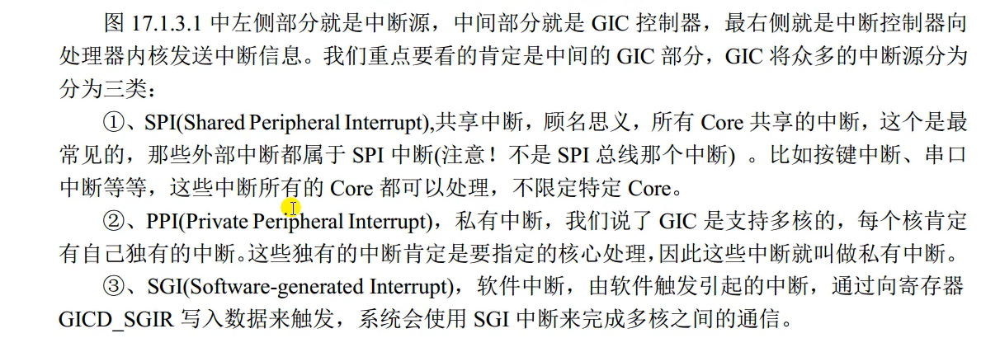

#### 4.  IMX6U中断号

- 为了区分不同的中断源需要分配唯一的ID；
- 每个CPU支持最多1020个中断ID；
- ID0 ~ ID15 ： 16个ID分配给SGI；
- ID16 ~ ID31 ： 16个ID分配给PPI；
- ID32 ~ ID1019 ： 分配给SPI；
- IMX6ULL支持128个中断；

#### 5. 中断服务函数的编写

- **一个是IRQ中断服务函数的编写 `IRQ_Handler` 汇编代码，在`start.s`文件中；**
- 另一个是在IRQ中断服务函数里面查找并允许的具体的外设中断服务函数；


## 15.2 IMX6ULL中断向量表的编写（和复位中断服务函数）

### 一、编写按键中断例程

> KEY0 使用UART1_CTS这个IO，编写UART_CTS的中断代码；


### 二、修改 start.S

添加中断向量表，编写复位中断服务函数和IRQ中断服务函数；

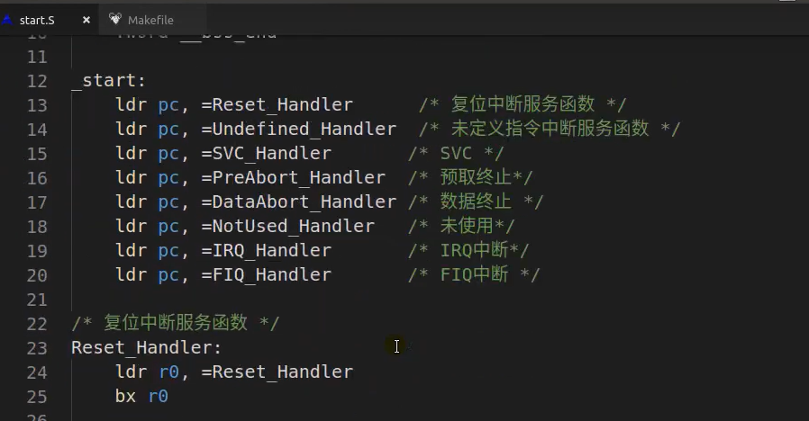


编写复位中断服务函数，内容如下：
0. 关闭I-cache、D-cache和MMU；
1. 设置处理器9种工作模式下对应的SP指针；要使用中断，必须设置IRQ模式下的SP指针；
2. 清除bss段；
3. 跳转到C函数，也就是main函数；


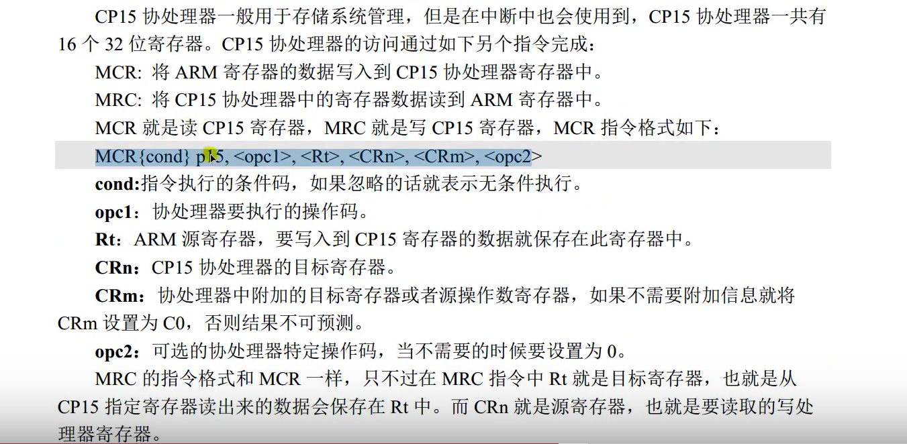

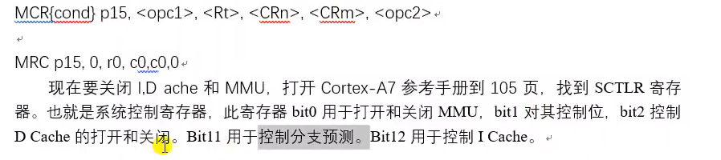

- 清零bit位是bic，置为1就是清零这个位；

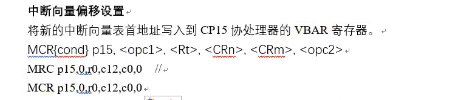

设置中断向量偏移：
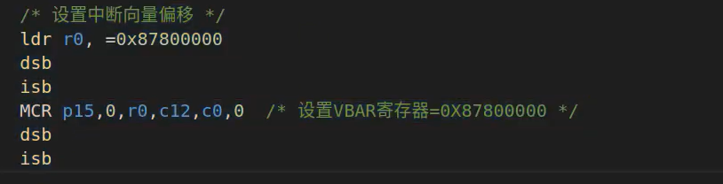

设置各个模式下的SP指针：

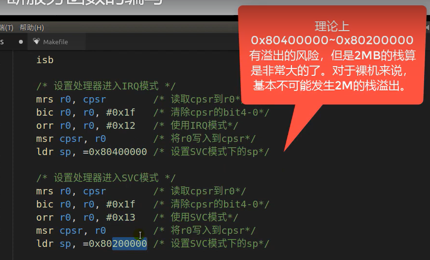

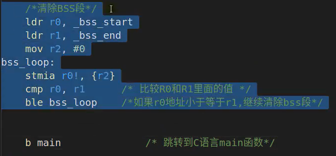

## 15.3 IRQ中断服务函数编写

Cortex-A的IRQ_Handler是基本通用的：

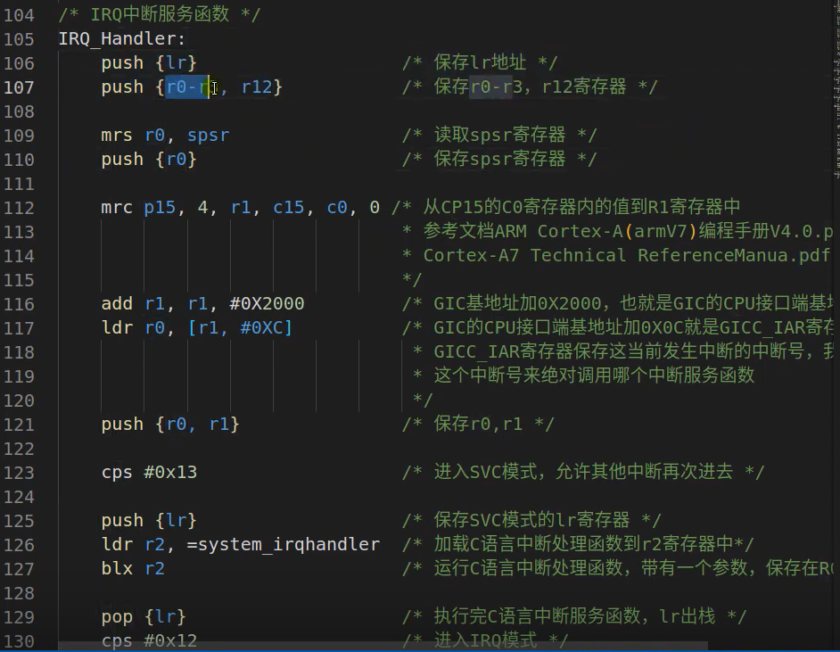

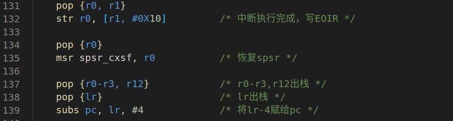

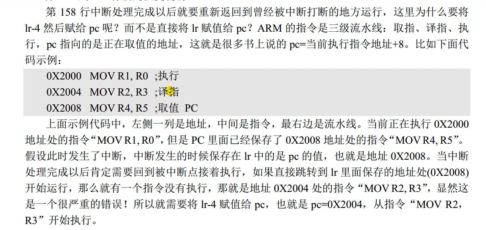

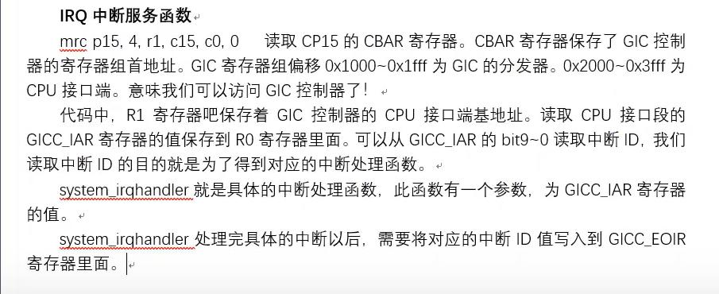


## 15.4 通用中断驱动编写

> [超级重要的一节！！](https://www.youtube.com/watch?v=tdJJYBjFCYw&list=PLkmkNssEXKuz3mAG0zxoJidbahYCzOXfA&index=34)


main函数中，`int_init()` 初始化中断，必须放在最前面（初始化时钟之前）！！

### bsp_int.c

```c
#include "bsp_int.h"

// 记录中断嵌套
static unsigned int irqNesting;

/*中断处理函数表*/
static sys_irq_handle_t irqTable[NUMBER_OF_INT_VECTORS];    // 160

/*初始化中断处理函数表*/
void system_irqtable_init(void)
{
	unsigned int i = 0;

	irqNesting = 0；
	for(i = 0; i < NUMBER_OF_INT_VECTORS; i++)
	{
		irqTable[i].irqHandler = default_irqhandler;
		irqTable[i].userParam = NULL;
	}
}

/*注册中断处理函数*/
void system_register_irqhandler(IRQn_Type irq, system_irq_handler_t handler, void *userParam)
{
	irqTable[irq].irqHandler = handler;
	irqTable[irq].userParam = userParam;
}

/*中断初始化函数*/
void  int_init(void)
{
	GIC_Init();
	system_irqtable_init();
	/*中断向量偏移设置*/
	__set__VBAR(0x87800000);
}

/*具体的中断处理函数，IRQ_Handler会调用这个函数*/
void system_irqhandler(unsigned int gicciar)
{
	uint32_t intNum = gicciar & 0x3ff;    // 取低10位
	/*检查中断ID*/
	if(intNum >= NUMBER_OF_INT_VECTORS)
	{
		return;
	}

	irqNesting++；
	/*根据中断ID号，读取中断处理寒素，然后执行*/
	irqTable[intNum].irqHandler(intNum, irqTable[intNum].userParam)
;
	irqNesting--；
}

/*默认中断处理函数*/
void default_irqhandler(unsigned int gicciar, void *userParam)
{
	while(1)
	{
	}
}

```


### bsp_int.h

```c
#ifndef __BSP_INT_H
#define __BSP_INT_H
#include "imx6u.h"

/*定义中断处理函数*/
typedef void (*system_irq_handler_t)(unsigned int gicciar, void *param);

/*定义中断处理函数结构体*/
typedef struct _sys_irq_handle
{
	system_irq_handler_t irqHandler;    /*中断处理函数*/
	void *userParam;    /*传递给中断处理函数的参数*/
}sys_irq_handle_t;

void int_init(void);

#endif
```


## 15.5 向GPIO驱动中添加中断处理函数

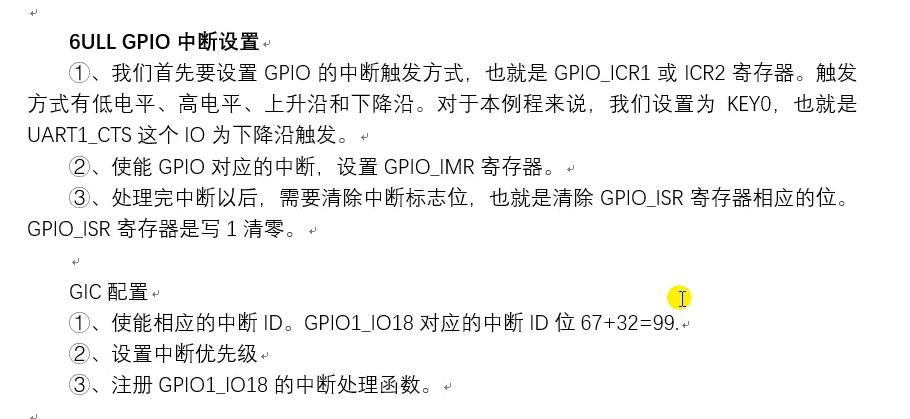

### bsp_gpio.h

```c
/*描述中断触发类型的枚举*/
typedef enum _gpio_interrupt_mode
{
	kGPIO_NoIntmode = 0U,    // 无中断功能
	kGPIO_IntLowLevel = 1U,    // 低电平触发
	kGPIO_IntHighLevel = 2U,    // 高电平触发
	kGPIO_IntRisingEdge = 3U,    // 上升沿触发
	kGPIO_IntFallingEdge = 4U,    // 下降沿触发
	kGPIO_IntRisingOrFallingEdge = 5U,    // 上升下降沿都触发
} gpio_interrupt_mode_t;

/*枚举类型和GPIO结构体*/
typedef enum _gpio_pin_direction
{
	kGPIO_DigitalInput = 0U,
	kGPIO_DigitalOutput = 1U,
}gpio_pin_direction_t;

typedef struct _gpio_pin_config
{
	gpio_pin_direction_t direction;
	uint8_t outputLogic;
	gpio_interrupt_mode_t interruptMode;    // 中断方式
}gpio_pin_config_t;

void gpio_init(GPIO_Type *base, int pin, gpio_pin_config_t config);
void gpio_pinwrite(GPIO_Type *base, int pin, int value);
int gpio_pinread(GPIO_Type *base, int pin);
```

### bsp_gpio.c

```c
/*添加和中断有关的函数*/

/*使能指定的IO中断*/
void gpio_enableint(GPIO_Type *base, unsigned int pin)
{
	base->IMR |= (1 << pin);
}

/*禁止指定的IO中断*/
void gpio_disableint(GPIO_Type *base, unsigned int pin)
{
	base->IMR &= ~(1 << pin);
}

/*清除中断标志位*/
void gpio_clearintflags(GPIO_Type *base, unsigned int pin)
{
	base->ISR |= (1 << pin);    // 芯片手册说：写1清零
}

/*GPIO中断初始化函数*/
void gpio_intconfig(GPIO_Type *base, unsigned int pin, gpio_interrupt_mode_t pin_int_mode)
{
	volatile uint32_t *icr;
	uint32_t icrShift;

	icrShift = pin;
	base->EDFE_SEL &= ~(1 << pin);    // 清零，防止icr被覆盖

	if(pin < 16)    // 低16位
	{
		icr = &(base->ICR1)；
	}
	else
	{
		icr = &(base->ICR2)；
		icrShift -= 16;
	}

	switch(pin_int_mode)
	{
		case kGPIO_IntLowLevel:
			*icr &= ~(3 << (2 * ircShift));    
			// 一个IO用2个位表示触发模式，icrShift保存IO在ICR1或者ICR2中具体的位域，所以是2*icrShift
			break;
		case kGPIO_IntHighLevel:
			*icr &= ~(3 << (2 * ircShift));  // 清零
			*icr |= (1 << (2 * ircShift));   // 写1
			break;
		case kGPIO_IntRisingEdge:
			*icr &= ~(3 << (2 * ircShift));  // 清零
			*icr |= (2 << (2 * ircShift));   // 写2
			break;
		case kGPIO_IntFallingEdge:
			*icr &= ~(3 << (2 * ircShift));  // 清零
			*icr |= (3 << (2 * ircShift));   // 写3
			break;
		case kGPIO_IntRisingOrFallingEdge:
			base->EDGE_SEL |= (1 << pin);
			break;
		default:
			break;
	}
}
```

把`gpio_intconfig`函数，放入`gpio_init`函数中！！

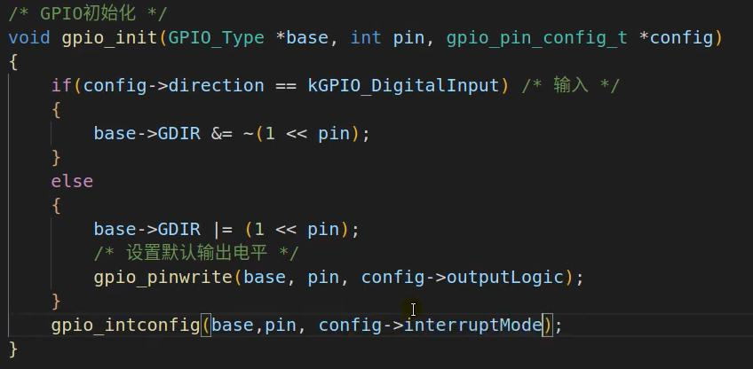


## 15.6 编写按键中断驱动


### bsp_exti.h

```c
#ifndef __BSP_EXTI_H
#define __BSP_EXTI_H
#include "imx6u.h"

void exti_init(void);
void gpio1_io18_irqhandler(unsigned int gicciar, void *param);
#endif
```


### bsp_exti.c

```c
#include "bsp_exti.h"
#include "bsp_gpio.h"
#include "bsp_int.h"
#include "bsp_delay.h"
#include "bsp_beep.h"

/*初始化外部中断，也就是GPIO-IO18*/
void exti_init(void)
{
    gpio_pin_config_t key_config;
    IOMUXC_SetPinMux(IOMUXC_UART1_CTS_B_GPIO1_IO18, 0); /*复用位GPIO1_IO18*/
    IOMUXC_SetPinConfig(IOMUXC_UART1_CTS_B_GPIO1_IO18, 0XF080);

    /*GPIO初始化*/
    key_config.direction = kGPIO_DigitalInput;
    key_config.interruptMode = kGPIO_IntFallingEdge;
    gpio_init(GPIO1, 18, &key_config);

    GIC_EnableIRQ(GPIO1_Combined_16_31_IRQn);
    /*注册中断处理函数*/
    system_register_irqhandler(GPIO1_Combined_16_31_IRQn, gpio1_io18_irqhandler, NULL);
    gpio_enableint(GPIO1, 18);
}


/*中断处理函数*/
void gpio1_io18_irqhandler(unsigned int gicciar, void *param)
{
    static unsigned char state = 0;

    delay(10);  // 消抖动,应该使用定时器，实际开发不能delay中断
    if(gpio_pinread(GPIO1, 18) == 0)  // 按键有效
    {
        state = !state;
        beep_switch(state);
    }

    /*清除中断标志位*/
    gpio_clearintflags(GPIO1, 18);
}

```

**写完以上两个程序之后，在`main函数`中添加`exti_init()`！！！**

### main.c

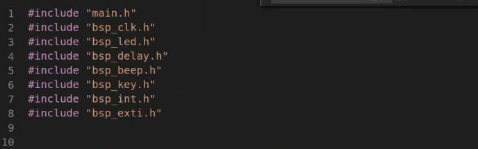

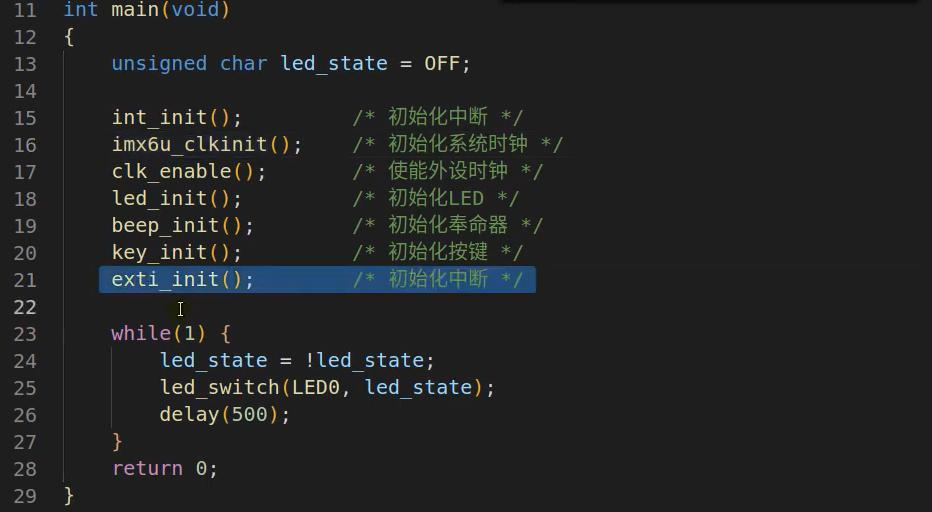

[[2022-11-24_星期四]]

